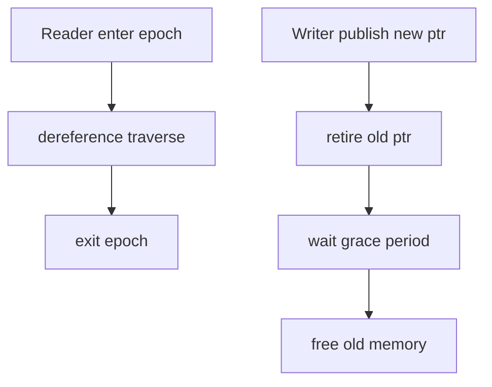
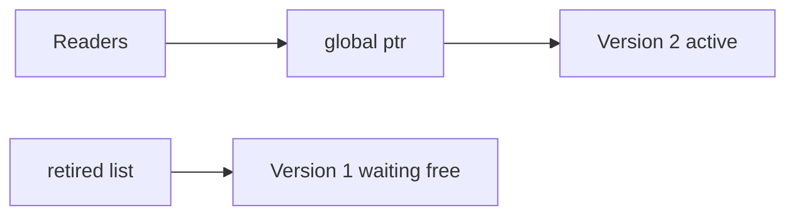
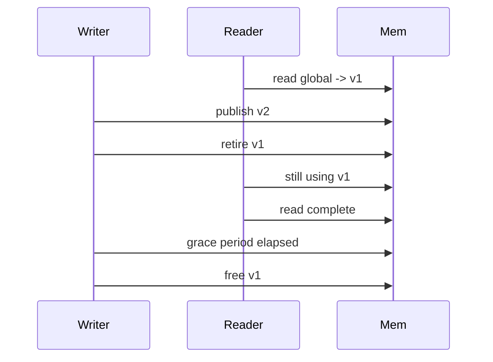

# Read-Copy-Update and Epoch Concepts

## Overview

**Read-Copy-Update (RCU)** is a synchronization pattern for **read-mostly** data: readers proceed **without locks**; writers create a new version, atomically publish, then **defer freeing** old memory until all pre-existing readers finish. **Epoch-based reclamation (EBR)** generalizes the idea: readers enter an **epoch**; memory retired in epoch `e` is freed only when no reader remains in epochs ≤ `e`.

**Concepts note**—full lock-free implementations with hazard pointers/EBR are expert territory. Application engineers apply RCU via **immutable snapshot publish** ([[04-Data-Structures/12-Persistent-and-Immutable/Copy-on-Write and In-Process Snapshots|Copy-on-Write and In-Process Snapshots]]). Kernel RCU and userspace libraries (liburcu) are systems topics.

## Learning Objectives

- Explain RCU read side vs grace period on write side
- Describe epoch table enter/exit and deferred free lists
- Connect RCU to immutable snapshot publish in application code
- Identify reclamation problem in lock-free data structures
- Choose RCU vs read-write lock vs concurrent collection

## Prerequisites

- [[04-Data-Structures/12-Persistent-and-Immutable/Immutability for Concurrent Readers|Immutability for Concurrent Readers]]
- [[04-Data-Structures/13-Concurrency-Aware-Structures/Thread-Safety Classes|Thread-Safety Classes]]

## Difficulty

`expert`

## Estimated Time

- Reading: 2 hours
- Exercises: 2 hours
- Mini project: 3 hours

## History

RCU originated in DYNIX/ptx UNIX kernel (1980s); McKenney formalized for Linux kernel scalability. Userspace EBR and hazard pointers (Michael, 2004) enable lock-free C++ structures.

## Problem It Solves

Lock-free readers on mutable structures cannot free removed nodes immediately—another thread may still traverse old pointer. RCU/epoch defers destruction until safe, enabling **wait-free reads** with acceptable writer cost.

## Internal Implementation

### RCU read path (concept)

1. Reader: `rcu_read_lock()` (often no-op or per-CPU flag)
2. Dereference shared pointer; traverse immutable or stable structure
3. `rcu_read_unlock()`

### RCU write path

1. Allocate new structure / copy-update path
2. `rcu_assign_pointer(&global, new)`
3. `synchronize_rcu()` — wait for grace period (all old readers done)
4. Free old structure

### Epoch-based reclamation

- Global epoch counter advances
- Each thread records current epoch on enter
- Retire list: `(ptr, retire_epoch)`; free when all threads past epoch



## Invariants

- **R1 (Reader safety)**: Memory reachable by reader at dereference time remains valid until reader exits critical section.
- **R2 (Grace period)**: No freed pointer is still reachable by any reader in pre-publish epoch.
- **R3 (Publish atomicity)**: New pointer visible atomically to all cores.
- **R4 (Epoch monotonicity)**: Epoch only increases; retired nodes tagged with retirement epoch.
- **R5 (No use-after-free)**: Deferred free runs only after R2 satisfied.

## Operation Complexity

| Role | Typical cost | Notes |
| --- | --- | --- |
| Reader | O(1) minimal overhead | Often no atomic except pointer load |
| Writer publish | O(1) pointer swap | |
| Grace wait | O(readers) unbounded | Batch writers amortize |
| Reclaim scan | O(retired) | Per epoch tick |

## Mermaid Diagrams

### Structure: global pointer + retired list



### Sequence: grace period before free



## Examples

### Minimal Example — application RCU pattern

**TypeScript**:

```typescript
type Index = ReadonlyMap<string, number>;

export class RcuIndex {
  private current: Index = new Map();

  read(): Index {
    return this.current; // readers treat as immutable
  }

  replace(next: Index): void {
    const old = this.current;
    this.current = next;
    // GC reclaims old when no references — application-level RCU
    queueMicrotask(() => this.onRetired(old));
  }

  private onRetired(_old: Index): void {
    /* metrics: retired_versions_total++ */
  }
}
```

**Python**:

```python
import threading
from types import MappingProxyType
from typing import Callable, Dict, Mapping, TypeVar

K = TypeVar("K")
V = TypeVar("V")

class EpochReclaimer:
    """Concept: retire callbacks after generation bump."""

    def __init__(self) -> None:
        self._epoch = 0
        self._retired: Dict[int, list[Callable[[], None]]] = {}
        self._lock = threading.Lock()

    def enter(self) -> int:
        with self._lock:
            return self._epoch

    def retire(self, gen: int, cb: Callable[[], None]) -> None:
        with self._lock:
            self._retired.setdefault(gen, []).append(cb)

    def bump(self) -> None:
        with self._lock:
            self._epoch += 1
            old = self._epoch - 2
            for cb in self._retired.pop(old, []):
                cb()
```

### Production-Shaped Example

Routing table updated every 5 minutes: build new `Map`, atomic swap, old map garbage-collected—JVM/Go GC acts as reclamation. For native lock-free queue, use **userspace RCU library**—do not hand-roll hazard pointers without expert review.

## Trade-offs

| Dimension | Upside | Downside | When it matters |
| --- | --- | --- | --- |
| vs RW lock | Readers scale | Writer grace delay | Kernel routes, config |
| vs immutable only | Native code nodes | Complex reclamation | Lock-free C++ |
| GC languages | Simple retire | Non-deterministic free latency | Java/Go services |
| Epoch vs hazard ptr | Batch reclaim | Memory peak retired list | Custom structures |

### When to Use

- Read-mostly structures with rare bulk update
- Application immutable publish (GC as reclaimer)
- Understanding kernel/userspace lock-free foundations

### When Not to Use

- Write-heavy structures—RCU writer cost dominates
- Hard real-time requiring bounded free latency without GC
- Team lacks expertise for native EBR/hazard pointers

## Exercises

1. Timeline: reader spans publish—when is free safe?
2. Compare RCU to double-buffer snapshot in [[04-Data-Structures/12-Persistent-and-Immutable/Copy-on-Write and In-Process Snapshots|COW note]].
3. Why lock-free queue delete needs reclamation?
4. Sketch epoch bump freeing generation g-2 nodes.
5. When does Java immutable publish avoid explicit RCU?

## Mini Project

Simulate readers/writers with generation counter; assert no use-after-free in single-threaded model.

## Portfolio Project

Document RCU analogy in config service architecture decision record.

## Interview Questions

1. RCU grace period purpose?
2. Reader synchronization in RCU—locks?
3. Epoch-based reclamation vs garbage collection?
4. Use-after-free in lock-free list without RCU?
5. RCU vs read-write lock when?

### Stretch / Staff-Level

1. Linux kernel RCU flavors (classic, preempt, SRCU) — one sentence each.
2. Hazard pointers vs epoch — trade-off summary.

## Common Mistakes

- Freeing memory still reachable by readers
- Assuming pointer swap enough without memory barriers in native code
- Using RCU pattern with **mutable** shared graph visible to readers
- Unbounded retired list if grace never completes

## Best Practices

- In managed languages, prefer immutable publish + GC
- For native lock-free, use established EBR/RCU libraries
- Bound staleness and document reader consistency model
- Stress-test reclamation under slow readers

## Summary

RCU and epoch reclamation let readers access shared data without locks while writers publish new versions and defer freeing old memory until a grace period passes. Application code achieves the same read-scaling pattern via immutable snapshots and garbage collection; native lock-free structures require explicit epoch or hazard-pointer discipline to prevent use-after-free.

## Further Reading

- [[00-References/Data Structures/README|Data Structures References]]
- McKenney — RCU book and articles
- Michael — hazard pointers paper

## Related Notes

- [[04-Data-Structures/12-Persistent-and-Immutable/Immutability for Concurrent Readers|Immutability for Concurrent Readers]]
- [[04-Data-Structures/12-Persistent-and-Immutable/Copy-on-Write and In-Process Snapshots|Copy-on-Write and In-Process Snapshots]]
- [[04-Data-Structures/13-Concurrency-Aware-Structures/Concurrent Queues|Concurrent Queues]]
- [[04-Data-Structures/10-Probabilistic-Structures/Skip Lists|Skip Lists]]
- [[04-Data-Structures/14-Production-Selection/From In-Memory Structures to Systems|From In-Memory Structures to Systems]]

## Progress Checklist

- [ ] Explained from first principles
- [ ] Drew at least one Mermaid diagram
- [ ] Implemented a minimal version
- [ ] Documented trade-offs and non-goals
- [ ] Completed exercises
- [ ] Practiced interview questions aloud
- [ ] Linked prerequisites and dependents
