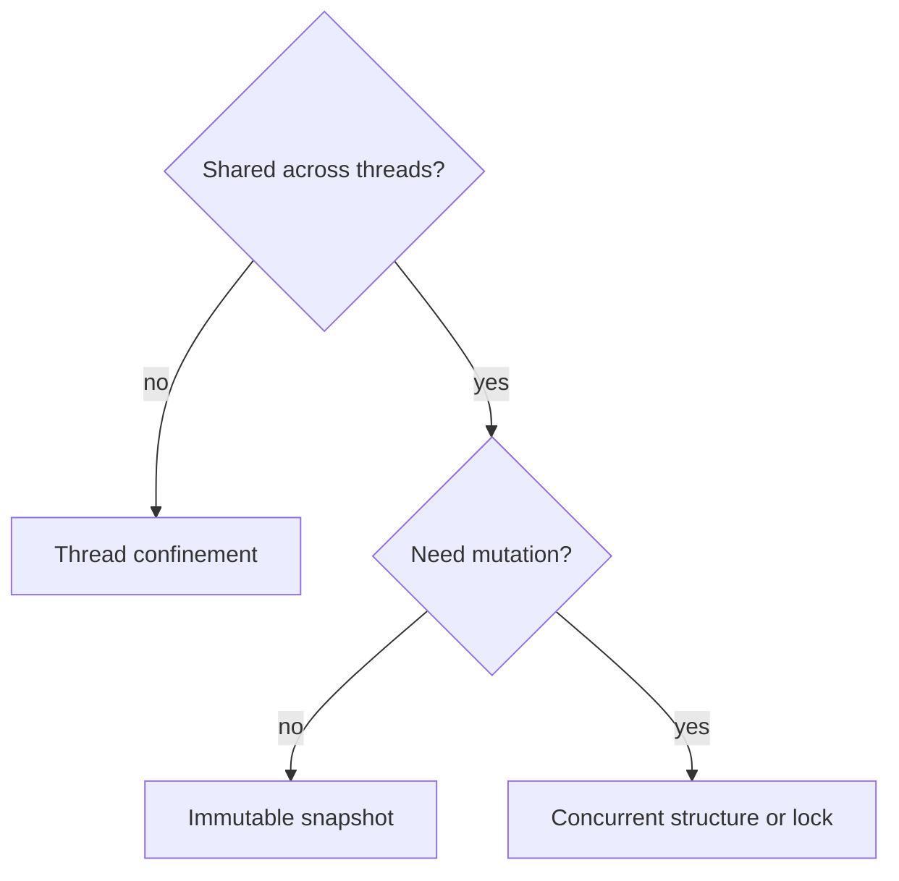
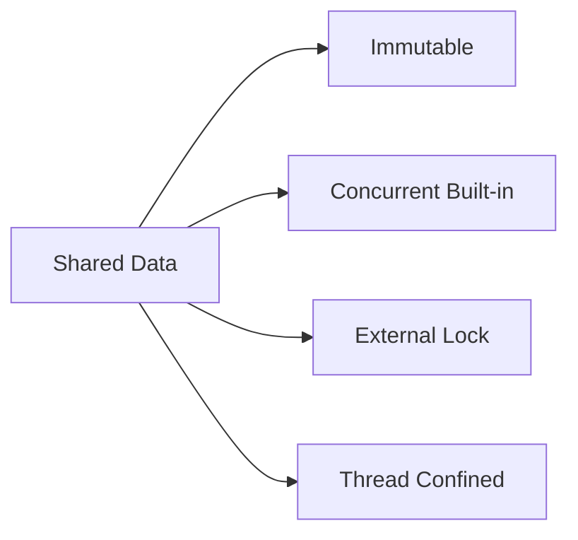
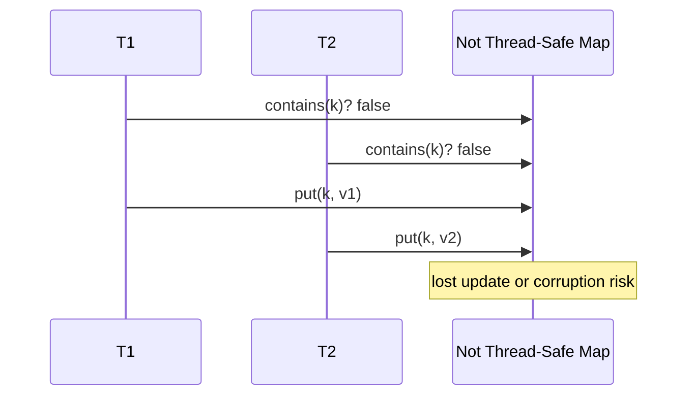

# Thread-Safety Classes

## Overview

**Thread-safety classes** categorize how a data structure behaves under concurrent access. Brian Goetz's taxonomy (from *Java Concurrency in Practice*) remains the standard vocabulary:

| Class | Meaning |
| --- | --- |
| **Immutable** | State never changes after construction |
| **Unconditionally thread-safe** | All methods safe concurrently (e.g., concurrent hash map) |
| **Conditionally thread-safe** | Some compound ops need external sync |
| **Not thread-safe** | Caller synchronizes (e.g., `ArrayList`, `HashMap`) |
| **Thread confinement** | Single-thread access by design |

This note defines contracts for structure selection—implementation details of lock-free algorithms are concepts in later notes, not full code here.

## Learning Objectives

- Classify standard library structures by thread-safety level
- Document compound operations requiring external locks
- Choose confinement vs shared concurrent structure
- Explain happens-before for synchronized publication
- Map safety class to [[04-Data-Structures/13-Concurrency-Aware-Structures/Concurrent Hash Maps Concepts|Concurrent Hash Maps Concepts]] and queues

## Prerequisites

- [[04-Data-Structures/00-Orientation-and-Contracts/Interface Design Capacity Errors and Iteration|Interface Design Capacity Errors and Iteration]]
- [[01-Computer-Science/03-Concurrency/Concurrency Fundamentals|Concurrency Fundamentals]]

## Difficulty

`intermediate`

## Estimated Time

- Reading: 1.5 hours
- Exercises: 2 hours
- Mini project: 2 hours

## History

Shared-memory multiprocessors forced explicit safety contracts. Before concurrent collections, every team reinvented wrapper locks. Standard classifications reduced bugs from ambiguous "thread-compatible" marketing.

## Problem It Solves

Using `HashMap` from multiple threads corrupts buckets silently. Misunderstanding `Collections.synchronizedMap` still allows check-then-act races on compound ops. Explicit safety class tells callers **what sync is required**.

## Internal Implementation

### Not thread-safe

Single lock wrapping all methods serializes access—correct but contended.

### Conditionally thread-safe

Individual `put`/`get` atomic; `if (!map.contains(k)) map.put(k,v)` is **not** atomic—race window.

### Unconditionally thread-safe

Internal fine-grained locks, lock-free buckets, or immutability—`ConcurrentHashMap`, `ConcurrentLinkedQueue`.

### Confinement strategies

- **Ad-hoc**: structure owned by one thread
- **Stack confinement**: local variables never escape
- **ThreadLocal**: per-thread copy



## Invariants

- **TS1 (Documented contract)**: Every public type declares safety class in docs/types.
- **TS2 (Atomicity scope)**: Single-method atomicity does not imply multi-method atomicity unless stated.
- **TS3 (Publication)**: Shared reference published only after fully constructed (safe publication).
- **TS4 (Confinement)**: If confined, no alias escapes to other threads without handoff protocol.
- **TS5 (Iterator weak consistency)**: Concurrent iterators reflect weakly consistent snapshot—document behavior.

## Operation Complexity

Thread-safety affects **latency under contention**, not Big-O of single-threaded ops:

| Approach | Uncontended | High contention |
| --- | --- | --- |
| Not TS + global lock | O(1) op | Serialized |
| Concurrent hash map | O(1) | Striped/bucket scale |
| Immutable publish | O(1) read | No read contention |

## Mermaid Diagrams

### Structure: safety decision tree



### Sequence: compound op race



## Examples

### Minimal Example

**TypeScript** — documenting safety:

```typescript
/**
 * NOT THREAD-SAFE. External synchronization required for shared use.
 * Compound ops (check-then-set) need single lock around whole sequence.
 */
export class SimpleMap<K, V> {
  private m = new Map<K, V>();
  get(k: K): V | undefined {
    return this.m.get(k);
  }
  put(k: K, v: V): void {
    this.m.set(k, v);
  }
}

/** Unconditionally thread-safe wrapper (coarse lock). */
export class SyncMap<K, V> {
  private m = new Map<K, V>();
  private lock = new Mutex(); // conceptual

  async get(k: K): Promise<V | undefined> {
    return this.lock.run(() => this.m.get(k));
  }
}
```

**Python**:

```python
import threading
from typing import Dict, Generic, Optional, TypeVar

K = TypeVar("K")
V = TypeVar("V")

class NotThreadSafeMap(Generic[K, V]):
    """NOT THREAD-SAFE — confine to one thread or wrap."""

    def __init__(self) -> None:
        self._m: Dict[K, V] = {}

    def get(self, key: K) -> Optional[V]:
        return self._m.get(key)

    def put(self, key: K, value: V) -> None:
        self._m[key] = value

class ConditionallySafeMap(Generic[K, V]):
    """Individual ops thread-safe via lock; compound ops need outer lock."""

    def __init__(self) -> None:
        self._m: Dict[K, V] = {}
        self._lock = threading.Lock()

    def get(self, key: K) -> Optional[V]:
        with self._lock:
            return self._m.get(key)

    def put_if_absent(self, key: K, value: V) -> bool:
        with self._lock:  # single lock spans check+act
            if key in self._m:
                return False
            self._m[key] = value
            return True
```

### Production-Shaped Example

Service rule: **request-scoped** maps are not thread-safe and confined to async handler; **global caches** use concurrent structures or immutable publish. Lint rule: flag shared mutable static `Map` without wrapper.

## Trade-offs

| Dimension | Upside | Downside | When it matters |
| --- | --- | --- | --- |
| Confinement | Zero sync cost | No sharing | Per-request state |
| Coarse lock | Simple | Contention | Low QPS shared |
| Concurrent built-in | Tuned impl | Semantic subtleties | Hot shared maps |
| Immutable | Lock-free reads | Publish cost | Config/routing |

### When to Use

- Document safety on every shared structure type
- Prefer confinement when data never needs cross-thread sharing
- Upgrade to concurrent collections when profiling shows lock contention

### When Not to Use

- Global lock "for safety" on read-heavy paths without measuring
- Assuming synchronized wrapper fixes compound operations
- Sharing not-thread-safe iterators across threads

## Exercises

1. Classify: `ArrayList`, `ConcurrentHashMap`, `Collections.synchronizedList`, frozen object.
2. Write race scenario for `putIfAbsent` without atomic compound.
3. Design thread confinement for per-request context map in HTTP server.
4. Map TypeScript `Map` and Python `dict` safety (single-threaded event loop nuance).
5. When is immutable publish better than `ConcurrentHashMap`?

## Mini Project

Add safety annotations and ESLint/custom rule for shared mutable module state.

## Portfolio Project

Concurrency bug gallery: reproduce map corruption with parallel puts without sync.

## Interview Questions

1. Five thread-safety classes?
2. Why is `Vector` conditionally thread-safe?
3. Difference thread-safe vs synchronized compound op?
4. Thread confinement examples?
5. Weakly consistent iterator meaning?

### Stretch / Staff-Level

1. Define safety contract for async Rust `Send`/`Sync` vs Java model.
2. Policy for when teams must use concurrent vs immutable structures.

## Common Mistakes

- "We only read" while another thread writes—undefined without sync
- Returning internal mutable collection from getter
- Iterator during concurrent modification without concurrent collection
- Node.js: assuming no concurrency—worker threads exist

## Best Practices

- Default new structures to **confined**; share intentionally
- Use `putIfAbsent` APIs that encode compound atomicity
- Prefer immutable snapshots for read-mostly globals
- Test with thread stress harnesses (CI)

## Summary

Thread-safety classes communicate concurrent contracts: immutable, fully concurrent, conditional, unsafe, or confined. Single-method thread safety does not protect compound check-then-act sequences. Production systems confine per-request state, use concurrent collections for shared mutation, or publish immutable snapshots for read-heavy globals.

## Further Reading

- [[00-References/Data Structures/README|Data Structures References]]
- Goetz et al. — Java Concurrency in Practice, Chapter 4

## Related Notes

- [[04-Data-Structures/13-Concurrency-Aware-Structures/Concurrent Hash Maps Concepts|Concurrent Hash Maps Concepts]]
- [[04-Data-Structures/13-Concurrency-Aware-Structures/Concurrent Queues|Concurrent Queues]]
- [[04-Data-Structures/12-Persistent-and-Immutable/Immutability for Concurrent Readers|Immutability for Concurrent Readers]]
- [[04-Data-Structures/13-Concurrency-Aware-Structures/False Sharing Padding and Contended Counters|False Sharing Padding and Contended Counters]]
- [[04-Data-Structures/00-Orientation-and-Contracts/Interface Design Capacity Errors and Iteration|Interface Design Capacity Errors and Iteration]]

## Progress Checklist

- [ ] Explained from first principles
- [ ] Drew at least one Mermaid diagram
- [ ] Implemented a minimal version
- [ ] Documented trade-offs and non-goals
- [ ] Completed exercises
- [ ] Practiced interview questions aloud
- [ ] Linked prerequisites and dependents
