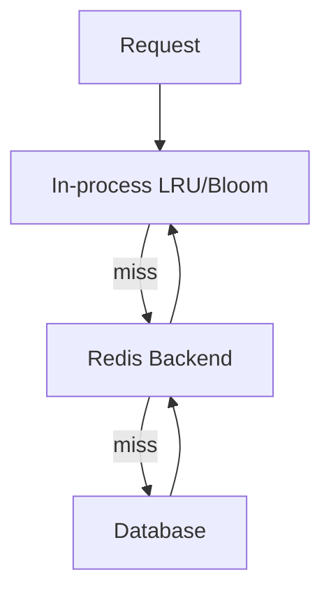
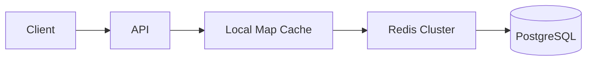
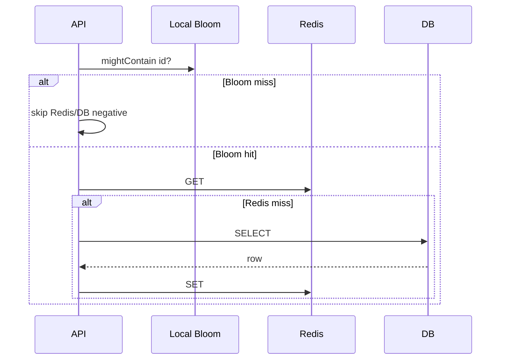

# From In-Memory Structures to Systems

## Overview

In-process structures from modules 00–14 solve **single-address-space** problems at microsecond scale. Production systems **escalate** across boundaries when requirements add **durability**, **shared state across hosts**, **capacity beyond RAM**, or **operational isolation**. This note maps escalation paths—without duplicating Backend or Database chapters.

**Stay in this track**: ADT choice, bounded caches, concurrent maps, probabilistic guards, immutable publish.

**Escalate outward**: Redis/Memcached ([[07-Backend/README|Backend]]), SQL/LSM storage ([[08-Databases/README|Databases]]), object stores, message queues ([[09-System-Design/README|System Design]]).

## Learning Objectives

- Identify signals that in-memory structure is insufficient
- Layer Bloom/LRU/local map in front of remote systems correctly
- Understand process vs cluster cache consistency models
- Design handoff: local structure → shared service → durable store
- Document boundary decisions in architecture diagrams

## Prerequisites

- [[04-Data-Structures/14-Production-Selection/Structure Selection Decision Matrix|Structure Selection Decision Matrix]]
- [[04-Data-Structures/14-Production-Selection/Measuring Structures in Production|Measuring Structures in Production]]
- [[09-System-Design/README|System Design Track]]

## Difficulty

`advanced`

## Estimated Time

- Reading: 2 hours
- Exercises: 2 hours
- Mini project: 3 hours

## History

LAMP-era apps held everything in one process heap; horizontal scaling forced external session stores, CDN caches, and database replicas. Microservices sharpened boundaries—**locality vs consistency** trade-offs became explicit.

## Problem It Solves

Teams either **prematurely distribute** (Redis for 50-entry config) or **OOM/crash** holding gigabytes locally without eviction. Escalation framework matches structure tier to requirement.

## Internal Implementation

### Tier model

```text
L0: CPU registers / stack (language runtime)
L1: In-process structures (this track)
L2: Shared memory / embedded cache (same host, rare)
L3: Network cache (Redis) — Backend
L4: Durable store (Postgres, S3, LSM) — Databases
```

### Common compositions

| Pattern | In-memory role | External role |
| --- | --- | --- |
| Cache-aside | LRU/TTL local | Authoritative DB |
| Negative guard | Bloom filter | DB existence check |
| Session | Sticky local map | Redis if multi-instance |
| Rate limit | Striped counter local | Central Redis sliding window |
| Read model | Immutable snapshot | Event log rebuild — System Design |

### Escalation signals

- Working set > RAM budget after eviction tuning
- Multiple replicas need **consistent** shared state
- Survive process restart with warm data
- Cross-region readers
- Audit/durability/legal retention



## Invariants

- **B1 (Single writer truth)**: One tier is authoritative per key class—others are derived.
- **B2 (Stale contract)**: Each tier documents max staleness tolerated.
- **B3 (Failure isolation)**: Local structure failure modes don't corrupt durable tier.
- **B4 (Thundering herd)**: Negative cache + singleflight on miss path.
- **B5 (Bound local growth)**: Always capacity/TTL on L1 before adding L3.

## Operation Complexity

End-to-end latency stacks:

| Path | Typical latency | Notes |
| --- | --- | --- |
| L1 hit | µs | Hash/LRU |
| L1 miss → L3 hit | sub-ms – ms | network |
| L3 miss → L4 | ms – tens ms | disk/network |
| Bloom skip DB | saves L4 | FP adds occasional L4 |

Optimize L1 before distributing; measure per [[04-Data-Structures/14-Production-Selection/Measuring Structures in Production|Measuring Structures in Production]].

## Mermaid Diagrams

### Structure: tiered read path



### Sequence: cache-aside with Bloom guard



## Examples

### Minimal Example

**TypeScript** — tiered read with local LRU fronting fetch:

```typescript
export class TieredUserLoader {
  constructor(
    private local: LRUCache<string, User>,
    private fetchFromService: (id: string) => Promise<User | null>
  ) {}

  async get(id: string): Promise<User | null> {
    const hit = this.local.get(id);
    if (hit !== undefined) return hit;

    const remote = await this.fetchFromService(id); // Redis/DB client inside
    if (remote) this.local.put(id, remote);
    return remote;
  }
}
```

**Python**:

```python
from typing import Callable, Optional

class TieredLoader:
    def __init__(
        self,
        local_cache,
        remote_get: Callable[[str], Optional[object]],
    ) -> None:
        self._local = local_cache
        self._remote_get = remote_get

    def get(self, key: str) -> Optional[object]:
        v = self._local.get(key)
        if v is not None:
            return v
        v = self._remote_get(key)
        if v is not None:
            self._local.put(key, v)
        return v
```

### Production-Shaped Example

Multi-tier decision ADR:

1. Start: in-process LRU 10k entries, 60s TTL
2. Metrics: hit_rate 55%, p99 DB load high → add Redis ([[07-Backend/README|Backend]])
3. Still: repeated negative lookups → add Bloom ([[04-Data-Structures/10-Probabilistic-Structures/Bloom Filters|Bloom Filters]])
4. Durability: user records always authoritative in Postgres ([[08-Databases/README|Databases]])

Diagram service boundaries in System Design capstone; don't embed Redis protocol details here.

## Trade-offs

| Dimension | Upside | Downside | When it matters |
| --- | --- | --- | --- |
| L1 only | Fastest | Lost on restart | Single node, soft state |
| + Redis | Shared, larger | Network, ops | Horizontal scale |
| + DB | Durable | Slowest | Source of truth |
| Bloom guard | Saves L4 | FP extra work | High negative rate |

### When to Use

- Escalation checklist during scale-up
- Designing read-heavy API with clear tiers
- Teaching where Data Structures track ends

### When Not to Use

- As substitute for Backend/Database chapters on ops and replication
- Distributed consensus problems—System Design track

## Exercises

1. Draw tier diagram for ecommerce product page (CDN, local, Redis, DB).
2. When is sticky session + local map enough vs Redis sessions?
3. Bloom before Redis or after? Justify.
4. List three escalation signals from metrics.
5. Failure: Redis down—local cache fallback behavior?

## Mini Project

Simulate tiered loader with latency injection; compare with/without Bloom.

## Portfolio Project

ADR template "Structure boundary decision" linking L1/L3/L4.

## Interview Questions

1. When move from in-memory to Redis?
2. Cache-aside vs read-through?
3. Where Bloom filter in tier stack?
4. Sticky sessions trade-offs?
5. Authoritative tier for orders vs product catalog?

### Stretch / Staff-Level

1. Cache invalidation across L1 and Redis—pub/sub sketch.
2. Multi-region: local L1 consistency expectations.

## Common Mistakes

- Redis for data that fits in 1MB local with high hit rate
- No TTL on L1 when upstream changes
- Treating cache as source of truth
- Bloom false positive without DB verification on critical path

## Best Practices

- Max out bounded local cache + metrics first
- Document staleness per tier
- Singleflight/coalesce on miss storms
- Cross-link Backend/Databases instead of duplicating
- Immutable publish for read models still valid at L1

## Summary

In-memory structures handle hot, process-local access patterns at lowest latency. Escalate to network cache and durable stores when scale, sharing, survival, or consistency requirements exceed one heap. Compose tiers—local LRU, probabilistic guards, remote cache, database— with clear authority, staleness contracts, and metrics proving each layer earns its operational cost.

## Further Reading

- [[00-References/Data Structures/README|Data Structures References]]
- [[09-System-Design/README|System Design Track]]
- [[07-Backend/README|Backend Track]]
- [[08-Databases/README|Databases Track]]

## Related Notes

- [[04-Data-Structures/14-Production-Selection/Structure Selection Decision Matrix|Structure Selection Decision Matrix]]
- [[04-Data-Structures/14-Production-Selection/Measuring Structures in Production|Measuring Structures in Production]]
- [[04-Data-Structures/14-Production-Selection/Standard-Library Mapping for TypeScript and Python|Standard-Library Mapping for TypeScript and Python]]
- [[04-Data-Structures/11-Caches-and-Eviction/Cache ADT Get Put and Capacity|Cache ADT Get Put and Capacity]]
- [[04-Data-Structures/10-Probabilistic-Structures/Bloom Filters|Bloom Filters]]

## Progress Checklist

- [ ] Explained from first principles
- [ ] Drew at least one Mermaid diagram
- [ ] Implemented a minimal version
- [ ] Documented trade-offs and non-goals
- [ ] Completed exercises
- [ ] Practiced interview questions aloud
- [ ] Linked prerequisites and dependents
