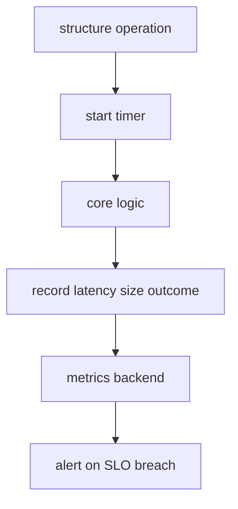
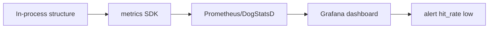
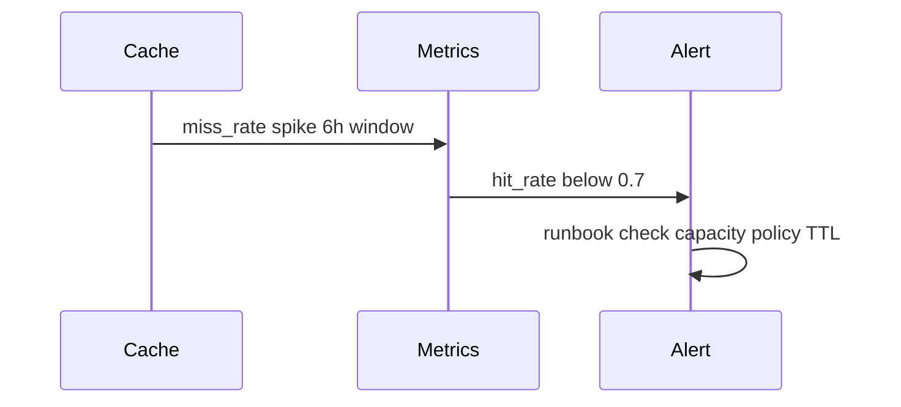

# Measuring Structures in Production

## Overview

Big-O is necessary but insufficient in production. **Measuring structures** means instrumenting hit rates, size distributions, latency percentiles, allocation rates, and eviction reasons for in-memory ADTs—then tying metrics to **SLOs** and structure re-selection triggers from [[04-Data-Structures/14-Production-Selection/Structure Selection Decision Matrix|Structure Selection Decision Matrix]].

Distributed cache/redis metrics live in [[07-Backend/README|Backend]]; here: process-local structures and their observability hooks.

## Learning Objectives

- Define metrics for caches, maps, queues, and probabilistic filters
- Interpret p50/p99 latency vs mean for structure hot paths
- Design dashboards and alerts for structure health
- Run microbenchmarks that reflect production key distributions
- Connect profiling to false sharing and contention notes

## Prerequisites

- [[04-Data-Structures/14-Production-Selection/Structure Selection Decision Matrix|Structure Selection Decision Matrix]]
- [[04-Data-Structures/00-Orientation-and-Contracts/Complexity Tables Amortization and Practical Constants|Complexity Tables Amortization and Practical Constants]]

## Difficulty

`intermediate`

## Estimated Time

- Reading: 2 hours
- Exercises: 2 hours
- Mini project: 3 hours

## History

Performance engineering shifted from lab MFLOPS to **continuous profiling** (Google pprof culture, OpenTelemetry, eBPF). Structure-specific metrics (cache hit ratio) predated generic APM but now integrate into unified observability stacks.

## Problem It Solves

Teams discover too late that LRU hit rate is 12%, hash map rehash spikes p99, or Bloom false-positive rate doubled after traffic growth. Without metrics, structure choices cannot be validated or revised.

## Internal Implementation

### Metric categories

| Structure | Key metrics |
| --- | --- |
| Cache | hit_rate, miss_rate, evictions, size, p99 get/put |
| Hash map | size, load_factor, rehash_events, max_chain/bin (custom) |
| Queue | depth p99, put_block_time, take_wait_time |
| Bloom | insert_count, estimated_fp_rate (sampled negatives) |
| HLL | estimated_cardinality, register saturation |
| Concurrent | lock_wait_time, stripe_contention (custom) |

### Histograms and SLOs

Record latency histograms per operation (`get`, `put`). Alert when p99 > budget or hit_rate < threshold for 24h.

### Sampling overhead

Use counters for hot path; histograms sampled 1–10%; aggregate in background thread.



## Invariants

- **MET1 (Low overhead)**: Instrumentation << operation cost on hot path.
- **MET2 (Consistent labels)**: `structure`, `name`, `op` labels on all series.
- **MET3 (Actionable thresholds)**: Alerts link to runbook and revisit triggers.
- **MET4 (Cardinality control)**: Never label metrics per user_id/key.
- **MET5 (Ground truth checks)**: Periodic exact audit samples for approximate structures.

## Operation Complexity

Instrumentation cost targets:

| Technique | Overhead | Use |
| --- | --- | --- |
| Atomic increment counter | ~ns | hits/misses |
| Reservoir histogram sample | ~ns amortized | latency |
| Full trace span per op | µs-ms | debug only |
| Periodic full scan audit | O(n) rare | Bloom FP calibration |

## Mermaid Diagrams

### Structure: metrics pipeline



### Sequence: cache hit rate alert



## Examples

### Minimal Example

**TypeScript**:

```typescript
type CacheStats = {
  hits: number;
  misses: number;
  evictions: number;
};

export class InstrumentedCache<K, V> {
  stats: CacheStats = { hits: 0, misses: 0, evictions: 0 };

  constructor(private inner: { get(k: K): V | undefined; put(k: K, v: V): void }) {}

  get(key: K): V | undefined {
    const t0 = performance.now();
    const v = this.inner.get(key);
    const dt = performance.now() - t0;
    if (v === undefined) this.stats.misses++;
    else this.stats.hits++;
    this.recordLatency("get", dt);
    return v;
  }

  hitRate(): number {
    const total = this.stats.hits + this.stats.misses;
    return total ? this.stats.hits / total : 0;
  }

  private recordLatency(op: string, ms: number): void {
    // export to OpenTelemetry histogram
    void op;
    void ms;
  }
}
```

**Python**:

```python
import time
from dataclasses import dataclass, field
from typing import Callable, Generic, Optional, TypeVar

K = TypeVar("K")
V = TypeVar("V")

@dataclass
class CacheStats:
    hits: int = 0
    misses: int = 0
    evictions: int = 0
    get_latency_ms: list[float] = field(default_factory=list)

class InstrumentedCache(Generic[K, V]):
    def __init__(self, inner_get, inner_put) -> None:
        self._get_fn = inner_get
        self._put_fn = inner_put
        self.stats = CacheStats()

    def get(self, key: K) -> Optional[V]:
        t0 = time.perf_counter()
        v = self._get_fn(key)
        ms = (time.perf_counter() - t0) * 1000
        if v is None:
            self.stats.misses += 1
        else:
            self.stats.hits += 1
        if len(self.stats.get_latency_ms) < 1000:
            self.stats.get_latency_ms.append(ms)
        return v

    @property
    def hit_rate(self) -> float:
        total = self.stats.hits + self.stats.misses
        return self.stats.hits / total if total else 0.0
```

### Production-Shaped Example

Dashboard panels:

- `cache_hit_rate{service="api"}`
- `cache_size`, `cache_evictions_total`
- `map_rehash_total` (custom hook after resize)
- `queue_depth` gauge from [[04-Data-Structures/13-Concurrency-Aware-Structures/Concurrent Queues|Concurrent Queues]]

Run weekly **load test replay** with anonymized production key sample; compare p99 to prod. Use `perf`/VTune only after metrics localize hotspot—see [[04-Data-Structures/13-Concurrency-Aware-Structures/False Sharing Padding and Contended Counters|False Sharing]].

## Trade-offs

| Dimension | Upside | Downside | When it matters |
| --- | --- | --- | --- |
| Rich metrics | Fast diagnosis | Cardinality/cost | Always label discipline |
| Sampled latency | Low overhead | Miss short spikes | Hot paths |
| Exact FP audit | Calibrate Bloom | CPU | Prob structures |
| Continuous profiling | Deep insight | Privacy/noise | Post-incident |

### When to Use

- Any shared cache or custom structure on critical path
- After structure change in ADR—prove improvement
- Probabilistic structures needing FP/cardinality calibration

### When Not to Use

- Per-key metrics (cardinality explosion)
- Synchronous logging inside lock-free hot loop
- Microbench without production key distribution

## Exercises

1. Define alert thresholds for cache hit_rate given 80% SLA.
2. Add rehash counter to teaching hash map; graph rehash vs latency spike.
3. Estimate Bloom FP by sampling 10k absent keys weekly.
4. Compare mean vs p99 queue depth for sizing bounded buffer.
5. Write runbook section: "hit_rate dropped — checklist".

## Mini Project

Wrap LRU from module 11 with Prometheus-style metrics export.

## Portfolio Project

Structures Workbench production metrics module with grafana json dashboard.

## Interview Questions

1. Metrics proving LRU too small?
2. p99 vs mean for hash map latency?
3. How estimate Bloom false-positive in prod?
4. Cardinality mistake in structure metrics?
5. When microbench misleads?

### Stretch / Staff-Level

1. eBPF vs in-app counters for map latency—trade-offs.
2. SLO error budget linking cache miss to user latency.

## Common Mistakes

- Hit rate without defining hit (peek vs get, negative cache)
- No baseline before structure change
- Alert on mean latency only
- Logging every miss at info in hot path

## Best Practices

- Instrument at ADT wrapper boundary
- Standard label schema across services
- Tie metrics to ADR revisit triggers
- Sample exact audits for approximate structures
- Profile with production-shaped data

## Summary

Production structure validation requires hit rates, sizes, eviction counts, and latency histograms—not just asymptotic analysis. Instrument wrappers with low-overhead counters and sampled histograms; alert against SLOs; audit probabilistic structures periodically. Metrics close the loop from structure selection to continuous improvement.

## Further Reading

- [[00-References/Data Structures/README|Data Structures References]]
- OpenTelemetry metrics semantic conventions
- Brendan Gregg — systems performance measurement

## Related Notes

- [[04-Data-Structures/14-Production-Selection/Structure Selection Decision Matrix|Structure Selection Decision Matrix]]
- [[04-Data-Structures/11-Caches-and-Eviction/Cache ADT Get Put and Capacity|Cache ADT Get Put and Capacity]]
- [[04-Data-Structures/10-Probabilistic-Structures/Bloom Filters|Bloom Filters]]
- [[04-Data-Structures/13-Concurrency-Aware-Structures/False Sharing Padding and Contended Counters|False Sharing Padding and Contended Counters]]
- [[04-Data-Structures/14-Production-Selection/From In-Memory Structures to Systems|From In-Memory Structures to Systems]]

## Progress Checklist

- [ ] Explained from first principles
- [ ] Drew at least one Mermaid diagram
- [ ] Implemented a minimal version
- [ ] Documented trade-offs and non-goals
- [ ] Completed exercises
- [ ] Practiced interview questions aloud
- [ ] Linked prerequisites and dependents
