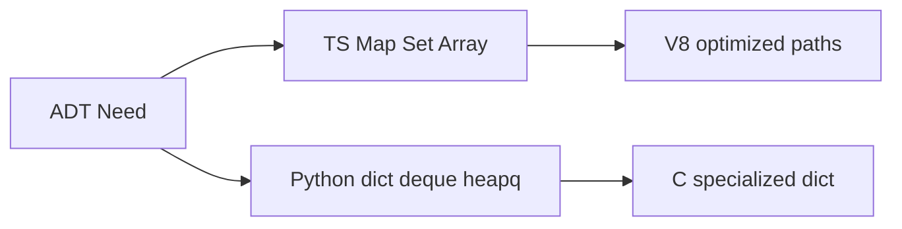
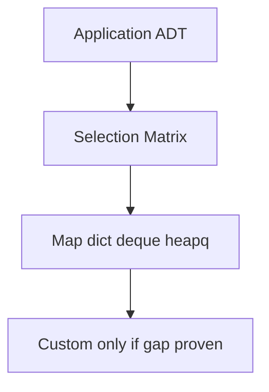
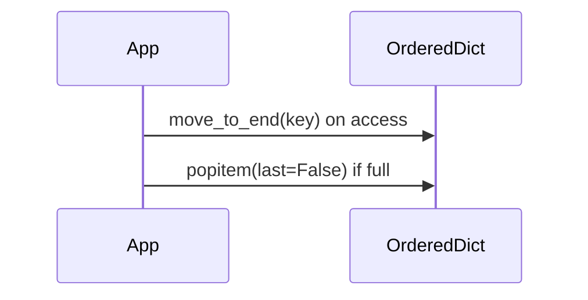

# Standard-Library Mapping for TypeScript and Python

## Overview

Production TypeScript/JavaScript and Python code should **default to standard library** collections unless profiling proves otherwise. This note maps ADTs from modules 00–14 to **built-in and stdlib types**, with complexity, thread-safety reality, and sharp edges.

Node worker threads and Python `threading` change safety assumptions—cross-link [[04-Data-Structures/13-Concurrency-Aware-Structures/Thread-Safety Classes|Thread-Safety Classes]].

## Learning Objectives

- Select `Map`/`Set`/`Array`/`deque`/`heapq` for each ADT need
- Know ES2024+ and Python 3.11+ relevant collection APIs
- Avoid JavaScript object `{}` as map for non-string keys
- Use `OrderedDict`, `dict` insertion order, and LRU patterns correctly
- Identify when to add `immutable.js`, `sortedcontainers`, or native extensions

## Prerequisites

- [[04-Data-Structures/14-Production-Selection/Structure Selection Decision Matrix|Structure Selection Decision Matrix]]
- [[02-JavaScript/README|JavaScript Track]]
- [[03-Python/README|Python Track]]

## Difficulty

`intermediate`

## Estimated Time

- Reading: 2 hours
- Exercises: 2 hours
- Mini project: 2 hours

## History

Python consolidated collections in early 2000s; ES6 (2015) added `Map`/`Set` fixing object-as-map footguns. TypeScript types these without changing runtime semantics.

## Problem It Solves

Reimplementing hash maps and heaps in application code duplicates bugs and misses engine optimizations (V8 inline caches, CPython dict specialization).

## Internal Implementation

### TypeScript / JavaScript mapping

| ADT | Use | Under the hood (engine-dependent) |
| --- | --- | --- |
| Dynamic array | `Array` | Contiguous amortized growth |
| Stack | `Array push/pop` | Same |
| Queue | `Array` shift O(n) or ring index | Prefer deque pattern or dedicated queue |
| Deque | Doubly-linked list lib or ring buffer | No stdlib deque |
| Hash map | `Map` | Hash table |
| Hash set | `Set` | Hash table keys |
| Ordered map | `Map` (insertion order ES2015+) | Not key-sorted; sorted keys separate |
| Priority queue | No stdlib — `heapify` npm or binary heap class | Roll own or dependency |
| Bit set | `Uint8Array` + bit ops | See bitsets note |
| LRU cache | `Map` order + manual evict or `lru-cache` package | Interview impl in module 11 |

### Python mapping

| ADT | Use | Notes |
| --- | --- | --- |
| Dynamic array | `list` | Amortized append |
| Stack/queue | `list` + `collections.deque` | Never `pop(0)` on list for queue |
| Hash map | `dict` | 3.7+ insertion ordered |
| Hash set | `set` | |
| Ordered move LRU | `OrderedDict` or `dict` + `move_to_end` | `move_to_end` 3.2+ OrderedDict |
| Priority queue | `heapq` on list | Min-heap |
| Counter/multiset | `collections.Counter` | |
| Default dict | `collections.defaultdict` | |
| Thread-safe queue | `queue.Queue` | Blocking |
| Immutable-ish | `types.MappingProxyType`, `tuple`, `frozenset` | |
| Typed compact array | `array.array`, `numpy` | Numeric bulk |



## Invariants

- **L1 (Key type)**: JS `Map` allows object keys with reference equality; Python dict requires hashable keys.
- **L2 (Iteration order)**: Insertion order ≠ sorted order; don't confuse for tree map.
- **L3 (Safety)**: Default TS/Py collections not thread-safe across OS threads without wrappers.
- **L4 (Mutation during iterate)**: Python dict size change rules; JS `Map` weakly safe with care.
- **L5 (Number keys)**: JS object keys stringify; use `Map` for number keys.

## Operation Complexity

Engine-optimized; typical expectations:

| Op | JS Map | Python dict | deque | heapq |
| --- | --- | --- | --- | --- |
| get/put | O(1) avg | O(1) avg | — | — |
| push/pop heap | — | — | — | O(log n) |
| deque ends | — | — | O(1) | — |
| shift Array | O(n) | — | — | — |

See [[04-Data-Structures/00-Orientation-and-Contracts/Complexity Tables Amortization and Practical Constants|Complexity Tables]] for amortized analysis.

## Mermaid Diagrams

### Structure: layer from ADT to stdlib



### Sequence: Python LRU with OrderedDict



## Examples

### Minimal Example

**TypeScript**:

```typescript
// Correct: Map for arbitrary keys
const sessions = new Map<string, Session>();

// Priority queue: simple min-heap sketch using array
class MinHeap<T> {
  private a: T[] = [];
  constructor(private less: (a: T, b: T) => boolean) {}
  push(x: T): void {
    this.a.push(x);
    this.bubbleUp(this.a.length - 1);
  }
  pop(): T | undefined {
    if (!this.a.length) return undefined;
    const top = this.a[0];
    const last = this.a.pop()!;
    if (this.a.length) {
      this.a[0] = last;
      this.bubbleDown(0);
    }
    return top;
  }
  private bubbleUp(i: number): void {
    while (i > 0) {
      const p = (i - 1) >> 1;
      if (!this.less(this.a[i], this.a[p])) break;
      [this.a[i], this.a[p]] = [this.a[p], this.a[i]];
      i = p;
    }
  }
  private bubbleDown(i: number): void {
    const n = this.a.length;
    while (true) {
      let s = i;
      const l = 2 * i + 1;
      const r = 2 * i + 2;
      if (l < n && this.less(this.a[l], this.a[s])) s = l;
      if (r < n && this.less(this.a[r], this.a[s])) s = r;
      if (s === i) break;
      [this.a[i], this.a[s]] = [this.a[s], this.a[i]];
      i = s;
    }
  }
}
```

**Python**:

```python
from collections import OrderedDict, deque
import heapq
from typing import Deque, Dict, Generic, Optional, Tuple, TypeVar

K = TypeVar("K")
V = TypeVar("V")

class LRUCache(Generic[K, V]):
    def __init__(self, capacity: int) -> None:
        self.capacity = capacity
        self._data: OrderedDict[K, V] = OrderedDict()

    def get(self, key: K) -> Optional[V]:
        if key not in self._data:
            return None
        self._data.move_to_end(key)
        return self._data[key]

    def put(self, key: K, value: V) -> None:
        if key in self._data:
            self._data.move_to_end(key)
        self._data[key] = value
        if len(self._data) > self.capacity:
            self._data.popitem(last=False)

task_queue: Deque[str] = deque()
schedule: list[Tuple[int, str]] = []
heapq.heappush(schedule, (priority, item))
```

### Production-Shaped Example

Dependencies when stdlib insufficient:

- **`lru-cache`** (npm): TTL + size + dispose callbacks
- **`immutable`** / **Immer**: persistent app state
- **`sortedcontainers`** (PyPI): sorted lists/maps if tree needed in pure Python
- **`bloom-filter`** packages: sized Bloom filters

Document in `package.json`/`requirements.txt` ADR why not stdlib.

## Trade-offs

| Dimension | Upside | Downside | When it matters |
| --- | --- | --- | --- |
| Map vs object | Safe key types | Slightly verbose | Non-string keys |
| list as queue | Simple | O(n) pop(0) | High throughput |
| heapq vs queue.PriorityQueue | Light | Not thread-safe | Single-thread async |
| Third-party | Features | Supply chain | LRU TTL production |

### When to Use

- Default all in-process structures to stdlib until matrix says otherwise
- `deque` for BFS/queue; `heapq` for schedulers
- `Map`/`Set` in TS; `dict`/`set` in Python

### When Not to Use

- `Object` as map for dynamic keys
- `list.pop(0)` as queue at scale
- Reinventing hash map in application layer

## Exercises

1. Rewrite `{}` object cache to `Map`—list key-type bugs avoided.
2. Implement top-K with `heapq.nlargest` vs full sort—benchmark.
3. TS: ring-buffer queue vs Array shift for 100k ops.
4. When is `WeakMap` appropriate? (GC-keyed metadata)
5. Map Python ADT needs in current project file to stdlib types.

## Mini Project

Cheatsheet generator: ADT → TS/Py snippet links for team wiki.

## Portfolio Project

Lint rules: ban `object` as string-key map in TS codebase except JSON literals.

## Interview Questions

1. JS `Map` vs plain object?
2. Python `list` vs `deque` for queue?
3. How `heapq` stores heap in list?
4. Is Python dict ordered? Sorted?
5. Thread-safe queue in Python stdlib?

### Stretch / Staff-Level

1. V8 elements vs dictionary mode for arrays—when slow?
2. CPython dict insertion order implementation impact on LRU?

## Common Mistakes

- Sorting on every read instead of heap/tree
- Assuming JSON.parse object order preserved for logic
- Shared mutable default dict/list in Python function defaults
- TypeScript `Record<string,T>` for non-string keys misconception

## Best Practices

- Use `Map`/`Set`, `dict`/`set`, `deque`, `heapq` first
- Pin third-party structure libs with ADR
- Type generics for keys/values in TS
- Profile before replacing stdlib

## Summary

TypeScript offers `Map`, `Set`, and `Array` as workhorses without a built-in heap or deque—use patterns from this track or vetted packages. Python's `dict`, `deque`, and `heapq` cover most ADTs with mature C implementations. Map ADT needs to stdlib types first; escalate to custom or native structures only with measured justification.

## Further Reading

- [[00-References/Data Structures/README|Data Structures References]]
- MDN Map/Set documentation
- Python collections and heapq docs

## Related Notes

- [[04-Data-Structures/14-Production-Selection/Structure Selection Decision Matrix|Structure Selection Decision Matrix]]
- [[04-Data-Structures/03-Stacks-Queues-and-Deques/Queues|Queues]]
- [[04-Data-Structures/06-Heaps-and-Priority-Queues/Priority Queue ADT|Priority Queue ADT]]
- [[04-Data-Structures/11-Caches-and-Eviction/LRU via Hash Map and Doubly Linked List|LRU via Hash Map and Doubly Linked List]]
- [[04-Data-Structures/13-Concurrency-Aware-Structures/Thread-Safety Classes|Thread-Safety Classes]]

## Progress Checklist

- [ ] Explained from first principles
- [ ] Drew at least one Mermaid diagram
- [ ] Implemented a minimal version
- [ ] Documented trade-offs and non-goals
- [ ] Completed exercises
- [ ] Practiced interview questions aloud
- [ ] Linked prerequisites and dependents
