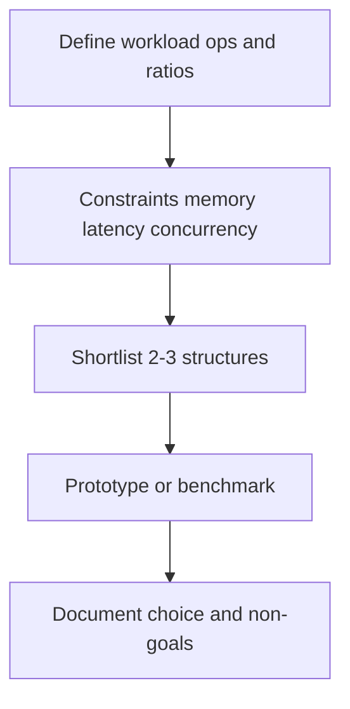
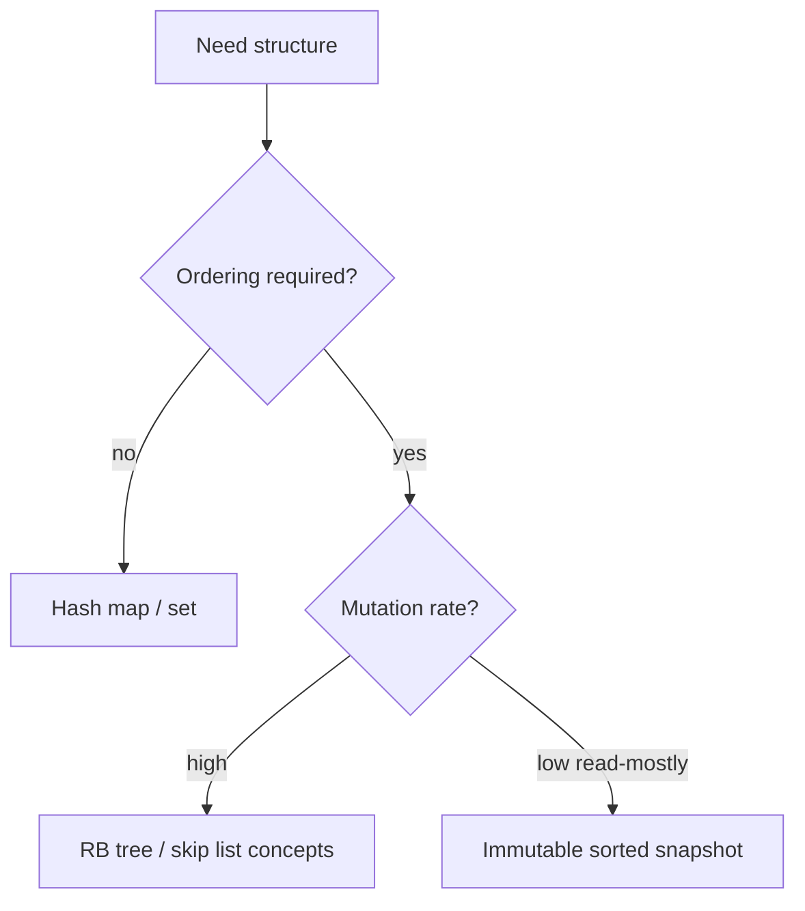
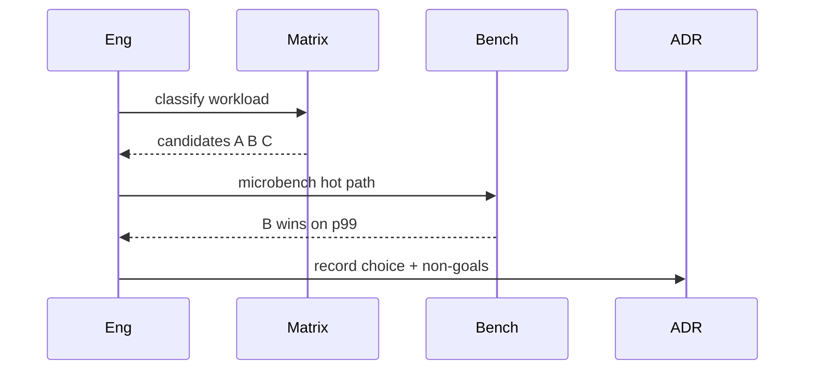

# Structure Selection Decision Matrix

## Overview

Choosing a data structure is an engineering decision—not a memorization exercise. This note consolidates **decision dimensions** and a **matrix** mapping common access patterns to candidate structures with explicit non-goals. It synthesizes modules 00–14; disk engines belong in [[08-Databases/README|Databases]], distributed caches in [[07-Backend/README|Backend]].

Use with [[04-Data-Structures/14-Production-Selection/Standard-Library Mapping for TypeScript and Python|Standard-Library Mapping for TypeScript and Python]] and [[04-Data-Structures/14-Production-Selection/Measuring Structures in Production|Measuring Structures in Production]].

## Learning Objectives

- Apply a repeatable decision workflow: workload → constraints → candidates → measure
- Use the matrix for ordered vs unordered, bounded vs unbounded, concurrent vs confined
- Document non-goals when rejecting a structure
- Relate Big-O to constants, cache locality, and allocation rate
- Produce ADR-quality structure choice for a feature

## Prerequisites

- [[04-Data-Structures/00-Orientation-and-Contracts/Abstract Data Types vs Concrete Structures|Abstract Data Types vs Concrete Structures]]
- [[04-Data-Structures/00-Orientation-and-Contracts/Complexity Tables Amortization and Practical Constants|Complexity Tables Amortization and Practical Constants]]

## Difficulty

`intermediate`

## Estimated Time

- Reading: 2 hours
- Exercises: 2 hours
- Mini project: 3 hours

## History

Knuth and later engineering blogs catalogued structures; production teams added **decision records** when defaults (`HashMap` everywhere) caused latency incidents—ordered scans on hash maps, LRU neglect under scan workloads, etc.

## Problem It Solves

Wrong structure wastes memory, adds latency, or invites subtle bugs (non-thread-safe map under concurrency). A matrix forces explicit **workload questions** before coding.

## Internal Implementation

### Decision workflow



### Primary questions

1. **Ordering** required? (rank, range, sorted iteration)
2. **Key lookup** or **index** access?
3. **Cardinality** and **memory** budget?
4. **Concurrency** model? (confined, read-mostly, shared write)
5. **Durability**? (if yes → leave this track for Databases)
6. **Approximation** acceptable? (Bloom, HLL)

## Invariants

- **M1 (Workload grounded)**: Every choice cites measured or estimated op frequencies.
- **M2 (Non-goals explicit)**: Document rejected alternatives and why.
- **M3 (Revisit trigger)**: Define metric thresholds that force re-selection.
- **M4 (Library first)**: Custom structure only with measured library gap.
- **M5 (Safety class)**: Concurrent access matches [[04-Data-Structures/13-Concurrency-Aware-Structures/Thread-Safety Classes|Thread-Safety Classes]].

## Operation Complexity

The matrix summarizes **dominant operations**—not every op:

| Need | Primary ops | Strong candidates | Avoid |
| --- | --- | --- | --- |
| Key-value, unordered | get/put | Hash map | BST if no order needed |
| Ordered map, range | scan, floor | Tree map, skip list | Hash map alone |
| Priority scheduling | push/pop-min | Binary heap | Sorted array insert |
| FIFO buffer | enqueue/dequeue | Queue, ring buffer | Stack |
| LRU cap cache | get/put + evict | Hash + DLL LRU | FIFO alone under skew |
| Membership at scale, FP OK | mightContain | Bloom filter | Exact set if memory tight |
| Distinct count stream | add/count | HyperLogLog | Exact set billions |
| Immutable history | versioned get | Persistent HAMT, COW | Mutable shared |
| Shared read-mostly | read >> write | Immutable publish | Coarse locked map |
| Shared write-heavy | concurrent put | Concurrent hash map | Plain HashMap |

## Mermaid Diagrams

### Structure: selection by ordering need



### Sequence: team decision process



## Examples

### Minimal Example — decision table excerpt

**TypeScript** — documenting a choice:

```typescript
/**
 * Structure: Map<string, Session> — NOT ordered.
 * Safety: thread-confined per request handler (NOT shared).
 * Revisit if: shared session store needed → Redis (Backend) or ConcurrentHashMap.
 */
type SessionStore = Map<string, Session>;
```

**Python**:

```python
# ADR snippet
# Decision: OrderedDict LRU for in-process cache (capacity 10_000)
# Rejected: @lru_cache — no per-entry TTL
# Rejected: Redis — latency budget < 1ms, single node OK
# Revisit: hit_rate < 0.8 for 24h → evaluate LFU (see LFU concepts note)
```

### Production-Shaped Example

Feature: **top-N trending tags** — updates frequent, need counts + order:

- Candidate A: `HashMap` + sort on read — O(n log n) read
- Candidate B: min-heap size N — O(log N) update
- Candidate C: Count-Min sketch + heap — approximate

Choose B if N small (<1000); measure update QPS and read freshness SLA.

## Trade-offs

| Dimension | Upside | Downside | When it matters |
| --- | --- | --- | --- |
| Matrix vs intuition | Repeatable | Needs workload data | Team scaling |
| Library default | Maintained | Hidden costs | Most apps |
| Custom structure | Tailored | Bug risk | Proven hot path |
| Approx structures | Space/time | Error budget | Scale |

### When to Use

- Design reviews for new hot-path storage
- Refactors when metrics degrade
- Interview system design — justify structure aloud

### When Not to Use

- As substitute for profiling on ambiguous hot path
- Before defining correctness requirements (exact vs approx)

## Exercises

1. Pick structure for: (a) dedup URLs 100M/day FP 1% OK; (b) scheduler; (c) undo stack.
2. Write ADR rejecting hash map for sorted range queries.
3. Given 90% read 10% write shared config—immutable vs concurrent map?
4. When does `Array` beat `LinkedList` despite O(n) insert? (cache locality)
5. Fill matrix row for concurrent job queue bounded 10k.

## Mini Project

Template ADR + matrix checklist integrated into repo `docs/adr/`.

## Portfolio Project

Structure Selection Wizard tool: answer questions → suggested structures + related notes links.

## Interview Questions

1. Hash map vs tree map—decision factors?
2. When Bloom filter over hash set?
3. LRU vs LFU heuristic?
4. Process for choosing structure in production?
5. When custom vs library?

### Stretch / Staff-Level

1. Org-wide policy: when teams allowed custom lock-free structures?
2. Multi-tenant structure selection with noisy neighbor isolation.

## Common Mistakes

- `HashMap` for sorted reports every request
- Unbounded in-memory growth without eviction policy
- Ignoring concurrency safety class
- Big-O only, ignoring constants and allocation

## Best Practices

- Start from ADT requirement, not concrete structure habit
- Benchmark with production-shaped keys and concurrency
- Link ADR to related notes and revisit metrics
- Prefer composition (hash + heap) over monolithic exotic structure

## Summary

Structure selection begins with workload operations, ordering, concurrency, memory, and correctness tolerance. The decision matrix narrows candidates; measurement confirms. Document choices and non-goals in ADRs; escalate to Backend/Databases when durability or distribution crosses process boundaries.

## Further Reading

- [[00-References/Data Structures/README|Data Structures References]]
- [[04-Data-Structures/02-Linked-Structures/Linked vs Contiguous Trade-offs|Linked vs Contiguous Trade-offs]]
- [[04-Data-Structures/04-Hash-Tables-and-Sets/Ordered Maps via Trees vs Hashing|Ordered Maps via Trees vs Hashing]]

## Related Notes

- [[04-Data-Structures/14-Production-Selection/Standard-Library Mapping for TypeScript and Python|Standard-Library Mapping for TypeScript and Python]]
- [[04-Data-Structures/14-Production-Selection/Measuring Structures in Production|Measuring Structures in Production]]
- [[04-Data-Structures/14-Production-Selection/From In-Memory Structures to Systems|From In-Memory Structures to Systems]]
- [[04-Data-Structures/04-Hash-Tables-and-Sets/Ordered Maps via Trees vs Hashing|Ordered Maps via Trees vs Hashing]]
- [[04-Data-Structures/11-Caches-and-Eviction/Cache ADT Get Put and Capacity|Cache ADT Get Put and Capacity]]

## Progress Checklist

- [ ] Explained from first principles
- [ ] Drew at least one Mermaid diagram
- [ ] Implemented a minimal version
- [ ] Documented trade-offs and non-goals
- [ ] Completed exercises
- [ ] Practiced interview questions aloud
- [ ] Linked prerequisites and dependents
