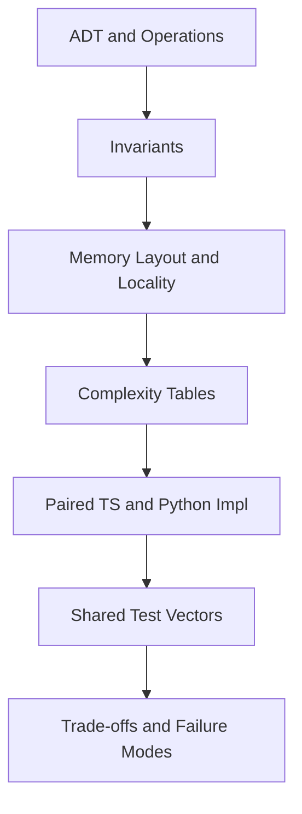
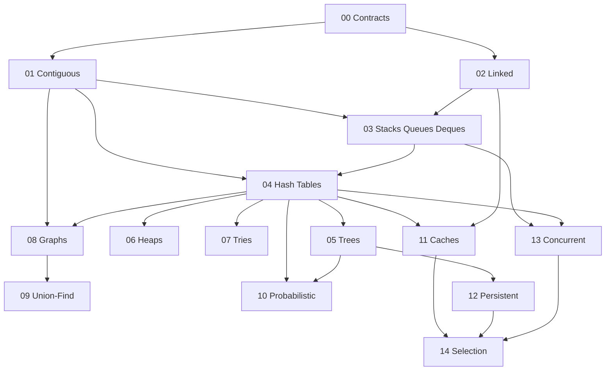

# 04 Data Structures

A first-principles track for understanding data structures as **contracts over memory layout**: ADT operations, invariants, locality, amortized complexity, from-scratch dual TypeScript/Python implementations, and production selection under failure and concurrency constraints.

## Objectives

- Distinguish ADTs from concrete representations
- State and check structural invariants after every mutation
- Reason about worst-case, amortized, and expected complexity with explicit assumptions
- Implement core structures from scratch in TypeScript and Python against shared test vectors
- Choose structures for latency, memory, concurrency, and attack surface
- Hand off algorithms, databases, and service architecture cleanly

## Why This Track Matters

Production systems fail when developers treat `Array`, `dict`, and `HashMap` as magic. Real costs come from pointer chasing, rehashing, tree degeneration, hash flooding, false sharing, and cache eviction policy. This track teaches the shapes underneath libraries so later Algorithms, Backend, and Databases tracks build on solid contracts.

## Teaching Contract

Every topic note follows:

## Scope Boundaries

| This track owns | Handoff |
| --- | --- |
| ADTs, layouts, invariants, amortization for containers | — |
| Arrays, lists, stacks, queues, deques, hash tables, trees, heaps, tries | — |
| Graphs as **representation** (adj list/matrix) | [[05-Algorithms/07-Graph-Traversal-and-DAGs/BFS\|BFS]] / [[05-Algorithms/07-Graph-Traversal-and-DAGs/DFS\|DFS]], [[05-Algorithms/08-Shortest-Paths/Dijkstra with Indexed Heaps\|Dijkstra]], [[05-Algorithms/09-MST-and-Connectivity/Minimum Spanning Tree Contracts and Cut Property\|MST]] |
| Bloom filters, LRU structure, union-find | Backend/System Design for product caching strategies |
| B-tree / B+ **concepts** for fanout and locality | [[08-Databases/README\|Databases]] for pages, WAL, indexes |
| Concurrent structure *classes* and simple guarded variants | CS concurrency foundations; Backend for service patterns |
| Sorting, DP, graph algorithms, interview leetcode catalogs | [[05-Algorithms/03-Sorting/Sorting Contracts Stability and Adaptivity\|Sorting]], [[05-Algorithms/06-Dynamic-Programming/Optimal Substructure and Overlapping Subproblems\|Dynamic Programming]], [[05-Algorithms/13-Production-Selection-and-Interview-Patterns/Interview Pattern Catalog and Complexity Communication\|Interview Patterns]] |
| Redis/Memcached as products, HTTP APIs | [[07-Backend/README\|Backend]] |

## Prerequisites

- [[01-Computer-Science/02-Machine-Model/Cache Hierarchy and Locality|Cache Hierarchy and Locality]]
- [[01-Computer-Science/03-Memory-and-Addressing/Pointers References and Aliasing|Pointers References and Aliasing]]
- [[01-Computer-Science/08-Languages-and-Computation/Computational Complexity Primer|Computational Complexity Primer]]
- [[01-Computer-Science/09-Correctness-and-Reliability/Invariants Assertions and Contracts|Invariants Assertions and Contracts]]
- [[01-Computer-Science/05-Concurrency-Fundamentals/Race Conditions|Race Conditions]] (before concurrency-aware structures)

## Roadmap

## Topics

### 00 — Orientation and Contracts

- [[04-Data-Structures/00-Orientation-and-Contracts/Why Data Structures Exist|Why Data Structures Exist]]
- [[04-Data-Structures/00-Orientation-and-Contracts/Abstract Data Types vs Concrete Structures|Abstract Data Types vs Concrete Structures]]
- [[04-Data-Structures/00-Orientation-and-Contracts/Complexity Tables Amortization and Practical Constants|Complexity Tables Amortization and Practical Constants]]
- [[04-Data-Structures/00-Orientation-and-Contracts/Invariants Representation and Debug Assertions|Invariants Representation and Debug Assertions]]
- [[04-Data-Structures/00-Orientation-and-Contracts/Memory Layout Locality and Allocation Patterns|Memory Layout Locality and Allocation Patterns]]
- [[04-Data-Structures/00-Orientation-and-Contracts/Interface Design Capacity Errors and Iteration|Interface Design Capacity Errors and Iteration]]

### 01 — Contiguous Sequences

- [[04-Data-Structures/01-Contiguous-Sequences/Fixed-Capacity Arrays|Fixed-Capacity Arrays]]
- [[04-Data-Structures/01-Contiguous-Sequences/Dynamic Arrays and Amortized Growth|Dynamic Arrays and Amortized Growth]]
- [[04-Data-Structures/01-Contiguous-Sequences/Multidimensional Arrays and Strides|Multidimensional Arrays and Strides]]
- [[04-Data-Structures/01-Contiguous-Sequences/Bitsets and Compact Boolean Arrays|Bitsets and Compact Boolean Arrays]]
- [[04-Data-Structures/01-Contiguous-Sequences/Ring Buffers as Contiguous Queues|Ring Buffers as Contiguous Queues]]

### 02 — Linked Structures

- [[04-Data-Structures/02-Linked-Structures/Singly Linked Lists|Singly Linked Lists]]
- [[04-Data-Structures/02-Linked-Structures/Doubly Linked Lists and Sentinels|Doubly Linked Lists and Sentinels]]
- [[04-Data-Structures/02-Linked-Structures/Circular Lists and XOR Lists Concepts|Circular Lists and XOR Lists Concepts]]
- [[04-Data-Structures/02-Linked-Structures/Linked vs Contiguous Trade-offs|Linked vs Contiguous Trade-offs]]

### 03 — Stacks Queues and Deques

- [[04-Data-Structures/03-Stacks-Queues-and-Deques/Stacks|Stacks]]
- [[04-Data-Structures/03-Stacks-Queues-and-Deques/Queues|Queues]]
- [[04-Data-Structures/03-Stacks-Queues-and-Deques/Deques|Deques]]
- [[04-Data-Structures/03-Stacks-Queues-and-Deques/Bounded Buffers and Producer-Consumer Interfaces|Bounded Buffers and Producer-Consumer Interfaces]]

### 04 — Hash Tables and Sets

- [[04-Data-Structures/04-Hash-Tables-and-Sets/Hash Functions Avalanche and Equality Contracts|Hash Functions Avalanche and Equality Contracts]]
- [[04-Data-Structures/04-Hash-Tables-and-Sets/Separate Chaining|Separate Chaining]]
- [[04-Data-Structures/04-Hash-Tables-and-Sets/Open Addressing|Open Addressing]]
- [[04-Data-Structures/04-Hash-Tables-and-Sets/Sets Multisets and Map vs Set|Sets Multisets and Map vs Set]]
- [[04-Data-Structures/04-Hash-Tables-and-Sets/Hash-Flooding DoS and Randomized Hashing|Hash-Flooding DoS and Randomized Hashing]]
- [[04-Data-Structures/04-Hash-Tables-and-Sets/Ordered Maps via Trees vs Hashing|Ordered Maps via Trees vs Hashing]]

### 05 — Trees and Ordered Maps

- [[04-Data-Structures/05-Trees-and-Ordered-Maps/Tree Representation and Traversal Contracts|Tree Representation and Traversal Contracts]]
- [[04-Data-Structures/05-Trees-and-Ordered-Maps/Binary Search Trees|Binary Search Trees]]
- [[04-Data-Structures/05-Trees-and-Ordered-Maps/AVL Trees|AVL Trees]]
- [[04-Data-Structures/05-Trees-and-Ordered-Maps/Red-Black Trees Concepts|Red-Black Trees Concepts]]
- [[04-Data-Structures/05-Trees-and-Ordered-Maps/B-Trees and B-Plus Trees Concepts|B-Trees and B-Plus Trees Concepts]]
- [[04-Data-Structures/05-Trees-and-Ordered-Maps/Treaps and Scapegoat Trees Concepts|Treaps and Scapegoat Trees Concepts]]

### 06 — Heaps and Priority Queues

- [[04-Data-Structures/06-Heaps-and-Priority-Queues/Binary Heaps and Array Layout|Binary Heaps and Array Layout]]
- [[04-Data-Structures/06-Heaps-and-Priority-Queues/Priority Queue ADT|Priority Queue ADT]]
- [[04-Data-Structures/06-Heaps-and-Priority-Queues/Decrease-Key and Indexed Heaps|Decrease-Key and Indexed Heaps]]
- [[04-Data-Structures/06-Heaps-and-Priority-Queues/D-ary and Pairing Heaps Concepts|D-ary and Pairing Heaps Concepts]]

### 07 — Tries and Prefix Structures

- [[04-Data-Structures/07-Tries-and-Prefix-Structures/Tries|Tries]]
- [[04-Data-Structures/07-Tries-and-Prefix-Structures/Compressed Tries and Radix Trees|Compressed Tries and Radix Trees]]
- [[04-Data-Structures/07-Tries-and-Prefix-Structures/Ternary Search Trees Concepts|Ternary Search Trees Concepts]]

### 08 — Graphs as Representation

- [[04-Data-Structures/08-Graphs-as-Representation/Graph ADT Vertices Edges and Labels|Graph ADT Vertices Edges and Labels]]
- [[04-Data-Structures/08-Graphs-as-Representation/Adjacency Lists|Adjacency Lists]]
- [[04-Data-Structures/08-Graphs-as-Representation/Adjacency Matrices and Edge Lists|Adjacency Matrices and Edge Lists]]
- [[04-Data-Structures/08-Graphs-as-Representation/Graph Storage Trade-offs and Dynamic Updates|Graph Storage Trade-offs and Dynamic Updates]]
- [[04-Data-Structures/08-Graphs-as-Representation/Implicit Graphs and On-the-Fly Neighbors|Implicit Graphs and On-the-Fly Neighbors]]

### 09 — Disjoint Set

- [[04-Data-Structures/09-Disjoint-Set/Union-Find Structure|Union-Find Structure]]
- [[04-Data-Structures/09-Disjoint-Set/Union by Rank and Path Compression|Union by Rank and Path Compression]]
- [[04-Data-Structures/09-Disjoint-Set/Disjoint-Set Applications as Glue|Disjoint-Set Applications as Glue]]

### 10 — Probabilistic Structures

- [[04-Data-Structures/10-Probabilistic-Structures/Bloom Filters|Bloom Filters]]
- [[04-Data-Structures/10-Probabilistic-Structures/Counting Bloom and Cuckoo Filters Concepts|Counting Bloom and Cuckoo Filters Concepts]]
- [[04-Data-Structures/10-Probabilistic-Structures/HyperLogLog Concepts|HyperLogLog Concepts]]
- [[04-Data-Structures/10-Probabilistic-Structures/Skip Lists|Skip Lists]]

### 11 — Caches and Eviction

- [[04-Data-Structures/11-Caches-and-Eviction/Cache ADT Get Put and Capacity|Cache ADT Get Put and Capacity]]
- [[04-Data-Structures/11-Caches-and-Eviction/LRU via Hash Map and Doubly Linked List|LRU via Hash Map and Doubly Linked List]]
- [[04-Data-Structures/11-Caches-and-Eviction/LFU Clock and Segmented LRU Concepts|LFU Clock and Segmented LRU Concepts]]
- [[04-Data-Structures/11-Caches-and-Eviction/TTL Soft References and Coalesced Expiry|TTL Soft References and Coalesced Expiry]]

### 12 — Persistent and Immutable

- [[04-Data-Structures/12-Persistent-and-Immutable/Persistence Structural Sharing and Path Copying|Persistence Structural Sharing and Path Copying]]
- [[04-Data-Structures/12-Persistent-and-Immutable/Persistent Vectors and Maps Concepts|Persistent Vectors and Maps Concepts]]
- [[04-Data-Structures/12-Persistent-and-Immutable/Copy-on-Write and In-Process Snapshots|Copy-on-Write and In-Process Snapshots]]
- [[04-Data-Structures/12-Persistent-and-Immutable/Immutability for Concurrent Readers|Immutability for Concurrent Readers]]

### 13 — Concurrency-Aware Structures

- [[04-Data-Structures/13-Concurrency-Aware-Structures/Thread-Safety Classes|Thread-Safety Classes]]
- [[04-Data-Structures/13-Concurrency-Aware-Structures/Concurrent Queues|Concurrent Queues]]
- [[04-Data-Structures/13-Concurrency-Aware-Structures/Concurrent Hash Maps Concepts|Concurrent Hash Maps Concepts]]
- [[04-Data-Structures/13-Concurrency-Aware-Structures/False Sharing Padding and Contended Counters|False Sharing Padding and Contended Counters]]
- [[04-Data-Structures/13-Concurrency-Aware-Structures/Read-Copy-Update and Epoch Concepts|Read-Copy-Update and Epoch Concepts]]

### 14 — Production Selection

- [[04-Data-Structures/14-Production-Selection/Structure Selection Decision Matrix|Structure Selection Decision Matrix]]
- [[04-Data-Structures/14-Production-Selection/Standard-Library Mapping for TypeScript and Python|Standard-Library Mapping for TypeScript and Python]]
- [[04-Data-Structures/14-Production-Selection/Measuring Structures in Production|Measuring Structures in Production]]
- [[04-Data-Structures/14-Production-Selection/From In-Memory Structures to Systems|From In-Memory Structures to Systems]]

## Suggested Study Order

1. Contracts (00) before implementing anything beyond arrays
2. Contiguous + Linked before stacks/queues
3. Hash tables before Bloom and LRU
4. Trees/heaps/tries after hashing foundations
5. Graphs as representation before Algorithms traversals
6. Concurrency-aware structures only after CS race/lock notes
7. Production selection and portfolio as synthesis

## Mini Projects

- [[04-Data-Structures/projects/Dynamic Array and Arena Lab/README|Dynamic Array and Arena Lab]]
- [[04-Data-Structures/projects/Hash Map Bake-Off/README|Hash Map Bake-Off]]
- [[04-Data-Structures/projects/Ordered Map Clinic/README|Ordered Map Clinic]]
- [[04-Data-Structures/projects/Graph Store CLI/README|Graph Store CLI]]
- [[04-Data-Structures/projects/Probabilistic Membership Lab/README|Probabilistic Membership Lab]]

## Portfolio Project

- [[04-Data-Structures/projects/Structures Workbench/README|Structures Workbench]]

## Exercises

Module sets live under [[04-Data-Structures/_exercises/README|Data Structures Exercises]].

## Interview Questions

Module sets live under [[04-Data-Structures/_interview/README|Data Structures Interview Questions]].

## Implementation Checklist

- [x] Shared JSON vectors + schema
- [x] Dynamic array, bitset, ring buffer (TS + Python)
- [x] Singly + doubly linked lists
- [x] Stack / queue / deque
- [x] Hash map chaining + open addressing + set
- [x] BST + AVL
- [x] Binary heap + indexed heap
- [x] Trie + radix tree
- [x] Graph adj list / matrix builders
- [x] Union-Find
- [x] Bloom filter
- [x] LRU cache
- [x] Persistent path-copying structure
- [x] Mutex-safe map + bounded concurrent queue
- [x] Five mini projects + Structures Workbench

## Code Labs

See [[04-Data-Structures/code/README|Data Structures code labs]].

## References

- [[00-References/Data Structures/README|Data Structures References]]

## Related Tracks

- [[01-Computer-Science/README|Computer Science]]
- [[02-JavaScript/README|JavaScript]]
- [[03-Python/README|Python]]
- [[05-Algorithms/README|Algorithms]]
- [[07-Backend/README|Backend]]
- [[08-Databases/README|Databases]]
- [[09-System-Design/README|System Design]]

## Stage Gate Checklist

- [ ] Can state invariants and complexity assumptions for each core ADT
- [ ] Can explain locality differences between contiguous and linked layouts
- [ ] Dual-language labs green against shared vectors
- [ ] Can choose structures under memory, latency, concurrency, and DoS constraints
- [ ] At least three mini projects and portfolio docs completed
- [ ] Interview sets practiced with diagrams and production failure modes
