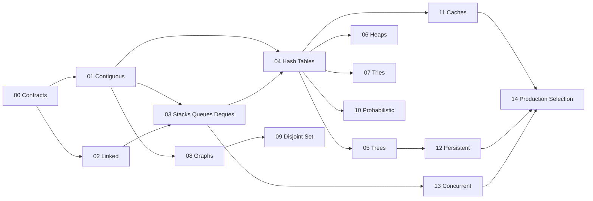

# Data Structures Exercises

Fifteen module sets move from ADT contracts through paired TypeScript/Python implementations, measurement, invariant debugging, and production selection.

## Learning Path

## Exercise Sets

1. [[04-Data-Structures/_exercises/Orientation and Contracts Exercises.md|Orientation and Contracts Exercises]] — separate adt contracts from concrete representations, complexity assumptions, and invariants before touching implementations
2. [[04-Data-Structures/_exercises/Contiguous Sequences Exercises.md|Contiguous Sequences Exercises]] — master fixed and dynamic contiguous layouts, strides, bitsets, and ring buffers as the locality baseline for the track
3. [[04-Data-Structures/_exercises/Linked Structures Exercises.md|Linked Structures Exercises]] — practice pointer-based sequences, sentinel nodes, and the locality trade-offs against contiguous storage
4. [[04-Data-Structures/_exercises/Stacks Queues and Deques Exercises.md|Stacks Queues and Deques Exercises]] — implement lifo, fifo, and double-ended adts with explicit overflow/underflow contracts and bounded-buffer semantics
5. [[04-Data-Structures/_exercises/Hash Tables and Sets Exercises.md|Hash Tables and Sets Exercises]] — build and defend hash maps and sets under chaining, open addressing, equality contracts, and adversarial load
6. [[04-Data-Structures/_exercises/Trees and Ordered Maps Exercises.md|Trees and Ordered Maps Exercises]] — maintain search-tree invariants, traversals, and self-balancing concepts for ordered maps under mutation
7. [[04-Data-Structures/_exercises/Heaps and Priority Queues Exercises.md|Heaps and Priority Queues Exercises]] — use array-backed heaps and indexed variants for priority queues, decrease-key, and scheduling workloads
8. [[04-Data-Structures/_exercises/Tries and Prefix Structures Exercises.md|Tries and Prefix Structures Exercises]] — model prefix search with tries, compressed radix trees, and ternary search tree trade-offs
9. [[04-Data-Structures/_exercises/Graphs as Representation Exercises.md|Graphs as Representation Exercises]] — choose adjacency lists, matrices, and edge lists for sparse vs dense graphs and dynamic updates
10. [[04-Data-Structures/_exercises/Disjoint Set Exercises.md|Disjoint Set Exercises]] — implement union-find with rank and path compression as connectivity glue for algorithms and services
11. [[04-Data-Structures/_exercises/Probabilistic Structures Exercises.md|Probabilistic Structures Exercises]] — engineer approximate membership and rank structures with explicit false-positive budgets and seed contracts
12. [[04-Data-Structures/_exercises/Caches and Eviction Exercises.md|Caches and Eviction Exercises]] — combine hash maps with eviction policies (lru, lfu concepts, ttl) under capacity and latency constraints
13. [[04-Data-Structures/_exercises/Persistent and Immutable Exercises.md|Persistent and Immutable Exercises]] — build path-copying and structural-sharing structures for snapshots, rollback, and concurrent readers
14. [[04-Data-Structures/_exercises/Concurrency-Aware Structures Exercises.md|Concurrency-Aware Structures Exercises]] — classify thread-safety guarantees and implement guarded or lock-free variants without breaking adt contracts
15. [[04-Data-Structures/_exercises/Production Selection Exercises.md|Production Selection Exercises]] — synthesize structure choice, stdlib mapping, measurement, and system boundaries under real operational constraints

## Completion Standard

- State ADT contracts, invariants, and complexity assumptions before coding.
- Implement against shared JSON vectors in [[04-Data-Structures/code/README|code labs]] with TS/Python parity.
- Measure before optimizing; preserve a correctness oracle and document layout assumptions.
- Debug drills must formalize invariants, minimal repro, and regression vectors.
- Production scenarios include telemetry, migration, rollback, and failure modes.

## Related Notes

- [[04-Data-Structures/README|Data Structures]]
- [[04-Data-Structures/code/README|code labs]]
- [[04-Data-Structures/_interview/README|Data Structures Interview Questions]]
- [[Career/README|Career]]
