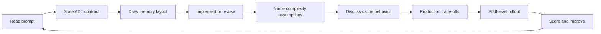

# Data Structures Interview Questions

Fifteen interview sets assess ADT contracts, memory layout, implementation mechanics, complexity assumptions, locality, production judgment, and staff-level structure selection.

## Practice Loop

## Interview Sets

1. [[04-Data-Structures/_interview/Orientation and Contracts Interview.md|Orientation and Contracts Interview]]
2. [[04-Data-Structures/_interview/Contiguous Sequences Interview.md|Contiguous Sequences Interview]]
3. [[04-Data-Structures/_interview/Linked Structures Interview.md|Linked Structures Interview]]
4. [[04-Data-Structures/_interview/Stacks Queues and Deques Interview.md|Stacks Queues and Deques Interview]]
5. [[04-Data-Structures/_interview/Hash Tables and Sets Interview.md|Hash Tables and Sets Interview]]
6. [[04-Data-Structures/_interview/Trees and Ordered Maps Interview.md|Trees and Ordered Maps Interview]]
7. [[04-Data-Structures/_interview/Heaps and Priority Queues Interview.md|Heaps and Priority Queues Interview]]
8. [[04-Data-Structures/_interview/Tries and Prefix Structures Interview.md|Tries and Prefix Structures Interview]]
9. [[04-Data-Structures/_interview/Graphs as Representation Interview.md|Graphs as Representation Interview]]
10. [[04-Data-Structures/_interview/Disjoint Set Interview.md|Disjoint Set Interview]]
11. [[04-Data-Structures/_interview/Probabilistic Structures Interview.md|Probabilistic Structures Interview]]
12. [[04-Data-Structures/_interview/Caches and Eviction Interview.md|Caches and Eviction Interview]]
13. [[04-Data-Structures/_interview/Persistent and Immutable Interview.md|Persistent and Immutable Interview]]
14. [[04-Data-Structures/_interview/Concurrency-Aware Structures Interview.md|Concurrency-Aware Structures Interview]]
15. [[04-Data-Structures/_interview/Production Selection Interview.md|Production Selection Interview]]

## Evaluation Standard

- Contract answers define operations, errors, iteration, and invariants.
- Internals answers explain layout and hot paths without treating library behavior as specification.
- Coding answers cover edge cases, shared vectors, and debug checks.
- Complexity answers label worst, average, amortized, and assumptions.
- Locality answers connect layout to cache lines, allocation, and contention.
- Production answers include misuse telemetry, migration, and attack surface.
- Staff-level answers connect standards, evidence, and phased deprecation.

## Related Notes

- [[Career/README|Career]]
- [[04-Data-Structures/_exercises/README|Data Structures Exercises]]
- [[04-Data-Structures/code/README|code labs]]
- [[04-Data-Structures/README|Data Structures]]
