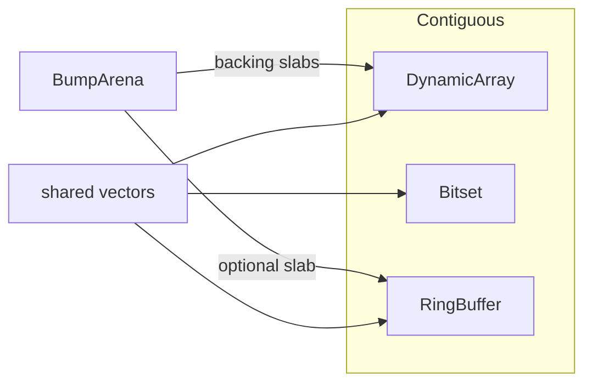
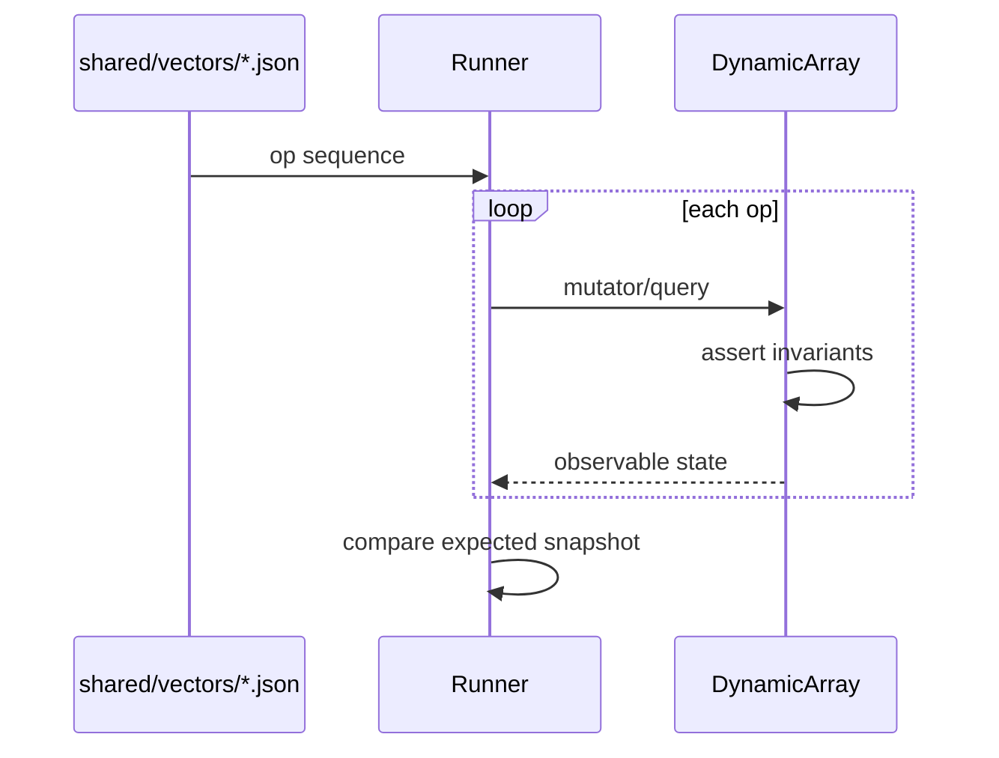

# Architecture — Dynamic Array and Arena Lab

## Summary

Three contiguous ADTs plus a bump arena share one vector-runner contract. Source of truth: [[04-Data-Structures/code/README|code labs]]. Tests consume shared JSON; implementations assert invariants in debug helpers.

## Components

| Component | Responsibility | Backing |
| --- | --- | --- |
| `DynamicArray` | Amortized append, indexed access, optional insert/delete | Heap buffer or arena slab |
| `Bitset` | Compact boolean membership, rank/select hooks optional | Word-aligned bit array |
| `RingBuffer` | Fixed-capacity FIFO with head/tail indices | Contiguous array |
| `BumpArena` | Sequential bump alloc, O(1) reset | One or more byte slabs |
| Instrumentation | Resize count, bytes copied, peak capacity | Side channel for benchmarks |

## Invariants

**DynamicArray**

- `0 ≤ size ≤ capacity`
- Elements in `[0, size)` are initialized; `[size, capacity)` is logically uninitialized
- After `reserve(n)`, `capacity ≥ max(size, n)`
- Growth only on append/insert when `size == capacity` (unless explicit shrink API)

**Bitset**

- `length` bits; word storage covers `ceil(length / wordSize)` words
- `test(i)` false for unset; out-of-range is error, not silent false

**RingBuffer**

- `count ≤ capacity`; head/tail indices in `[0, capacity)`
- Empty: `count == 0`; full: `count == capacity`
- Push when full follows configured overflow policy (default reject)

**BumpArena**

- Alloc cursor monotonic within a slab until reset
- Reset invalidates all prior arena pointers (documented UB if used after reset)

## Data Flow — Vector Runner

## Growth and Locality

Default growth factor: **2×** (see [[04-Data-Structures/projects/Structures Workbench/ADR/ADR-001 Growth Factor|ADR-001]]). Alternative 1.5× is benchmarked but not default—trades memory slack for more frequent copies.

Contiguous layout favors scan-heavy workloads; front-insert/delete remains O(n) and is out of scope for optimization in this lab.

## Failure Model

| Failure | Behavior |
| --- | --- |
| Index out of range | Synchronous error with stable type |
| Ring buffer overflow (reject policy) | `OverflowError` / domain error |
| Arena exhausted | Fail alloc; no implicit growth in v1 |
| Resize beyond configured max | Fail before allocation |

No silent truncation. Callers own cleanup outside in-process structures.

## Trade-offs

| Choice | Upside | Downside |
| --- | --- | --- |
| Doubling growth | Fewer resizes | Up to ~50% memory slack |
| Arena bump alloc | Fast batch alloc, cache-friendly | No individual free; reset is coarse |
| Reject on ring full | Clear correctness | Requires sizing or backpressure upstream |
| Instrumentation hooks | Workbench metrics | Minor overhead in hot paths |

## Evolution Rules

- Shared vector semantics change only with schema version bump and dual-language updates.
- Add failing vector case before fixing invariant bugs.
- Shrink-to-fit and SSO are stretch goals—document if added.

## Related Documents

- [[04-Data-Structures/projects/Dynamic Array and Arena Lab/README|README]]
- [[04-Data-Structures/projects/Dynamic Array and Arena Lab/Testing|Testing]]
- [[04-Data-Structures/projects/Structures Workbench/Architecture|Structures Workbench Architecture]]
