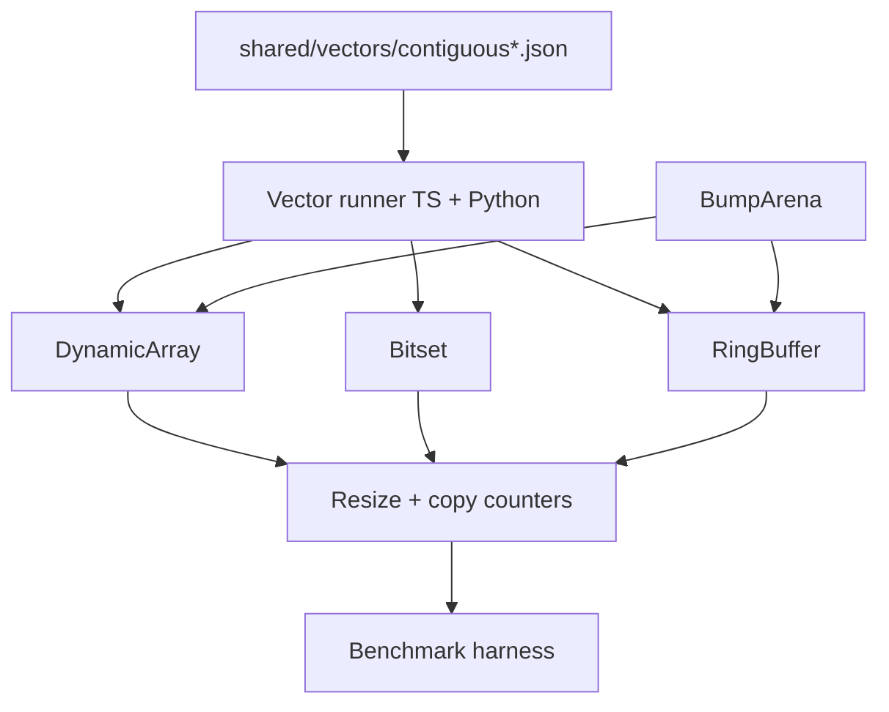

# Dynamic Array and Arena Lab

## One-Line Purpose

Build instrumented contiguous-sequence implementations—dynamic array, bitset, ring buffer, and a bump arena allocator—to internalize amortized growth, locality, capacity errors, and allocation patterns.

## Status

**Active.** Implementations live in [[04-Data-Structures/code/README|Data Structures code labs]] under contiguous modules; this folder documents scope, invariants, and acceptance tied to shared JSON vectors.

## Prerequisites

- [[04-Data-Structures/01-Contiguous-Sequences/Dynamic Arrays and Amortized Growth|Dynamic Arrays and Amortized Growth]]
- [[04-Data-Structures/01-Contiguous-Sequences/Fixed-Capacity Arrays|Fixed-Capacity Arrays]]
- [[04-Data-Structures/01-Contiguous-Sequences/Bitsets and Compact Boolean Arrays|Bitsets and Compact Boolean Arrays]]
- [[04-Data-Structures/01-Contiguous-Sequences/Ring Buffers as Contiguous Queues|Ring Buffers as Contiguous Queues]]
- [[04-Data-Structures/00-Orientation-and-Contracts/Memory Layout Locality and Allocation Patterns|Memory Layout Locality and Allocation Patterns]]
- [[04-Data-Structures/00-Orientation-and-Contracts/Complexity Tables Amortization and Practical Constants|Complexity Tables Amortization and Practical Constants]]

## Architecture



Read [[04-Data-Structures/projects/Dynamic Array and Arena Lab/Architecture|Architecture]] for invariants, growth policy, and failure boundaries.

## Acceptance Criteria

- [ ] `DynamicArray`, `Bitset`, and `RingBuffer` pass shared vectors in both TypeScript (Vitest) and Python (pytest).
- [ ] Growth factor, load thresholds, and `reserve` behavior match documented ADR defaults in [[04-Data-Structures/projects/Structures Workbench/ADR/ADR-001 Growth Factor|ADR-001 Growth Factor]].
- [ ] Debug builds assert representation invariants after every mutator (size ≤ capacity, ring head/tail consistency, bit index bounds).
- [ ] Arena allocations are bump-only; reset/reclaim semantics are explicit and tested—no hidden free-list in v1.
- [ ] Overflow and empty/full errors use stable error types documented in [[04-Data-Structures/00-Orientation-and-Contracts/Interface Design Capacity Errors and Iteration|Interface Design Capacity Errors and Iteration]].
- [ ] Instrumentation exports resize count, bytes copied, and peak capacity for Workbench integration.

## Run and Test

From the repository root:

```bash
cd 04-Data-Structures/code/typescript
npm install
npm test -- -t "DynamicArray|Bitset|RingBuffer"

cd ../python
python -m pip install -e ".[dev]"
python -m pytest -q -k "dynamic_array or bitset or ring_buffer"
```

Shared operation sequences: `04-Data-Structures/code/shared/vectors/` (schema in `shared/schema.json`). Keep experiments in `04-Data-Structures/code/`; this directory is documentation only.

## Benchmarks

| Scenario | Metric | Compare |
| --- | --- | --- |
| 1M `push_back` cold start | total copies, resize events | growth 1.5× vs 2× |
| 1M `push_back` with `reserve(n)` | resize events | reserved vs naive |
| Ring buffer producer/consumer | overflow rate, cache misses (optional perf) | fixed vs dynamic capacity |
| Bitset `set/test` scan | ns/op vs `boolean[]` | density win threshold |
| Arena batch alloc + reset | alloc count vs system heap | arena vs naive vector growth |

Publish histograms (resize sizes, copy bytes) as JSON artifacts for [[04-Data-Structures/projects/Structures Workbench/README|Structures Workbench]] import.

## Security and Failure Constraints

- Treat vector length and arena capacity as **resource ceilings**; reject or fail fast when inputs exceed configured maxima (CLI/lab default: document limit in tests).
- No parsing of untrusted binary blobs into structures without explicit size caps—prevents memory exhaustion in classroom demos.
- Ring buffer overflow policy must be explicit (`reject`, `overwrite-oldest`, or `expand`); default is **reject** for correctness labs.
- Iterator invalidation: document that references across `resize` are undefined; tests must not rely on stale views.

## Exercises and Reflection

1. Prove aggregate O(n) copy work for n appends with doubling growth.
2. Implement `insert(i, x)` and measure worst-case shifts vs linked list prepend.
3. Compare arena reset vs individual frees for a parse-then-discard workload.

**Reflection prompts**

- Which invariant did shared vectors *not* exercise (e.g., shrink-to-fit, concurrent access)?
- When would a 1.5× growth factor violate an latency SLO that 2× tolerates?
- How does bump-arena reset change your API design for nested parsers?

## Interview Questions

- Why is `push_back` amortized O(1) but worst-case O(n)?
- When should you call `reserve` in production?
- What breaks if you hold a reference to internal storage across `resize`?

## Related Notes

- [[04-Data-Structures/projects/Dynamic Array and Arena Lab/Architecture|Architecture]]
- [[04-Data-Structures/projects/Dynamic Array and Arena Lab/Testing|Testing]]
- [[04-Data-Structures/projects/Dynamic Array and Arena Lab/Security|Security]]
- [[04-Data-Structures/README|Data Structures MOC]]
- [[04-Data-Structures/code/README|Data Structures Code Labs]]
- [[04-Data-Structures/projects/Structures Workbench/README|Structures Workbench]]
- [[Career/README|Career]]
