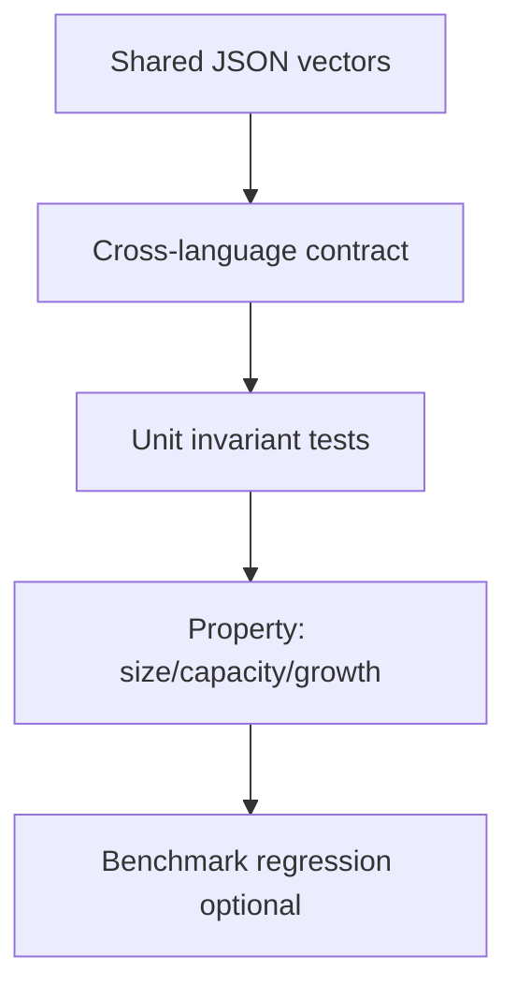

# Testing — Dynamic Array and Arena Lab

## Strategy



## Layers

| Layer | Focus |
| --- | --- |
| Contract | Identical outcomes for `shared/vectors/contiguous*.json` in TS and Python |
| Unit | Edge cases: empty, single element, full ring, bit boundaries |
| Property | Random append/pop sequences preserve invariants |
| Negative | Out-of-range, overflow, arena exhaustion |

## Critical Paths

1. Dynamic array: append, indexed get/set, rehash after load threshold, `reserve`
2. Bitset: set/clear/test at word boundaries
3. Ring buffer: wraparound push/pop, empty dequeue error, full enqueue error
4. Arena: sequential alloc, reset invalidates, slab exhaustion

## Commands

```bash
cd 04-Data-Structures/code/typescript && npm test -- -t "DynamicArray|Bitset|RingBuffer"
cd 04-Data-Structures/code/python && python -m pytest -q -k "dynamic_array or bitset or ring_buffer"
```

## Definition of Done

- [ ] Both language suites green on shared vectors
- [ ] Invariant assertions enabled in debug/test builds
- [ ] Failure modes asserted, not only happy path
- [ ] Benchmark fixtures checked in without flaky wall-clock thresholds

## Related Documents

- [[04-Data-Structures/projects/Dynamic Array and Arena Lab/README|README]]
- [[04-Data-Structures/code/README|Code Labs]]
