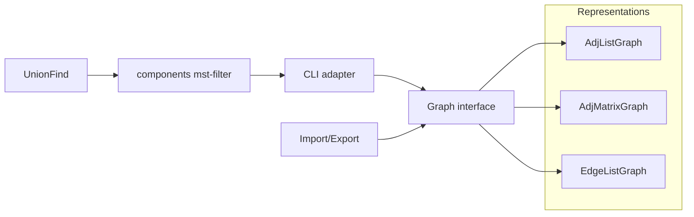
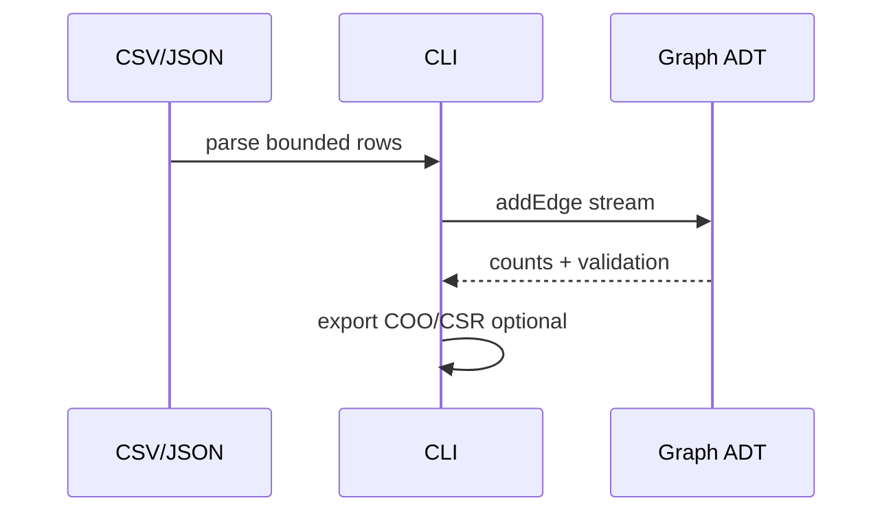

# Architecture — Graph Store CLI

## Summary

Graph **representation** lab with thin CLI. Algorithms (shortest path, traversal, MST solvers) are out of scope—only storage, import/export, and DSU glue.

## Graph ADT

| Operation | Semantics |
| --- | --- |
| `addVertex(id)` | Idempotent add |
| `addEdge(u,v,w?)` | Directed/undirected per config |
| `removeEdge(u,v)` | No-op or error if missing—document |
| `neighbors(v)` | Iterable adjacency |
| `hasEdge(u,v)` | Boolean membership |
| `vertexCount` / `edgeCount` | O(1) or documented cost |

## Representation Notes

**Adjacency list**: `Map<Vertex, DynamicArray<Neighbor>>` or vector of vectors—best for sparse graphs.

**Adjacency matrix**: `n × n` bit or weight matrix—O(1) `hasEdge`, O(n²) memory.

**Edge list**: COO array of tuples—compact import, slow neighbor queries unless augmented.

## Import / Export Pipeline

Matrix auto-build only when `n ≤ N_MAX_MATRIX` (document constant, e.g., 5000).

## DSU Glue Commands

- `components`: stream edges into Union-Find; output component count and optional partition labels.
- `mst-filter`: filter edges that would be rejected by Kruskal-style DSU walk—**not** a full MST proof or optimized heap queue.

## Failure Model

- Unknown vertex on edge add: auto-create or error—pick one globally
- Import over limits: fail before alloc
- Benchmark mode: warm-up runs excluded from reported metrics

## Trade-offs

| Rep | Best for | Avoid when |
| --- | --- | --- |
| List | Sparse, neighbor iteration | Very dense `hasEdge` heavy |
| Matrix | Dense, O(1) edge test | Large sparse n |
| Edge list | Streaming ingest | Frequent neighbor queries |

## Related Documents

- [[04-Data-Structures/projects/Graph Store CLI/README|README]]
- [[04-Data-Structures/08-Graphs-as-Representation/Graph Storage Trade-offs and Dynamic Updates|Graph Storage Trade-offs]]
