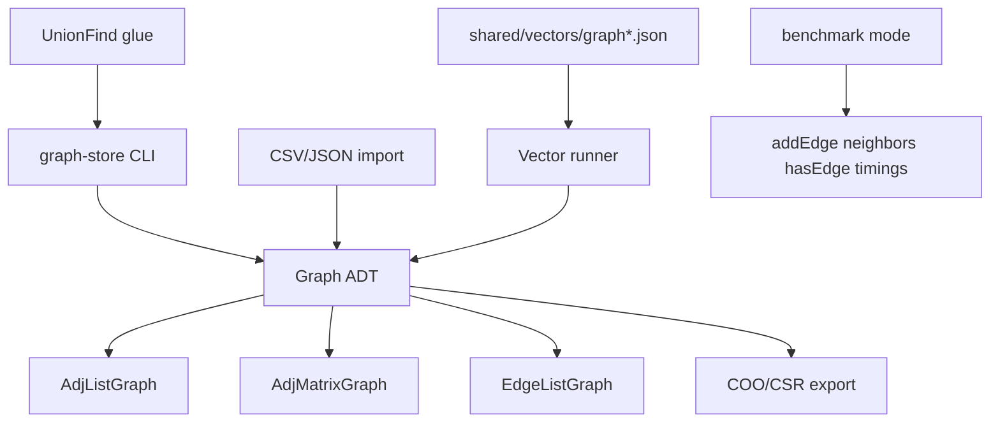

# Graph Store CLI

## One-Line Purpose

Implement a graph **storage** CLI with swappable adjacency list, adjacency matrix, and edge-list representations—import/export, neighbor queries, and representation benchmarks—without shipping a full graph **algorithm** suite (that belongs in [[05-Algorithms/07-Graph-Traversal-and-DAGs/BFS|BFS]]/[[05-Algorithms/07-Graph-Traversal-and-DAGs/DFS|DFS]] and [[05-Algorithms/08-Shortest-Paths/Dijkstra with Indexed Heaps|Dijkstra]]).

## Status

**Active.** Graph modules target [[04-Data-Structures/code/README|code labs]] (`AdjListGraph`, `AdjMatrixGraph`); CLI wraps ADT operations and benchmark modes.

## Prerequisites

- [[04-Data-Structures/08-Graphs-as-Representation/Graph ADT Vertices Edges and Labels|Graph ADT Vertices Edges and Labels]]
- [[04-Data-Structures/08-Graphs-as-Representation/Adjacency Lists|Adjacency Lists]]
- [[04-Data-Structures/08-Graphs-as-Representation/Adjacency Matrices and Edge Lists|Adjacency Matrices and Edge Lists]]
- [[04-Data-Structures/08-Graphs-as-Representation/Graph Storage Trade-offs and Dynamic Updates|Graph Storage Trade-offs and Dynamic Updates]]
- [[04-Data-Structures/09-Disjoint-Set/Union-Find Structure|Union-Find Structure]] (connectivity glue subcommand)
- [[04-Data-Structures/01-Contiguous-Sequences/Dynamic Arrays and Amortized Growth|Dynamic Arrays and Amortized Growth]]

## Architecture



See [[04-Data-Structures/projects/Graph Store CLI/Architecture|Architecture]].

## Acceptance Criteria

- [ ] Graph ADT conformance tests shared across all three representations.
- [ ] Operations: `addVertex`, `addEdge`, `removeEdge`, `neighbors`, `hasEdge`, `vertexCount`, `edgeCount`.
- [ ] Import sample edge list CSV; export COO/CSR when `n` within matrix threshold.
- [ ] Benchmark mode runs same workload on three backends; JSON report with ns/op per operation class.
- [ ] `components` subcommand uses [[04-Data-Structures/09-Disjoint-Set/Union-Find Structure|Union-Find]] on edge stream—not BFS/DFS algorithm library.
- [ ] Optional `mst-filter` uses DSU edge filter only; full MST algorithms deferred to Algorithms track.
- [ ] Shared graph vectors pass in TypeScript and Python.

## Run and Test

```bash
cd 04-Data-Structures/code/typescript
npm install
npm test -- -t "AdjListGraph|AdjMatrixGraph|GraphStore"

cd ../python
python -m pip install -e ".[dev]"
python -m pytest -q -k "adj_list or adj_matrix or graph_store"
```

CLI (target): `graph-store import`, `neighbors`, `benchmark --rep=list|matrix|edge`, `components`.

**Explicitly excluded**: Redis graph modules, disk storage engines, distributed graph services, Dijkstra/BFS/DFS suites—see [[07-Backend/README|Backend]], [[08-Databases/README|Databases]], [[05-Algorithms/08-Shortest-Paths/Dijkstra with Indexed Heaps|Dijkstra]], [[05-Algorithms/07-Graph-Traversal-and-DAGs/BFS|BFS]]/[[05-Algorithms/07-Graph-Traversal-and-DAGs/DFS|DFS]].

## Benchmarks

| Operation | Sparse graph | Dense graph | Metric |
| --- | --- | --- | --- |
| addEdge | social web snapshot | clique near n | ns/op, alloc count |
| neighbors(v) | low degree | high degree | ns/op |
| hasEdge(u,v) | — | — | list vs matrix crossover |
| removeVertex | dynamic updates | — | compaction cost |
| build from edge list | 1M edges | — | import time by rep |

Use same SNAP sample subset across reps; publish crossover `n`/`m` where matrix wins vs list.

## Security and Failure Constraints

- Cap `|V|`, `|E|`, and import file size before allocation.
- Reject malformed CSV rows with line-level errors—no partial silent graph.
- Label strings bounded length; no code execution from import formats.
- Implicit/on-the-fly neighbor generators (maze mode) must document max expansion steps.

## Exercises and Reflection

1. Implement CSR builder from edge list and compare memory vs adjacency list.
2. Find density threshold where matrix `hasEdge` beats list scan.
3. Stream edges into Union-Find without building full adjacency structure.

**Reflection prompts**

- Which representation would you pick for a live social feed vs static road network?
- What breaks when you need frequent `removeVertex` on adjacency matrix?
- Why keep algorithm code out of this storage CLI?

## Interview Questions

- Adjacency list vs matrix space and time trade-offs?
- When use edge list as primary store?
- How does Union-Find help connectivity without BFS?

## Related Notes

- [[04-Data-Structures/projects/Graph Store CLI/Architecture|Architecture]]
- [[04-Data-Structures/projects/Graph Store CLI/Testing|Testing]]
- [[04-Data-Structures/projects/Graph Store CLI/Security|Security]]
- [[04-Data-Structures/README|Data Structures MOC]]
- [[04-Data-Structures/code/README|Data Structures Code Labs]]
- [[04-Data-Structures/projects/Structures Workbench/README|Structures Workbench]]
- [[Career/README|Career]]
