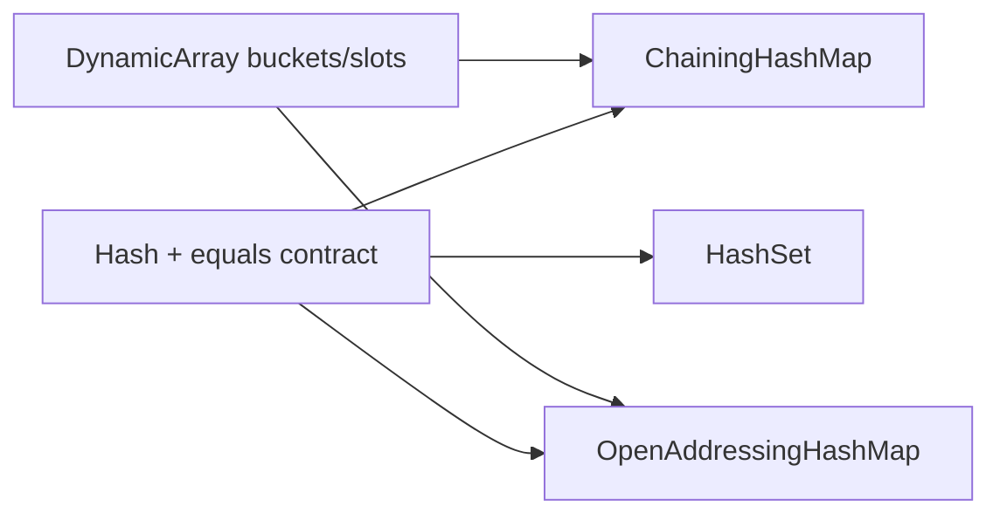
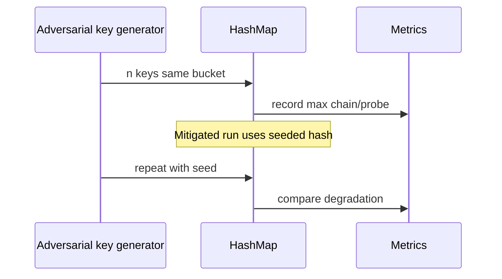

# Architecture — Hash Map Bake-Off

## Summary

Two concrete map representations plus a set facade share hash/equality contracts and a benchmark harness. Decision record: [[04-Data-Structures/projects/Structures Workbench/ADR/ADR-002 Hash Collision Strategy|ADR-002 Hash Collision Strategy]].

## Components

| Component | Representation | Resize trigger |
| --- | --- | --- |
| `ChainingHashMap` | Array of buckets → collision chains | load > maxLoad (default 0.75) |
| `OpenAddressingHashMap` | Single slot array, linear/quadratic probe | load > maxLoad |
| `HashSet` | Same table without values | shared with map core |
| `HashMetrics` | Probes, chain depth, chi-squared | read-only side channel |

## Invariants

- `size` equals count of live entries
- Load factor `size / capacity ≤ maxLoad` except transiently during rehash
- Every stored key `k`: `slotIndex = hash(k) mod capacity` (with probing rules for OA)
- Rehash reinserts **all** entries with new modulus—never reuse stale indices
- Iterator visits each live entry exactly once per full scan

## Probe and Chain Semantics

**Chaining**: bucket index `hash(k) % m`; collision resolved by linked list or dynamic-array bucket; lookup compares hash then `equals`.

**Open addressing**: on collision, probe `(i + p) % m` until empty or match; delete uses tombstone or backshift policy—pick one and document.

## Adversarial Workload Path

## Failure Model

| Condition | Response |
| --- | --- |
| Missing key on get | Optional/absent per ADT contract |
| Table at max configured capacity | Fail insert with explicit error |
| Invalid hash/equals contract | Debug assert; test vectors use stable types |
| Iterator during structural mutation | Undefined unless documented snapshot iterator |

## Trade-offs

| Strategy | Strength | Weakness |
| --- | --- | --- |
| Chaining | Simple delete, graceful degradation | Pointer chasing, cache misses |
| Open addressing | Better locality, no bucket alloc | Clustering, tombstone complexity |
| Uniform hash only | Deterministic tests | Vulnerable to flooding |
| Seeded hash | Mitigates adversarial keys | Non-deterministic across runs unless seed fixed |

## Related Documents

- [[04-Data-Structures/projects/Hash Map Bake-Off/README|README]]
- [[04-Data-Structures/projects/Hash Map Bake-Off/Security|Security]]
- [[04-Data-Structures/projects/Structures Workbench/ADR/ADR-002 Hash Collision Strategy|ADR-002]]
