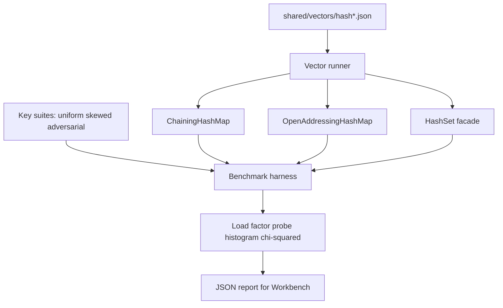

# Hash Map Bake-Off

## One-Line Purpose

Compare separate chaining and open addressing hash maps—and set/multiset facades—under uniform, skewed, and adversarial key workloads while measuring probe depth, rehash cost, and hash-quality metrics.

## Status

**Active.** Core implementations target [[04-Data-Structures/code/README|code labs]] modules `ChainingHashMap`, `OpenAddressingHashMap`, and `HashSet`; this folder defines benchmarks, security scenarios, and acceptance against shared vectors.

## Prerequisites

- [[04-Data-Structures/04-Hash-Tables-and-Sets/Hash Functions Avalanche and Equality Contracts|Hash Functions Avalanche and Equality Contracts]]
- [[04-Data-Structures/04-Hash-Tables-and-Sets/Separate Chaining|Separate Chaining]]
- [[04-Data-Structures/04-Hash-Tables-and-Sets/Open Addressing|Open Addressing]]
- [[04-Data-Structures/04-Hash-Tables-and-Sets/Sets Multisets and Map vs Set|Sets Multisets and Map vs Set]]
- [[04-Data-Structures/04-Hash-Tables-and-Sets/Hash-Flooding DoS and Randomized Hashing|Hash-Flooding DoS and Randomized Hashing]]
- [[04-Data-Structures/01-Contiguous-Sequences/Dynamic Arrays and Amortized Growth|Dynamic Arrays and Amortized Growth]]

## Architecture



See [[04-Data-Structures/projects/Hash Map Bake-Off/Architecture|Architecture]] for collision strategy and rehash contracts.

## Acceptance Criteria

- [ ] Chaining and open-addressing maps pass shared hash vectors in TypeScript and Python.
- [ ] `HashSet` shares hash core with map; multiset counts optional stretch.
- [ ] Rehash preserves all entries; load-factor threshold triggers resize exactly as documented.
- [ ] Delete paths maintain invariants (tombstones or backshift per implementation).
- [ ] Adversarial key suite produces measurable probe/chain degradation without mitigation; mitigated run uses seeded/randomized hashing per [[04-Data-Structures/projects/Structures Workbench/ADR/ADR-002 Hash Collision Strategy|ADR-002]].
- [ ] Benchmark exports: p50/p95 probe length, max chain, rehash count, chi-squared bucket uniformity.

## Run and Test

```bash
cd 04-Data-Structures/code/typescript
npm install
npm test -- -t "ChainingHashMap|OpenAddressing|HashSet"

cd ../python
python -m pip install -e ".[dev]"
python -m pytest -q -k "chaining or open_addressing or hash_set"
```

Benchmark entry point (when added): `04-Data-Structures/code/shared/bench/hash_bakeoff.ts` / `.py`. Vectors: `04-Data-Structures/code/shared/vectors/`.

## Benchmarks

| Workload | Variants | Primary metrics |
| --- | --- | --- |
| 1M uniform inserts + lookups | chaining vs open addressing | ns/op, rehash count |
| 1M inserts same bucket (adversarial) | naive hash vs seeded hash | max chain / max probe |
| Mixed insert/delete (50/50) | tombstone density (OA) | probe p95 after deletes |
| Set membership only | map facade vs dedicated set | memory bytes, lookup ns |
| Iterator full scan | bucket order vs insertion order | allocations per step |

Compare against [[04-Data-Structures/14-Production-Selection/Standard-Library Mapping for TypeScript and Python|stdlib maps]] as reference only—not pass/fail.

## Security and Failure Constraints

- **Hash-flooding**: include adversarial key generator; document mitigation checklist (random seed per process, SipHash-style hash, treeified bins—concept note only).
- Cap table size and key length before insert from untrusted JSON/CLI.
- Equality must be consistent with hash: if `a.equals(b)` then `hash(a)==hash(b)`.
- No unbounded rehash loops—validate load-factor config in tests.

## Exercises and Reflection

1. Derive expected chain length at load factor α = 1 under simple uniform hashing.
2. Implement delete for open addressing and measure tombstone clustering.
3. Plot probe-length histogram before/after randomized hashing on adversarial keys.

**Reflection prompts**

- Which failure mode does chaining hide that open addressing exposes under delete-heavy workloads?
- When would you accept higher memory for chaining despite worse cache locality?
- How does hash-flooding differ from ordinary collision spikes?

## Interview Questions

- What is load factor and typical rehash threshold?
- Why is delete harder in open addressing than chaining?
- How does Java treeify bins relate to hash-flooding mitigation?

## Related Notes

- [[04-Data-Structures/projects/Hash Map Bake-Off/Architecture|Architecture]]
- [[04-Data-Structures/projects/Hash Map Bake-Off/Testing|Testing]]
- [[04-Data-Structures/projects/Hash Map Bake-Off/Security|Security]]
- [[04-Data-Structures/README|Data Structures MOC]]
- [[04-Data-Structures/code/README|Data Structures Code Labs]]
- [[04-Data-Structures/projects/Structures Workbench/README|Structures Workbench]]
- [[Career/README|Career]]
