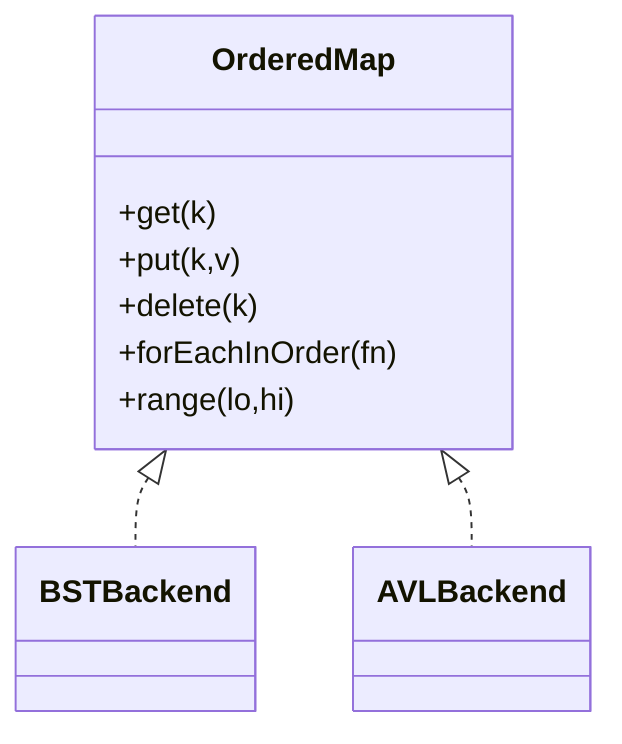
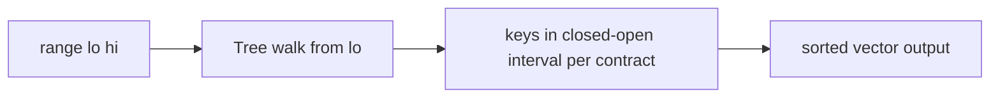

# Architecture — Ordered Map Clinic

## Summary

Pluggable backends behind one ordered-map ADT. Default balanced backend: AVL ([[04-Data-Structures/projects/Structures Workbench/ADR/ADR-003 Balanced Tree Default|ADR-003]]).

## ADT Contract

| Operation | Complexity (AVL) | Notes |
| --- | --- | --- |
| get/put/delete | O(log n) | BST worst O(n) on skew |
| min/max | O(log n) | or O(n) BST degenerate |
| forEachInOrder | O(n) | in-order walk |
| range | O(log n + k) | k = output size |

Keys totally ordered by comparator; duplicate policy: overwrite value (document).

## BST Backend

Unbalanced binary search tree for baseline. Invariants: left < node < right (per comparator). No balance repair.

## AVL Backend

Maintains balance factor ∈ {−1, 0, 1} for every node. Rotations on insert/delete restore AVL property. Optional trace hook emits rotation sequence for teaching exports.

## Range Query Flow

## Failure Model

- Missing key: absent optional or error per interface enum
- Comparator inconsistency: debug assert
- Depth limit exceeded (CLI guard): abort with diagnostic

## Trade-offs

| Backend | Pros | Cons |
| --- | --- | --- |
| BST | Simple code, fast on random inserts | Degenerates on sorted input |
| AVL | Stricter balance, predictable depth | More rotations on some patterns |
| Hash + sort | O(1) point ops | O(n log n) for ordered range |

Red-black implementation excluded from labs—compare traces via concepts note only.

## Related Documents

- [[04-Data-Structures/projects/Ordered Map Clinic/README|README]]
- [[04-Data-Structures/projects/Structures Workbench/ADR/ADR-003 Balanced Tree Default|ADR-003]]
