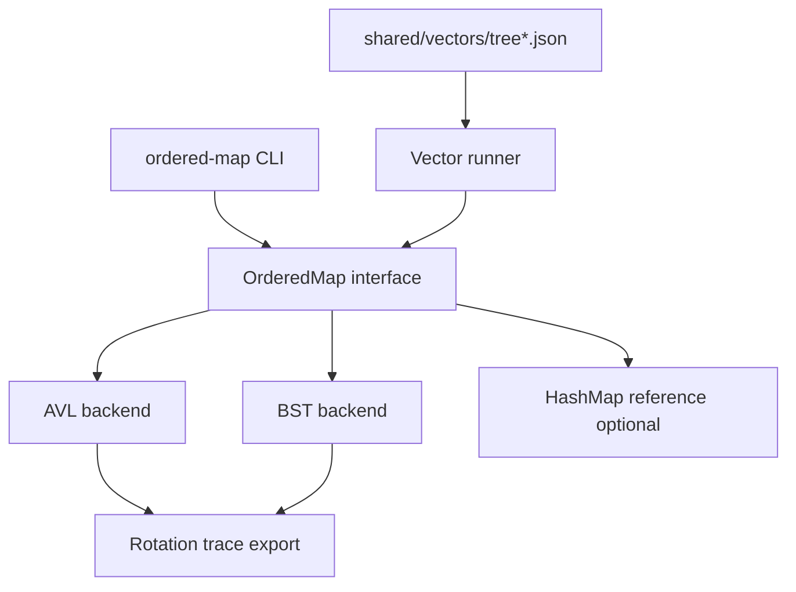

# Ordered Map Clinic

## One-Line Purpose

Build a swappable ordered-map CLI and library surface—BST baseline and AVL balanced backend—to compare point lookups, ordered iteration, and range dumps against hashed unordered maps.

## Status

**Active.** Tree modules target [[04-Data-Structures/code/README|code labs]] (`BST`, `AVL`); red-black remains a **concepts-only** trace comparison per curriculum notes.

## Prerequisites

- [[04-Data-Structures/05-Trees-and-Ordered-Maps/Binary Search Trees|Binary Search Trees]]
- [[04-Data-Structures/05-Trees-and-Ordered-Maps/AVL Trees|AVL Trees]]
- [[04-Data-Structures/05-Trees-and-Ordered-Maps/Tree Representation and Traversal Contracts|Tree Representation and Traversal Contracts]]
- [[04-Data-Structures/05-Trees-and-Ordered-Maps/Red-Black Trees Concepts|Red-Black Trees Concepts]]
- [[04-Data-Structures/04-Hash-Tables-and-Sets/Ordered Maps via Trees vs Hashing|Ordered Maps via Trees vs Hashing]]

## Architecture



Details: [[04-Data-Structures/projects/Ordered Map Clinic/Architecture|Architecture]].

## Acceptance Criteria

- [ ] `OrderedMap` API: `get`, `put`, `delete`, `min`, `max`, `forEachInOrder`, `range(from, to)`.
- [ ] BST and AVL backends pass shared tree vectors in TypeScript and Python.
- [ ] AVL maintains height balance invariant; debug asserts after mutators.
- [ ] CLI flag `--backend=bst|avl` produces identical observable results on non-degenerate vectors.
- [ ] Rotation trace export (JSON) available for AVL inserts on teaching subset.
- [ ] Range dump returns keys in sorted order with documented tie-breaking.

## Run and Test

```bash
cd 04-Data-Structures/code/typescript
npm install
npm test -- -t "BST|AVL|OrderedMap"

cd ../python
python -m pip install -e ".[dev]"
python -m pytest -q -k "bst or avl or ordered_map"
```

CLI (target): `04-Data-Structures/code/cli/ordered-map` — `put`, `get`, `range`, `--backend`.

## Benchmarks

| Scenario | Backends | Metrics |
| --- | --- | --- |
| 100k random inserts | BST vs AVL | height, rotations, ns/op |
| 100k sorted inserts (degenerate) | BST vs AVL | height, worst lookup depth |
| 10k range scans width w | AVL vs hash sort | keys returned, time |
| Mixed insert/delete | AVL | rebalance count |

Compare ordered iteration vs `HashMap` + sort for range queries—document crossover point.

## Security and Failure Constraints

- Cap tree size from untrusted CLI/JSON input.
- Degenerate BST on adversarial sorted input is a **teaching feature**—label latency risk; AVL is the production-shaped default per [[04-Data-Structures/projects/Structures Workbench/ADR/ADR-003 Balanced Tree Default|ADR-003]].
- No recursion depth unbounded on huge trees in CLI—prefer iterative traversals or depth limits.

## Exercises and Reflection

1. Export AVL rotation trace for insert sequence `[1..16]`.
2. Implement `range(lo, hi)` without full tree walk.
3. Compare RB trace (concepts note) vs AVL on identical inserts.

**Reflection prompts**

- When is O(log n) tree worse than O(1) hash for your workload?
- What invariant does AVL enforce that BST only achieves in expectation?
- How would you expose ordering in a concurrent map without global lock?

## Interview Questions

- BST vs AVL vs red-black—what trade-off does each optimize?
- Cost of in-order traversal vs hash map keys + sort?
- When use `TreeMap` vs `HashMap` in production?

## Related Notes

- [[04-Data-Structures/projects/Ordered Map Clinic/Architecture|Architecture]]
- [[04-Data-Structures/projects/Ordered Map Clinic/Testing|Testing]]
- [[04-Data-Structures/projects/Ordered Map Clinic/Security|Security]]
- [[04-Data-Structures/README|Data Structures MOC]]
- [[04-Data-Structures/code/README|Data Structures Code Labs]]
- [[04-Data-Structures/projects/Structures Workbench/README|Structures Workbench]]
- [[Career/README|Career]]
