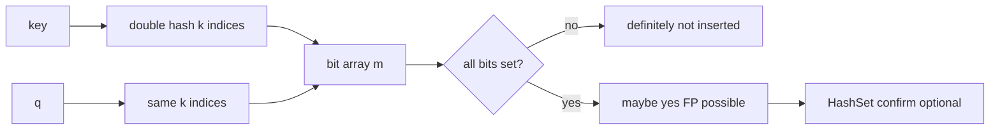
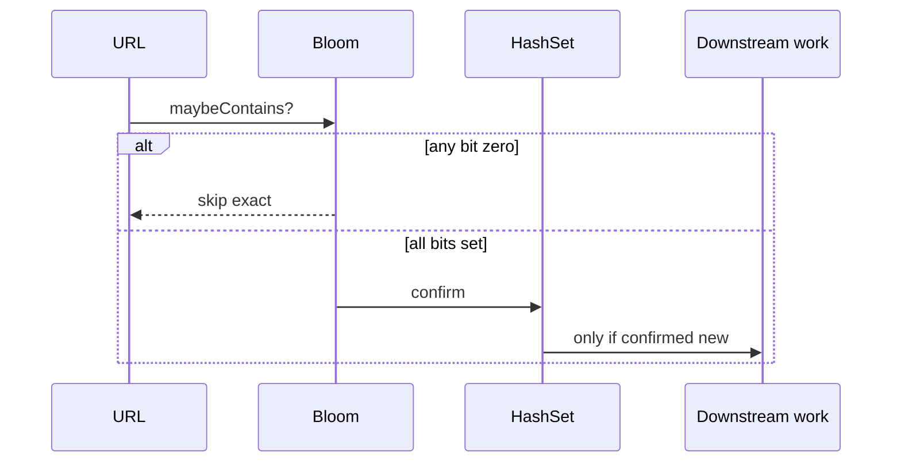

# Architecture — Probabilistic Membership Lab

## Summary

Bloom filter as approximate set membership with exact set verification path for production-shaped demos.

## BloomFilter Component

| Field | Role |
| --- | --- |
| `bits[m]` | Bit array storage |
| `k` | Number of hash functions (via double hashing) |
| `n_plan` | Planned insert count for sizing |
| `p_target` | Target false-positive rate |

Sizing: choose `m` and `k` from standard formulas for `(n_plan, p_target)`.

## Operations

- `add(key)`: set all `k` bits
- `maybeContains(key)`: true iff all `k` bits set
- `insertCount`: tracked inserts (may exceed `n_plan`)

**No delete** in v1—clearing bits introduces false negatives.

## Two-Tier Crawler Demo

## Invariants

- If `maybeContains(k)` is false, `k` was never added (insert-only, no delete)
- After add, `maybeContains` true for same key
- Independent hash bases for double hashing; seeds documented for tests

## Failure Model

- Key/hash failure: synchronous error
- Insert beyond planned capacity: allowed but FP rate degrades—surface metric warning
- Exact tier required when false positive causes user-visible incorrect behavior

## Trade-offs

| Structure | Memory | Correctness | Delete |
| --- | --- | --- | --- |
| Bloom | Low | One-sided error | No (v1) |
| HashSet | High | Exact | Yes |
| Counting Bloom | Higher | Exact delete possible | Complex |

HyperLogLog cardinality stays concept-only in this lab.

## Related Documents

- [[04-Data-Structures/projects/Probabilistic Membership Lab/README|README]]
- [[04-Data-Structures/10-Probabilistic-Structures/Bloom Filters|Bloom Filters]]
