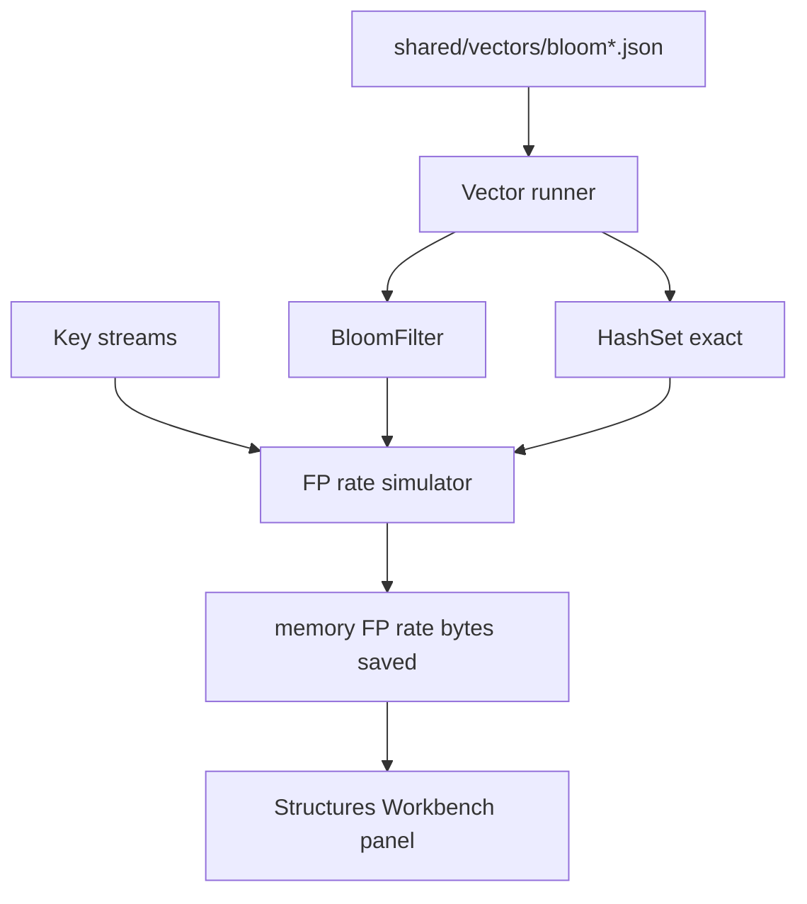

# Probabilistic Membership Lab

## One-Line Purpose

Implement and compare Bloom filters against exact hash sets for membership prefilter workloads—measuring false-positive rate, memory footprint, and when probabilistic answers require downstream verification.

## Status

**Active.** Bloom module targets [[04-Data-Structures/code/README|code labs]] (`BloomFilter`); counting Bloom and cuckoo filters remain concept extensions.

## Prerequisites

- [[04-Data-Structures/10-Probabilistic-Structures/Bloom Filters|Bloom Filters]]
- [[04-Data-Structures/10-Probabilistic-Structures/Counting Bloom and Cuckoo Filters Concepts|Counting Bloom and Cuckoo Filters Concepts]]
- [[04-Data-Structures/10-Probabilistic-Structures/HyperLogLog Concepts|HyperLogLog Concepts]]
- [[04-Data-Structures/04-Hash-Tables-and-Sets/Hash Functions Avalanche and Equality Contracts|Hash Functions Avalanche and Equality Contracts]]
- [[04-Data-Structures/04-Hash-Tables-and-Sets/Sets Multisets and Map vs Set|Sets Multisets and Map vs Set]]

## Architecture



See [[04-Data-Structures/projects/Probabilistic Membership Lab/Architecture|Architecture]].

## Acceptance Criteria

- [ ] Bloom filter passes shared vectors in TypeScript and Python.
- [ ] Parameters `m` (bits), `k` (hashes), planned `n` documented at construction.
- [ ] **No false negatives** on insert-only workload (no delete in v1).
- [ ] Empirical FP rate within tolerance of theoretical `p` for random keys at planned `n`.
- [ ] Double-hashing generates `k` indices from two base hashes.
- [ ] Two-tier demo: Bloom prefilter + exact set confirmation; log FP rate and bytes saved.
- [ ] Counting Bloom / delete explicitly marked stretch—document false-negative risk if bits cleared.

## Run and Test

```bash
cd 04-Data-Structures/code/typescript
npm install
npm test -- -t "BloomFilter"

cd ../python
python -m pip install -e ".[dev]"
python -m pytest -q -k "bloom"
```

URL-seen-filter demo (target): `04-Data-Structures/code/demos/url_seen_filter/`.

## Benchmarks

| Scenario | Structures | Metrics |
| --- | --- | --- |
| 5M URL hashes planned n=5M p=0.01 | Bloom vs HashSet | bytes, ns lookup |
| Insert beyond planned n | Bloom saturation | FP rate drift |
| Lookup mix 90% negative | Bloom only | ns/op vs exact |
| Crawler two-tier | Bloom + Set | confirmed FP rate, DB queries saved |

Report theoretical vs empirical FP with chi-squared or Wilson interval.

## Security and Failure Constraints

- Bloom answers are **non-authoritative**—never use as sole access control gate without exact verification.
- Size bit array from planned `(n, p)` with checked arithmetic; reject overflow in `m * k`.
- Do not expose Bloom "maybe present" as "definitely present" in CLI output wording.
- Saturation when inserts exceed planned `n`: warn and recommend rebuild.

## Exercises and Reflection

1. Compute optimal `m` and `k` for `n=1_000_000`, `p=0.01`.
2. Demonstrate false negative after naive bit clear on delete.
3. Design deploy strategy: rebuild Bloom on version change while exact set warms.

**Reflection prompts**

- When is a false positive acceptable if downstream work is cheap?
- Why cannot Bloom replace a hash set for authorization?
- How does saturation differ from hash collision spikes?

## Interview Questions

- False positives vs false negatives in Bloom filters?
- How do `m`, `k`, and `n` relate to FP probability?
- When use counting Bloom vs rebuild?

## Related Notes

- [[04-Data-Structures/projects/Probabilistic Membership Lab/Architecture|Architecture]]
- [[04-Data-Structures/projects/Probabilistic Membership Lab/Testing|Testing]]
- [[04-Data-Structures/projects/Probabilistic Membership Lab/Security|Security]]
- [[04-Data-Structures/README|Data Structures MOC]]
- [[04-Data-Structures/code/README|Data Structures Code Labs]]
- [[04-Data-Structures/projects/Structures Workbench/README|Structures Workbench]]
- [[Career/README|Career]]
