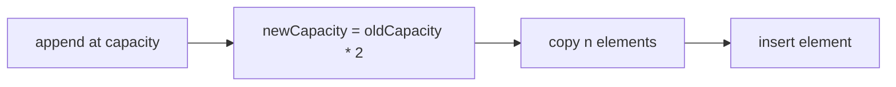

# ADR-001: Dynamic Array Growth Factor

## Status

Accepted on 2026-07-21.

## Context

Dynamic arrays, hash table bucket arrays, and ring buffer expansion all rely on geometric growth. The growth factor trades **memory slack** against **copy frequency** and tail latency spikes. Labs must pick one default so shared vectors and benchmarks are comparable across TypeScript and Python.

## Decision

Use **2× geometric growth** as the default expansion factor for `DynamicArray` and hash table backing arrays in Workbench modules. Document **1.5×** as an alternative benchmark profile in [[04-Data-Structures/projects/Dynamic Array and Arena Lab/README|Dynamic Array and Arena Lab]]—not the default contract.

Initial capacity: **8** elements (or 8 buckets) unless `reserve` specifies otherwise.

## Alternatives Considered

| Option | Pros | Cons |
| --- | --- | --- |
| 2× growth | Fewer resizes; standard teaching default | Up to ~50% unused capacity |
| 1.5× growth | Lower memory slack | More frequent O(n) copies |
| Fixed increment | Simple | Amortized cost degrades; not used |
| Adaptive policy | Tunes to workload | Harder cross-language parity |

## Consequences

- Shared vectors assume 2× rehash/resize thresholds unless tagged `growthPolicy: "1.5"`.
- Benchmarks comparing policies must label results explicitly.
- `reserve(n)` remains the escape hatch for known batch sizes.
- Amortized analysis in notes references doubling unless otherwise stated.

## Follow-ups

- Expose `growthPolicy` in instrumentation JSON for teaching mode.
- Add vector cases that assert resize events at predicted boundaries.

## Related Documents

- [[04-Data-Structures/01-Contiguous-Sequences/Dynamic Arrays and Amortized Growth|Dynamic Arrays and Amortized Growth]]
- [[04-Data-Structures/projects/Structures Workbench/Architecture|Architecture]]
