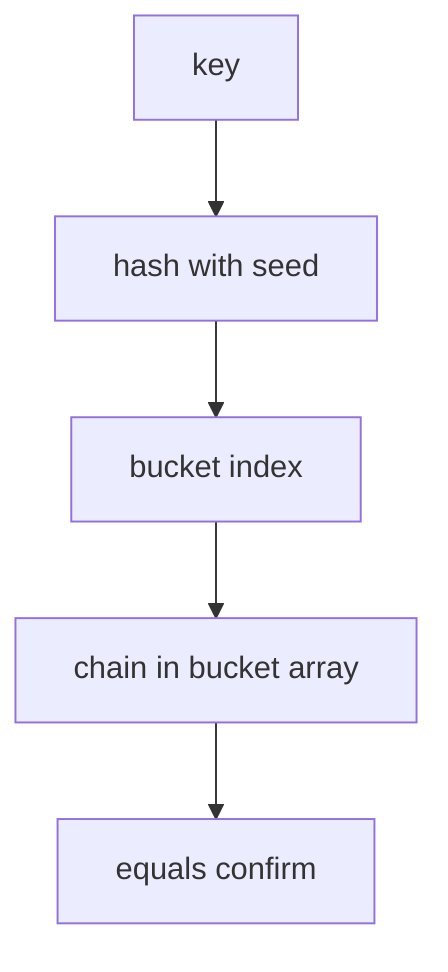

# ADR-002: Hash Collision Strategy

## Status

Accepted on 2026-07-21.

## Context

Workbench ships both **separate chaining** and **open addressing** maps for [[04-Data-Structures/projects/Hash Map Bake-Off/README|Hash Map Bake-Off]]. Production systems also worry about **hash-flooding** adversarial keys. We need a default collision resolution story for the portfolio and mitigations for untrusted keys.

## Decision

1. **Primary teaching default for new code paths**: separate chaining with dynamic-array buckets (not linked lists of heap nodes) for cache-friendly bucket storage.
2. **Open addressing**: linear probing with tombstones for delete—implemented for comparison, not default in advisor recommendations for delete-heavy workloads.
3. **Load factor**: rehash at **0.75** before insert.
4. **Mitigation mode**: per-process **random hash seed** (fixed seed in tests) for CLI/demo paths handling untrusted keys.
5. **Adversarial suite**: mandatory benchmark profile documenting naive vs seeded hash degradation.

## Alternatives Considered

| Option | Pros | Cons |
| --- | --- | --- |
| Chaining only | Simple delete, predictable | Pointer chasing if linked nodes |
| Open addressing only | Locality | Tombstone clustering |
| Treeified bins (Java-style) | Flooding defense | Complexity; defer to concept notes |
| Universal perfect hashing | Strong guarantees | Impractical for general maps |

## Consequences

- Bake-Off publishes probe/chain histograms for uniform and adversarial keys.
- Advisor prefers chaining when deletes are frequent; open addressing when memory is tight and deletes rare.
- Security docs require seeded hash for untrusted CLI input.
- No claim of SipHash-equivalent strength—educational seed only.

## Follow-ups

- Integrate chi-squared bucket uniformity into instrumentation JSON.
- Document treeified bin concept without implementing in v1 labs.

## Related Documents

- [[04-Data-Structures/04-Hash-Tables-and-Sets/Hash-Flooding DoS and Randomized Hashing|Hash-Flooding DoS]]
- [[04-Data-Structures/projects/Hash Map Bake-Off/Security|Hash Map Bake-Off Security]]
