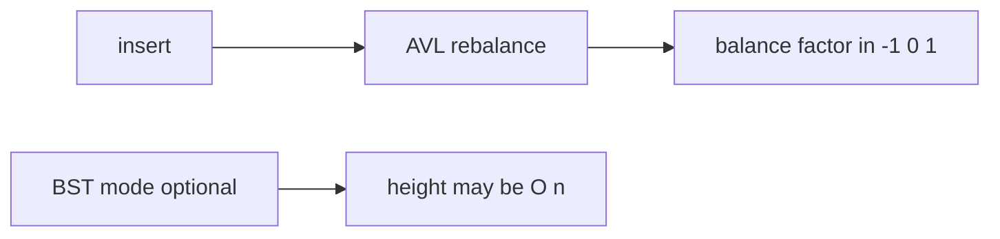

# ADR-003: Balanced Tree Default

## Status

Accepted on 2026-07-21.

## Context

[[04-Data-Structures/projects/Ordered Map Clinic/README|Ordered Map Clinic]] compares BST and AVL backends. Unbalanced BST degrades to O(n) on sorted input—a useful teaching moment but unsafe default for CLI demos that accept arbitrary key order.

## Decision

- **Portfolio default ordered map backend**: **AVL tree**.
- **BST backend**: retained as explicit `--backend=bst` baseline for degeneracy demonstrations.
- **Red-black trees**: concepts-only traces—no RB implementation in labs v1.
- **Range queries**: in-order walk with O(log n + k) positioning via tree search—not hash-then-sort.

## Alternatives Considered

| Option | Pros | Cons |
| --- | --- | --- |
| AVL default | Stricter balance, predictable height | More rotations on some patterns |
| RB default | Industry stdlib pattern (Java TreeMap) | More complex implementation |
| BST only | Minimal code | Adversarial sorted keys |
| Skip list | Probabilistic balance | Different failure mode teaching |

## Consequences

- CLI and advisor recommend AVL for ordered maps unless learner explicitly selects BST lab mode.
- Rotation trace export available for AVL teaching subset.
- Interview prep still covers RB conceptually via notes comparison.

## Follow-ups

- Golden rotation traces for fixed insert sequences.
- Document crossover where hash map + sort beats tree for range size k.

## Related Documents

- [[04-Data-Structures/05-Trees-and-Ordered-Maps/AVL Trees|AVL Trees]]
- [[04-Data-Structures/04-Hash-Tables-and-Sets/Ordered Maps via Trees vs Hashing|Ordered Maps via Trees vs Hashing]]
