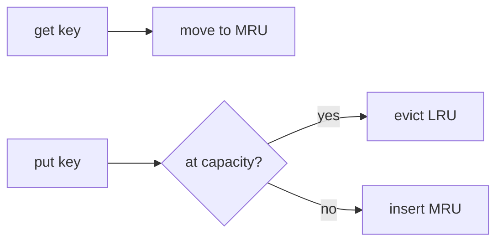

# ADR-004: Cache Eviction Policy

## Status

Accepted on 2026-07-21.

## Context

Workbench includes an in-memory **LRU cache** ADT ([[04-Data-Structures/11-Caches-and-Eviction/LRU via Hash Map and Doubly Linked List|LRU via Hash Map and Doubly Linked List]]). LFU, clock, and segmented LRU appear as concept notes. Portfolio must pick a default eviction policy for labs, benchmarks, and advisor output without implementing Redis or disk tiering.

## Decision

- **Default cache ADT**: **LRU** via hash map + doubly linked list with sentinel nodes.
- **Capacity model**: fixed max entries; `get` promotes to MRU; `put` evicts LRU on overflow.
- **TTL / soft references**: not implemented in v1—document as Backend/ JVM-specific concerns.
- **Benchmarks**: publish hit rate and eviction count under synthetic Zipf and uniform access traces.
- **Advisor**: recommend LRU for temporal locality workloads; cite LFU concept note when frequency skew is dominant.

## Alternatives Considered

| Option | Pros | Cons |
| --- | --- | --- |
| LRU | Simple, common, O(1) ops | Scan-resistant workloads suffer |
| LFU | Frequency awareness | Stale hot items, aging complexity |
| Random eviction | Tiny implementation | Poor hit rate |
| Redis/LRU server | Production realism | Out of scope |

## Consequences

- Cache module tests cover get/put/evict/overwrite and iterator stability rules.
- No distributed invalidation or persistence—see [[08-Databases/README|Databases]] for durable cache tiers.
- Instrumentation exports `eviction_count`, `hit_rate`, `size`.

## Follow-ups

- Optional benchmark traces downloadable via [[04-Data-Structures/projects/Structures Workbench/assets/README|assets]]
- Concept gallery entry for LFU/clock without implementation

## Related Documents

- [[04-Data-Structures/11-Caches-and-Eviction/Cache ADT Get Put and Capacity|Cache ADT]]
- [[04-Data-Structures/11-Caches-and-Eviction/LFU Clock and Segmented LRU Concepts|LFU Clock Concepts]]
