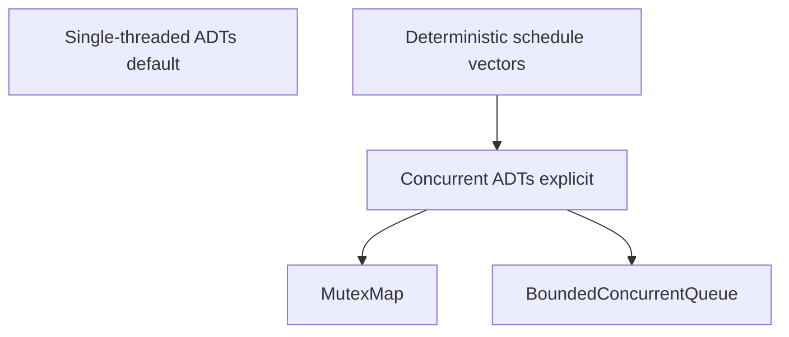

# ADR-005: Concurrency Guarantees

## Status

Accepted on 2026-07-21.

## Context

Track includes [[04-Data-Structures/13-Concurrency-Aware-Structures/Thread-Safety Classes|Thread-Safety Classes]], `MutexMap`, and `BoundedConcurrentQueue`. Workbench must teach concurrency trade-offs without claiming lock-free production readiness or implementing distributed consistency.

## Decision

1. **Default concurrency class label**: **single-threaded** for all structures unless explicitly marked concurrent.
2. **Concurrent labs**: `MutexMap` (mutex-guarded map) and `BoundedConcurrentQueue` with **deterministic interleaving schedules** in tests—no timing-based flaky races.
3. **Documentation**: classify structures using thread-safety taxonomy from curriculum notes; RCU/lock-free remain concept-only.
4. **False sharing**: optional instrumentation documents padding experiments—no silent CPU-specific magic.
5. **No distributed guarantees**: no linearizable cross-process API, no Redis transactions.

## Alternatives Considered

| Option | Pros | Cons |
| --- | --- | --- |
| Single-threaded only | Simplest proofs | Misses concurrency learning |
| Mutex wrapper | Clear happens-before | Contention under skew |
| Lock-free structures | Performance story | Extreme complexity; misleading claims |
| Deterministic scheduler tests | Reproducible | Not a substitute for stress tests |

## Consequences

- Concurrent module tests enumerate schedules explicitly in JSON vectors.
- Advisor warns when single-threaded structures used in multi-threaded context without external locking.
- Portfolio does not ship lock-free hash map or Michael-Scott queue implementations.

## Follow-ups

- Link false-sharing notes to perf instrumentation module.
- Document happens-before edges in concurrent queue tests.

## Related Documents

- [[04-Data-Structures/13-Concurrency-Aware-Structures/Concurrent Hash Maps Concepts|Concurrent Hash Maps Concepts]]
- [[04-Data-Structures/13-Concurrency-Aware-Structures/False Sharing Padding and Contended Counters|False Sharing Padding]]
- [[01-Computer-Science/README|Computer Science concurrency prerequisites]]
