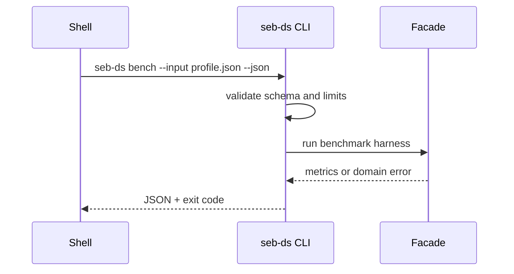

# API — Structures Workbench

## Library Surface (Target Facade)

| Module group | Symbols | Contract summary |
| --- | --- | --- |
| Contiguous | `DynamicArray`, `Bitset`, `RingBuffer`, `BumpArena` | capacity errors, amortized append |
| Linked | `SinglyLinkedList`, `DoublyLinkedList` | sentinel invariants |
| Linear | `Stack`, `Queue`, `Deque` | overflow policies |
| Hash | `ChainingHashMap`, `OpenAddressingHashMap`, `HashSet` | load factor, rehash |
| Tree | `BST`, `AVL`, `OrderedMap` | ordering, balance |
| Heap | `BinaryHeap`, `IndexedHeap` | heap property |
| Trie | `Trie`, `RadixTree` | prefix ops |
| Graph | `AdjListGraph`, `AdjMatrixGraph`, `GraphStore` | storage ADT only |
| DSU | `UnionFind` | union by rank + path compression |
| Probabilistic | `BloomFilter` | one-sided error |
| Cache | `LRUCache` | get/put capacity |
| Persistent | `PersistentStack` | path copying |
| Concurrent | `MutexMap`, `BoundedConcurrentQueue` | deterministic schedules |

Source: [[04-Data-Structures/code/README|code labs]]. Educational APIs—not stdlib drop-in replacements.

## CLI Contract (Target)

Syntax: `seb-ds <run-vectors|bench|advise|invariants> --input <json> --json`

| Command | Purpose |
| --- | --- |
| `run-vectors` | Execute shared vector against named structure |
| `bench` | Run benchmark profile; emit metrics JSON |
| `advise` | Workload profile → structure recommendation |
| `invariants` | Run mutator sequence with checker enabled |

## Error Model

| Exit | Code | Meaning |
| --- | --- | --- |
| 0 | OK | Completed |
| 2 | INVALID_INPUT | Parse/schema/limit failure |
| 3 | DOMAIN_ERROR | Invariant violation, ADT error |
| 4 | VECTOR_FAIL | Shared vector mismatch |
| 70 | INTERNAL_ERROR | Unexpected defect |

## Overflow and Iterator Contracts

Shared enum `OverflowPolicy`: `reject`, `overwrite-oldest` (ring), `expand` (where supported). Document per ADT in [[04-Data-Structures/00-Orientation-and-Contracts/Interface Design Capacity Errors and Iteration|Interface Design]].

## Compatibility

Semantic versioning after first tagged release. Shared vector schema version, JSON field names, exit codes, and public export names are compatibility surfaces.

## Related Documents

- [[04-Data-Structures/projects/Structures Workbench/Requirements|Requirements]]
- [[04-Data-Structures/projects/Structures Workbench/Testing|Testing]]
