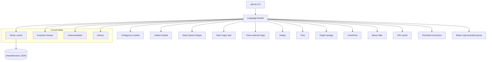

# Architecture — Structures Workbench

## Summary

Modular monolith: dual-language libraries, thin CLI, shared vectors, cross-cutting invariant and instrumentation layers. All state is **in-memory**; no durable database or network service.

## Data Flow — Vector Runner

```mermaid
sequenceDiagram
    actor User
    participant CLI
    participant Runner
    participant ADT
    participant Inv as Invariants
    User->>CLI: run-vectors --structure DynamicArray
    CLI->>Runner: load shared JSON
    loop operations
        Runner->>ADT: apply op
        ADT->>Inv: check representation
        Inv-->>Runner: ok or fail
    end
    Runner-->>CLI: pass/fail + metrics
    CLI-->>User: JSON result
```

## Key Components

| Component | Responsibility |
| --- | --- |
| Language facades | Stable exports, semver surface |
| Core ADT modules | Implementations in `code/typescript` and `code/python` |
| Vector runner | Parse schema, dispatch ops, compare snapshots |
| Invariant checker | Per-structure debug hooks (size, balance, load factor) |
| Instrumentation | Resize, probe, FP, eviction, false-sharing counters |
| Advisor | Rules engine over workload profile → recommendation |
| CLI adapter | Parse bounded JSON, format stdout, stderr diagnostics |

## Quality Attributes

- **Correctness**: shared vectors are the contract; invariants catch representation drift.
- **Locality**: instrumentation exposes bytes/element and scan friendliness per [[04-Data-Structures/00-Orientation-and-Contracts/Memory Layout Locality and Allocation Patterns|Memory Layout]].
- **Security**: resource ceilings, hash-flooding adversarial suite, Bloom non-authoritative semantics.
- **Concurrency**: deterministic schedules for concurrent labs—not production lock-free claims.

## Explicit Boundaries

| In scope | Out of scope (other tracks) |
| --- | --- |
| In-memory ADTs + CLI | Redis, Memcached modules |
| Graph **storage** + DSU glue | Graph **algorithm** library |
| LRU cache ADT | Disk cache / storage engine |
| Advisor + benchmarks | Distributed sharded services |

## Decisions

- [[04-Data-Structures/projects/Structures Workbench/ADR/ADR-001 Growth Factor|ADR-001 Growth Factor]]
- [[04-Data-Structures/projects/Structures Workbench/ADR/ADR-002 Hash Collision Strategy|ADR-002 Hash Collision Strategy]]
- [[04-Data-Structures/projects/Structures Workbench/ADR/ADR-003 Balanced Tree Default|ADR-003 Balanced Tree Default]]
- [[04-Data-Structures/projects/Structures Workbench/ADR/ADR-004 Cache Eviction|ADR-004 Cache Eviction]]
- [[04-Data-Structures/projects/Structures Workbench/ADR/ADR-005 Concurrency Guarantees|ADR-005 Concurrency Guarantees]]

## Trade-offs

Dual-language parity increases maintenance but enforces semantic clarity. Central CLI simplifies demos but hides embedding patterns—document both paths. Instrumentation adds overhead; default off in release benchmarks, on in teaching mode.

## Related Documents

- [[04-Data-Structures/projects/Structures Workbench/Requirements|Requirements]]
- [[04-Data-Structures/projects/Structures Workbench/API|API]]
- [[04-Data-Structures/projects/Structures Workbench/Database|Database]]
