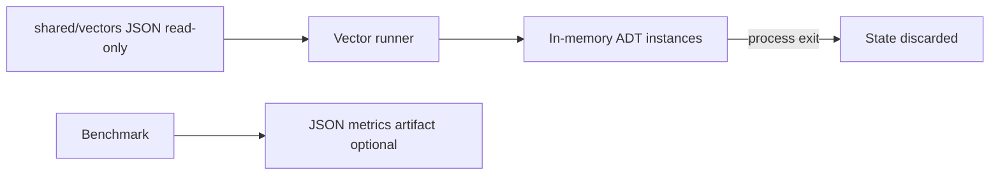

# Database — Structures Workbench

## Storage Choice: None (In-Memory Only)

| Store | Role | Rationale |
| --- | --- | --- |
| **N/A — process heap only** | All ADT state lives in RAM for the lifetime of the CLI/library call | Portfolio teaches **representation and complexity**, not durability, replication, or query planning |
| Shared JSON vectors (read-only files) | Test/bench **inputs**, not application state | Deterministic contracts across TypeScript and Python |
| Optional metrics JSON (stdout/files) | Ephemeral benchmark output | Not authoritative storage; no migration story |

## Why No Durable Database

1. **Scope**: Durable engines belong in [[08-Databases/README|Databases]] (B-trees on disk, WAL, LSM). This track isolates in-memory layout and ADT semantics.
2. **Pedagogy**: Learners must see resize, rehash, and rotation **in process** without IO noise.
3. **Safety**: No connection strings, migrations, or backup drills—reduces accidental scope creep.
4. **Parity**: Dual-language labs share file-based vectors; runtime state remains identical shape in both hosts.

## Consistency Model

Single-process, single-threaded default. Concurrent structures use **documented** memory models and deterministic test schedules ([[04-Data-Structures/projects/Structures Workbench/ADR/ADR-005 Concurrency Guarantees|ADR-005]])—not cross-process transactions.

## If You Need Persistence

| Need | Redirect |
| --- | --- |
| Key-value cache server | [[07-Backend/README|Backend]] + Redis notes |
| Graph analytics at scale | [[08-Databases/README|Databases]] graph stores |
| Ordered durable index | B-tree / LSM tracks |
| Serialized snapshots for demos | Export JSON graph/vector **artifacts** only—explicit import, no hidden DB |

## Operational Concerns

- No backups, pooling, or migration locks apply.
- Memory caps enforced at CLI boundary ([[04-Data-Structures/projects/Structures Workbench/Security|Security]]).
- Long-running daemons explicitly out of scope.

## Related Documents

- [[04-Data-Structures/projects/Structures Workbench/Architecture|Architecture]]
- [[04-Data-Structures/14-Production-Selection/From In-Memory Structures to Systems|From In-Memory Structures to Systems]]
