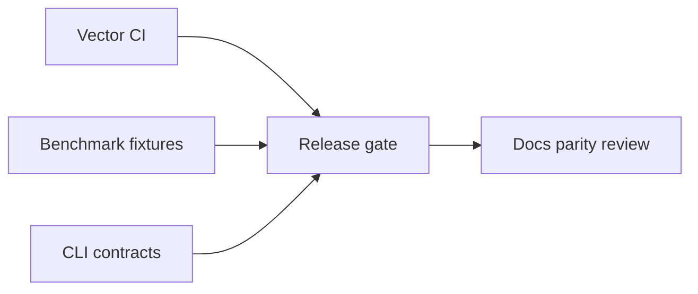

# Monitoring — Structures Workbench

## Operability Model

Local library and CLI—not a always-on service. Release health measured via CI, vector pass rate, benchmark fixture drift, and optional teaching metrics export.

| Signal | Target | Evidence |
| --- | --- | --- |
| Shared vector pass rate | 100% both languages | CI |
| Invariant suite | 100% on registered structures | CI job |
| CLI contract tests | 100% when adapter present | integration suite |
| Adversarial hash suite | Documented degradation bounds | bench artifact |
| Dependency audit | 0 unmitigated critical on release | audit log |

## Instrumentation Metrics (Teaching Mode)

When `--instrument` enabled, structures emit:

| Metric | Structures |
| --- | --- |
| `resize_count`, `bytes_copied` | DynamicArray, hash tables |
| `probe_histogram`, `max_chain` | Hash maps |
| `rotation_count`, `height` | AVL |
| `fp_rate`, `insert_count` | BloomFilter |
| `eviction_count`, `hit_rate` | LRUCache |
| `union_count`, `root_count` | UnionFind |

Default off in performance benchmarks; on in Workbench teaching panel. Never include raw user keys in exported metrics.

## Production Bridge

For translating metrics to production observability, see [[04-Data-Structures/14-Production-Selection/Measuring Structures in Production|Measuring Structures in Production]]—Workbench metrics are **didactic**, not SLO dashboards.

## Triage

Vector failure blocks merge. Advisor golden mismatch blocks release. Performance observations become regressions only against versioned fixtures.

## Related Documents

- [[04-Data-Structures/projects/Structures Workbench/Deployment|Deployment]]
- [[04-Data-Structures/projects/Structures Workbench/Debug Diary|Debug Diary]]
