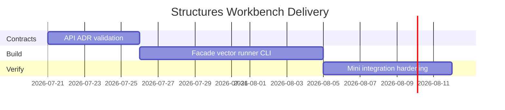

# Planning — Structures Workbench

## Problem Statement

Individual labs in [[04-Data-Structures/code/README|code labs]] teach representations in isolation, but learners lack an integrated surface to compare structures, run shared vectors, validate invariants, and connect choices to production trade-offs.

## Success Definition

Dual-language vector suite green; CLI demonstrates bench + advisor; documentation and ADRs explain major defaults; exclusions (Redis, disk, graph algorithms, distributed) remain explicit.

## Scope

### In Scope

- Facade + CLI over existing ADT modules
- Shared vector runner and schema
- Invariant checker and instrumentation JSON
- Structure-selection advisor
- Integration hooks for five mini projects
- ADRs for growth, hashing, trees, cache eviction, concurrency

### Out of Scope

- Redis or external cache servers
- Disk storage engines (LSM, B-tree on disk)
- Full graph algorithm suites
- Distributed data structures or RPC services
- Production replacements for stdlib collections

## Milestones

| Milestone | Outcome | Exit criteria |
| --- | --- | --- |
| M1 Contracts | API, vectors, ADRs reviewed | Requirements + ADR acceptance |
| M2 Core integration | Facade + vector runner | All shared vectors pass both languages |
| M3 CLI vertical slice | bench + advise + invariants | JSON schema tests green |
| M4 Mini project linkage | Metrics import from labs | Mini acceptance checklists satisfied |
| M5 Hardening | Caps, adversarial tests, docs parity | Security checklist complete |

## Risks

| Risk | Impact | Mitigation |
| --- | --- | --- |
| TS/Python semantic drift | Broken learning contract | Shared vectors as source of truth |
| Scope creep into Backend/Databases | Unmaintainable portfolio | Enforce non-goals in review |
| Benchmark flakiness | False regressions | Deterministic fixtures, no network |
| Advisor oversimplifies | Wrong production choices | Link to decision matrix + caveats |

## Dependencies

Node.js + Vitest, Python 3.11+ + pytest, shared JSON schema under `code/shared/`.

## Related Documents

- [[04-Data-Structures/projects/Structures Workbench/Roadmap|Roadmap]]
- [[04-Data-Structures/projects/Structures Workbench/Requirements|Requirements]]
