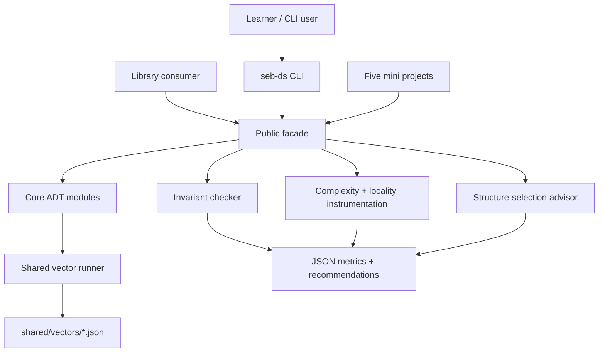

# Structures Workbench

## One-Line Purpose

A dual-language in-memory structures library and CLI that exposes core ADTs, runs shared JSON vectors, validates invariants, instruments complexity and cache locality, and recommends structure choices from workload profiles—without building databases, Redis modules, disk engines, graph algorithm suites, or distributed services.

## Status

**Active.** Core labs live in [[04-Data-Structures/code/README|Data Structures code labs]]; Workbench documentation defines the integrated portfolio boundary, ADRs, and acceptance for facade, CLI, advisor, and instrumentation layers.

## Goals

- Unify contiguous, linked, linear, hash, tree, heap, trie, graph, DSU, probabilistic, cache, persistent, and concurrency-aware labs behind one discoverable API and CLI.
- Run **shared vector runner** across TypeScript and Python with identical semantics.
- Provide **invariant checker** toggles per structure for teaching and debug builds.
- Export **complexity and locality instrumentation** (resize counts, probe histograms, false-sharing notes where applicable).
- Ship **structure-selection advisor** grounded in [[04-Data-Structures/14-Production-Selection/Structure Selection Decision Matrix|Structure Selection Decision Matrix]].

## Non-Goals

- Redis, disk storage engines, LSM/B-tree on disk, or durable persistence.
- Full graph **algorithm** suites (BFS, Dijkstra, MST solvers)—see [[05-Algorithms/07-Graph-Traversal-and-DAGs/BFS|BFS]], [[05-Algorithms/08-Shortest-Paths/Dijkstra with Indexed Heaps|Dijkstra]], [[05-Algorithms/09-MST-and-Connectivity/Minimum Spanning Tree Contracts and Cut Property|MST]].
- Distributed services, replication, or network RPC fronts—see [[07-Backend/README|Backend]] and [[09-System-Design/README|System Design]].
- Replacing language stdlib collections in production.

## Architecture Snapshot



## Document Map

| Document | Purpose |
| --- | --- |
| [[04-Data-Structures/projects/Structures Workbench/Planning\|Planning]] | Scope, milestones, risks |
| [[04-Data-Structures/projects/Structures Workbench/Requirements\|Requirements]] | Functional and non-functional requirements |
| [[04-Data-Structures/projects/Structures Workbench/Architecture\|Architecture]] | System shape and components |
| [[04-Data-Structures/projects/Structures Workbench/Database\|Database]] | In-memory-only storage rationale |
| [[04-Data-Structures/projects/Structures Workbench/API\|API]] | Library and CLI contracts |
| [[04-Data-Structures/projects/Structures Workbench/Deployment\|Deployment]] | Local install and release path |
| [[04-Data-Structures/projects/Structures Workbench/Security\|Security]] | DoS, flooding, resource ceilings |
| [[04-Data-Structures/projects/Structures Workbench/Testing\|Testing]] | Verification strategy |
| [[04-Data-Structures/projects/Structures Workbench/Monitoring\|Monitoring]] | Metrics and release health |
| [[04-Data-Structures/projects/Structures Workbench/Engineering Journal\|Engineering Journal]] | Session logs |
| [[04-Data-Structures/projects/Structures Workbench/Debug Diary\|Debug Diary]] | Investigations |
| [[04-Data-Structures/projects/Structures Workbench/Known Issues\|Known Issues]] | Open defects |
| [[04-Data-Structures/projects/Structures Workbench/Lessons Learned\|Lessons Learned]] | Durable takeaways |
| [[04-Data-Structures/projects/Structures Workbench/Postmortem\|Postmortem]] | Retrospectives |
| [[04-Data-Structures/projects/Structures Workbench/Ideas\|Ideas]] | Future directions |
| [[04-Data-Structures/projects/Structures Workbench/Roadmap\|Roadmap]] | Phased delivery |

### ADRs

- [[04-Data-Structures/projects/Structures Workbench/ADR/ADR-001 Growth Factor|ADR-001 Growth Factor]]
- [[04-Data-Structures/projects/Structures Workbench/ADR/ADR-002 Hash Collision Strategy|ADR-002 Hash Collision Strategy]]
- [[04-Data-Structures/projects/Structures Workbench/ADR/ADR-003 Balanced Tree Default|ADR-003 Balanced Tree Default]]
- [[04-Data-Structures/projects/Structures Workbench/ADR/ADR-004 Cache Eviction|ADR-004 Cache Eviction]]
- [[04-Data-Structures/projects/Structures Workbench/ADR/ADR-005 Concurrency Guarantees|ADR-005 Concurrency Guarantees]]

## Mini Projects

| Mini project | Focus |
| --- | --- |
| [[04-Data-Structures/projects/Dynamic Array and Arena Lab/README\|Dynamic Array and Arena Lab]] | Contiguous sequences + arena |
| [[04-Data-Structures/projects/Hash Map Bake-Off/README\|Hash Map Bake-Off]] | Chaining vs open addressing |
| [[04-Data-Structures/projects/Ordered Map Clinic/README\|Ordered Map Clinic]] | BST vs AVL ordered maps |
| [[04-Data-Structures/projects/Graph Store CLI/README\|Graph Store CLI]] | Graph representations + DSU glue |
| [[04-Data-Structures/projects/Probabilistic Membership Lab/README\|Probabilistic Membership Lab]] | Bloom vs exact set |

## Run and Test

```bash
cd 04-Data-Structures/code/typescript
npm install
npm test

cd ../python
python -m pip install -e ".[dev]"
python -m pytest -q
```

Target CLI: `seb-ds <run-vectors|bench|advise|invariants> --json`. Until the adapter lands, use module imports and mini-project CLIs documented in [[04-Data-Structures/projects/Structures Workbench/API|API]].

## Portfolio Acceptance Checklist

- [ ] All documented ADTs exported from one facade per language.
- [ ] Shared vector runner green in TypeScript and Python.
- [ ] Invariant checker covers every mutating operation on registered structures.
- [ ] Instrumentation JSON schema stable and documented.
- [ ] Advisor output cites decision matrix dimensions with trade-offs.
- [ ] Security ceilings enforced on CLI JSON inputs.
- [ ] Explicit exclusions (Redis, disk engines, graph alg suites, distributed) remain out of repo scope.

## Related Notes

- [[04-Data-Structures/README|Data Structures MOC]]
- [[04-Data-Structures/code/README|Data Structures Code Labs]]
- [[04-Data-Structures/14-Production-Selection/Structure Selection Decision Matrix|Structure Selection Decision Matrix]]
- [[05-Algorithms/README|Algorithms]]
- [[07-Backend/README|Backend]]
- [[08-Databases/README|Databases]]
- [[Projects/README|Projects]]
- [[Career/README|Career]]
