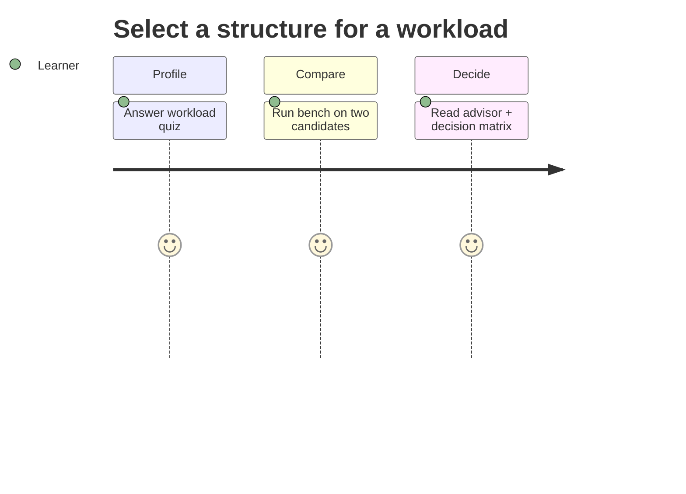

# Requirements — Structures Workbench

## Actors

| Actor | Goal |
| --- | --- |
| Learner | Compare structures, run vectors, read metrics |
| Library consumer | Import typed ADTs with stable contracts |
| CLI user | Run benchmarks and advisor without writing code |
| Maintainer | Extend labs without breaking shared vectors |

## Functional Requirements

| ID | Requirement | Acceptance |
| --- | --- | --- |
| FR-001 | Export documented core ADTs from one facade per language | Import smoke resolves every symbol in [[04-Data-Structures/projects/Structures Workbench/API\|API]] |
| FR-002 | Run shared JSON vectors identically in TS and Python | Full vector suite pass |
| FR-003 | CLI: `run-vectors`, `bench`, `advise`, `invariants` with JSON stdout | Schema tests + exit codes |
| FR-004 | Invariant checker validates representation after mutators | Toggle enables per-structure asserts |
| FR-005 | Instrumentation exports resize, probe, FP, eviction, DSU metrics | JSON matches documented schema |
| FR-006 | Structure-selection advisor maps workload quiz to recommendations | Output cites matrix dimensions |
| FR-007 | Integrate five mini projects as documented modules | Mini README acceptance criteria met |
| FR-008 | Document explicit exclusions | No Redis/disk/graph-alg/distributed code in scope |

## Non-Functional Requirements

| ID | Category | Requirement | Measurement |
| --- | --- | --- | --- |
| NFR-001 | Correctness | Deterministic results for deterministic inputs | 100% vector pass |
| NFR-002 | Performance | Benchmark mode respects configured size ceilings | rejects over-limit before alloc |
| NFR-003 | Security | Hash-flooding and memory exhaustion mitigations documented | adversarial suite + caps |
| NFR-004 | Portability | TS + Python parity on shared vectors | CI matrix |
| NFR-005 | Observability | Metrics JSON separated from diagnostics | stdout/stderr contract |
| NFR-006 | Teachability | Complexity bounds visible per operation | Complexity panel in CLI/report |

## Traceability

FR-001/002 → code labs + facade; FR-003 → CLI adapter; FR-004 → invariant module; FR-005 → instrumentation; FR-006 → [[04-Data-Structures/14-Production-Selection/Structure Selection Decision Matrix|Decision Matrix]]; FR-007 → mini projects; NFR-003 → [[04-Data-Structures/projects/Structures Workbench/Security|Security]] and ADR-002/005.

## Related Documents

- [[04-Data-Structures/projects/Structures Workbench/API|API]]
- [[04-Data-Structures/projects/Structures Workbench/Testing|Testing]]
