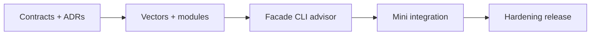

# Roadmap — Structures Workbench

## Current Phase

**P0 — Contracts and documentation active.** Core module layout documented; facade, CLI, vectors, and advisor are acceptance work.

| Phase | Outcome | Exit criteria |
| --- | --- | --- |
| P0 | Truthful contracts | Requirements, API, ADRs, project docs reviewed |
| P1 | Shared vectors + ADT modules | Dual-language vector suite green |
| P2 | Integrated CLI | run-vectors, bench, advise, invariants pass |
| P3 | Mini project metrics import | Five mini acceptance checklists done |
| P4 | Release evidence | Security caps, adversarial tests, docs parity |

## Now

- Commit shared vector schema and first vector files
- Implement per-module tests in both languages
- Land invariant checker hooks on contiguous + hash modules

## Next

- Unified facades and `seb-ds` CLI adapter
- Advisor golden outputs from decision matrix
- Benchmark fixture JSON for Workbench import

## Later

Evaluate Ideas backlog (Grafana teaching dashboard, persistent sharing viz) without expanding into Redis, disk engines, or graph algorithm suites.

## Related Documents

- [[04-Data-Structures/projects/Structures Workbench/Planning|Planning]]
- [[04-Data-Structures/projects/Structures Workbench/Known Issues|Known Issues]]
