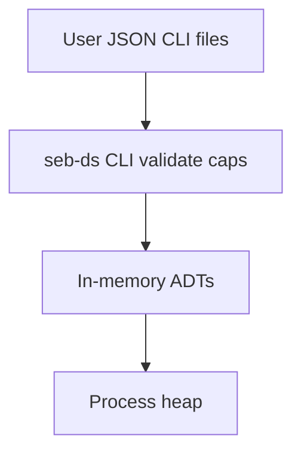

# Security — Structures Workbench

## Trust Boundaries

Untrusted input enters via CLI JSON, import files, or benchmark profiles—all must pass schema validation and **resource ceilings** before allocation.

## Assets

| Asset | Sensitivity | Location |
| --- | --- | --- |
| In-memory structures | Process-local | Heap |
| Shared vectors | Integrity (teaching contract) | `code/shared/vectors/` |
| Benchmark reports | Low | stdout / optional files |

## Threat Model

| Threat | Example | Mitigation |
| --- | --- | --- |
| Spoofing | N/A for local CLI | No auth surface in v1 |
| Tampering | Malformed vector JSON | Schema validation |
| Repudiation | N/A | Local logs only |
| Information disclosure | Metrics leak input sizes | Redact raw keys in default reports |
| Denial of service | Huge reserve/rehash/graph matrix | Hard caps; matrix build limit |
| Elevation | Code exec via import | No eval; strict parsers |

## Structure-Specific Controls

- **Hash maps**: adversarial key suite + seeded hash ([[04-Data-Structures/projects/Structures Workbench/ADR/ADR-002 Hash Collision Strategy|ADR-002]])
- **Ordered maps**: AVL default for untrusted key order ([[04-Data-Structures/projects/Structures Workbench/ADR/ADR-003 Balanced Tree Default|ADR-003]])
- **Bloom filters**: never authoritative for security decisions
- **Graph import**: vertex/edge/file size caps
- **Concurrent labs**: deterministic schedules only ([[04-Data-Structures/projects/Structures Workbench/ADR/ADR-005 Concurrency Guarantees|ADR-005]])

## Controls Checklist

- [ ] Checked arithmetic on all size calculations
- [ ] CLI rejects over-limit operations before alloc
- [ ] Hash-flooding mitigation documented and tested
- [ ] No secrets in repository
- [ ] Dependency scanning on TS/Python lockfiles when published

## Related Documents

- [[04-Data-Structures/projects/Hash Map Bake-Off/Security|Hash Map Bake-Off Security]]
- [[04-Data-Structures/04-Hash-Tables-and-Sets/Hash-Flooding DoS and Randomized Hashing|Hash-Flooding DoS]]
