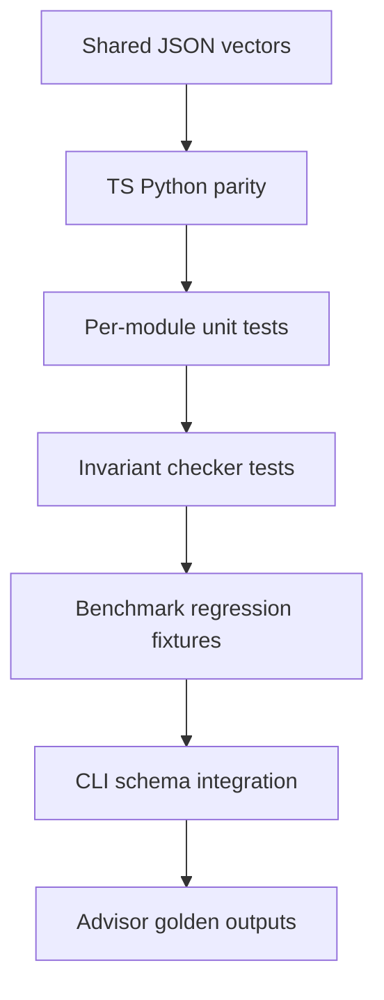

# Testing — Structures Workbench

## Strategy



## Test Layers

| Layer | Coverage |
| --- | --- |
| Contract | All `shared/vectors/*.json` in both languages |
| Unit | Edge cases per ADT module |
| Invariant | Post-mutator representation checks |
| Adversarial | Hash flooding, sorted BST, Bloom saturation |
| Integration | Facade exports, CLI JSON, exit codes |
| Advisor | Golden recommendations for fixed workload profiles |

## Commands

```bash
cd 04-Data-Structures/code/typescript && npm test
cd 04-Data-Structures/code/python && python -m pytest -q
```

Module filters mirror [[04-Data-Structures/code/README|code labs]] structure table.

## Critical Paths

1. Full vector suite green both languages
2. Invariant checker fails injected corruption in tests
3. CLI rejects over-limit input with exit code 2
4. Mini project benchmark JSON imports without schema errors
5. Concurrent tests use fixed interleaving schedules—no timing flakes

## Definition of Done

- [ ] Failure modes asserted, not only happy path
- [ ] No network in default test run
- [ ] Benchmark regressions tied to committed fixtures, not wall-clock thresholds alone
- [ ] Documentation commands copy-paste verified

## Related Documents

- [[04-Data-Structures/projects/Structures Workbench/API|API]]
- [[04-Data-Structures/projects/Structures Workbench/Requirements|Requirements]]
