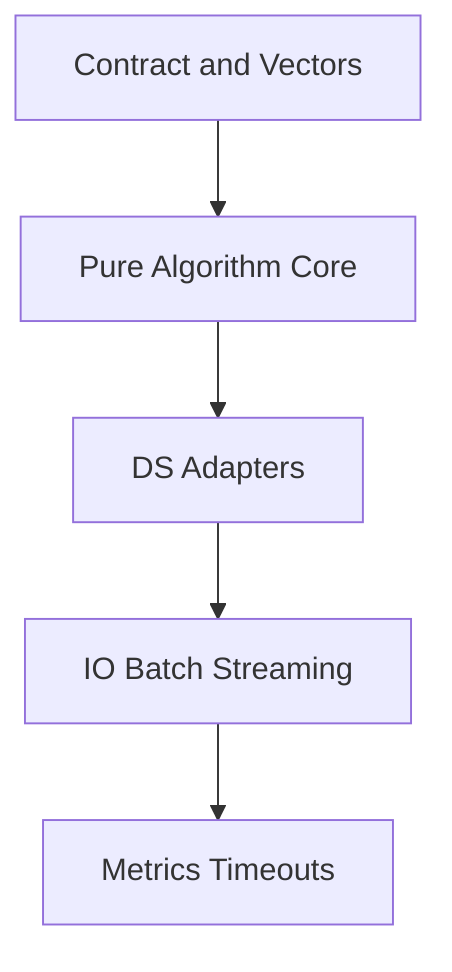
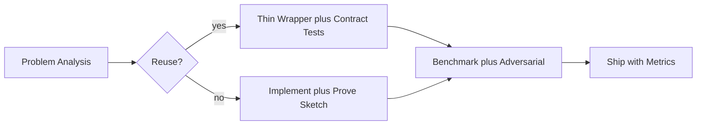
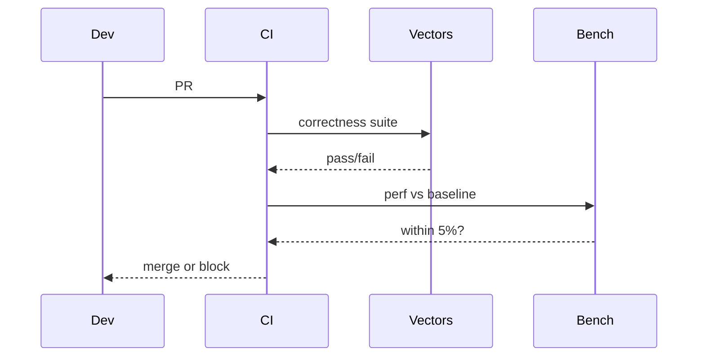

# Algorithm Engineering and Reuse vs Reinvention

## Overview

**Algorithm engineering** is the discipline of turning textbook procedures into reliable production components: explicit contracts, dual-language implementations, shared test vectors, benchmark harnesses, adversarial cases, and operational observability. **Reuse vs reinvention** is not "always use the library"—it is matching problem shape, scale, and failure cost to either vetted implementations or controlled custom code.

Libraries encode decades of bug fixes; they also encode assumptions (comparison sort stability, hash seeding, integer overflow). Reinvention wastes time when contracts align; reuse fails when contracts diverge silently.

## Learning Objectives

- Apply a decision framework for library vs custom algorithm selection
- Map language/stdlib algorithms to underlying families and assumptions
- Structure implementations for testability: pure core + IO shell
- Plan regression gates: correctness vectors + perf baselines
- Identify when to extract hot-path custom code from generic library calls

## Prerequisites

- [[05-Algorithms/00-Foundations-and-Correctness/Why Algorithms Exist|Why Algorithms Exist]]
- [[04-Data-Structures/00-Orientation-and-Contracts/Abstract Data Types vs Concrete Structures|Abstract Data Types vs Concrete Structures]]

## Difficulty

`intermediate`

## Estimated Time

- Reading: 2 hours
- Exercises: 3 hours
- Mini project: 6 hours

## History

LEDA (1990s) and STL popularized reusable algorithm + iterator separation. Google Abseil, Rust `std`, and Python's timsort adoption show ecosystem evolution. Competitive programming glorifies reimplementation; SRE postmortems glorify **boring** known algorithms with metrics.

## Problem It Solves

| Anti-pattern | Outcome |
| --- | --- |
| Custom sort for "speed" | Unstable audit trail |
| Hand-rolled hash without collision plan | HashDoS |
| Copy-paste binary search from blog | Off-by-one on duplicates |
| `O(n²)` acceptable in prototype | Becomes production path via feature flag |

Engineering process prevents "works in demo" from becoming "paged at 3am."

## Internal Implementation

### Reuse decision matrix

| Question | Lean reuse | Lean custom |
| --- | --- | --- |
| Contract matches library? | Yes | No (stability, external memory) |
| n scale | Within tested bounds | Beyond library sweet spot |
| Hot path % CPU | Low | Dominant |
| Adversarial input | Standard | Attacker-controlled |
| Team expertise | General | Deep domain (geo, bio) |

### Layered implementation



Core depends on **ADT interfaces** ([[04-Data-Structures/README|Data Structures]]), not concrete layouts.

### Shared test vectors

JSON fixtures: `{ name, pre, input, expected, cmp_mode }` run in TypeScript and Python labs—see [[05-Algorithms/code/README|Algorithms code labs]].

## Mermaid Diagrams

### Structure: engineering pipeline



### Sequence: regression gate



## Correctness

Reuse does not transfer correctness automatically:

- **Wrapper correctness**: map types, handle empty input, define error propagation
- **Comparator laws**: antisymmetry, transitivity—stdlib assumes them
- **Equivalence**: custom must match library on shared vectors for overlapping domain

Reinvention demands full **pre/post + invariant** package—no free lunch.

Property: for sort wrapper, output is permutation and ordered—certificate functions in CI.

## Complexity

Library docs often state **average** complexity; your SLA may need **worst case**:

- `quickselect` vs `nth_element`—worst O(n²) without introspection
- Hash map O(1) **expected**—rehash spikes

Benchmark with **your** n and distribution; see [[05-Algorithms/01-Complexity-and-Analysis/Practical Constants Locality and Benchmark Design|Practical Constants Locality and Benchmark Design]].

Custom code wins when constants matter (SIMD radix on fixed keys) not when Big-O class wrong.

## Examples

### Minimal Example

**TypeScript** — thin wrapper with explicit contract test hook:

```typescript
export function sortNumbers(a: number[]): number[] {
  const out = a.slice();
  out.sort((x, y) => x - y); // reuse: V8 Timsort-ish
  return out;
}

export function isSorted(a: readonly number[]): boolean {
  for (let i = 1; i < a.length; i++) if (a[i - 1]! > a[i]!) return false;
  return true;
}
```

**Python**:

```python
def sort_numbers(a: list[float]) -> list[float]:
    return sorted(a)  # Timsort; stable

def is_sorted(a: list[float]) -> bool:
    return all(a[i] <= a[i + 1] for i in range(len(a) - 1))
```

### Production-Shaped Example

Top-k streaming: library `heapq.nlargest(k, stream)` vs custom min-heap of size k.

- Reuse when k small, Python overhead OK
- Custom when million events/sec, object allocation toxic
- Contract: stable tie-break on `(score, id)` for audit

```typescript
class TopK<T> {
  private readonly buf: T[] = [];
  constructor(
    private readonly k: number,
    private readonly better: (a: T, b: T) => boolean
  ) {}

  offer(x: T): void {
    if (this.buf.length < this.k) {
      this.buf.push(x);
      if (this.buf.length === this.k) this.buf.sort((a, b) => (this.better(b, a) ? 1 : -1));
      return;
    }
    const worst = this.buf[this.k - 1]!;
    if (!this.better(x, worst)) return;
    this.buf[this.k - 1] = x;
    this.buf.sort((a, b) => (this.better(b, a) ? 1 : -1));
  }
}
```

Engineering note: production would use [[04-Data-Structures/06-Heaps-and-Priority-Queues/Priority Queue ADT|Priority Queue ADT]]—O(log k) per offer vs sort-on-insert O(k log k).

## Trade-offs

| Dimension | Upside | Downside | When it matters |
| --- | --- | --- | --- |
| Library reuse | Battle-tested | Hidden assumptions | Default path |
| Custom hot path | Tailored perf | Maintenance | CPU-bound scale |
| Shared vectors | Cross-lang parity | Fixture upkeep | Polyglot services |
| Premature custom | Ego / interview prep | Bugs | Most startups early |

### When to Use

- Reuse: contract match, team bandwidth limited, adversarial risk low
- Custom: measurable perf gap, spec mismatch (stable external sort), embedded constraints

### When Not to Use

- Reinventing hash tables or balanced trees for app logic—use [[04-Data-Structures/README|Data Structures]] modules
- Micro-optimizing cold paths

## Exercises

1. List assumptions behind `Array.sort` in JavaScript vs `sorted()` in Python (stability).
2. When would external merge sort beat in-memory timsort for your data?
3. Design shared JSON vector for lower bound binary search—fields needed?
4. Audit one service: catalog 5 algorithm calls; reuse or risky custom?
5. Estimate break-even n where O(n log n) custom beats O(n²) simple custom at given constants.

## Mini Project

**Wrapper vs Core Bake-off**

Implement stable sort wrapper and naive custom sort; run shared vectors + 10⁵ random benchmark; document crossover (if any).

## Portfolio Project

Bootstrap [[05-Algorithms/projects/Algorithm Workbench/README|Algorithm Workbench]] with vector runner TS + Python and one module (search) green.

## Interview Questions

1. When reinvent binary search vs use library?
2. What test proves your sort wrapper is correct?
3. Stable sort requirement—impact on reuse choice?
4. How share tests between TypeScript and Python services?
5. Worst case of relying on hash map O(1) claims?

### Stretch / Staff-Level

1. Org policy: when require ADR for custom algorithm on hot path?
2. How would you wrap DB query planner choice vs in-app algorithm?

## Common Mistakes

- Benchmarking **empty** or **tiny** n only
- Ignoring **allocation** in library paths
- Custom code without **vector parity** vs reference impl
- Confusing **DS choice** with algorithm engineering

## Best Practices

- Pure core functions; inject comparators and accessors
- Pin algorithm version in perf regression docs
- Document **non-goals** (not external sort, not parallel)
- Link production module [[05-Algorithms/13-Production-Selection-and-Interview-Patterns/Algorithm Selection Decision Matrix|Algorithm Selection Decision Matrix]]
- Prefer heaps/maps from DS track over reimplementing

## Summary

Algorithm engineering is contracts plus measurement plus operational guardrails. Reuse when assumptions align; reinvent narrowly when specs or scale demand it—and pay the proof and test tax either way. Boring, tested algorithms beat clever custom code in most production paths.

## Further Reading

- [[00-References/Algorithms/README|Algorithms References]]
- [[05-Algorithms/13-Production-Selection-and-Interview-Patterns/Profiling Correctness and Regression Gates|Profiling Correctness and Regression Gates]]
- [[05-Algorithms/code/README|Algorithms Code Labs]]

## Related Notes

- [[05-Algorithms/00-Foundations-and-Correctness/Why Algorithms Exist|Why Algorithms Exist]]
- [[05-Algorithms/01-Complexity-and-Analysis/Practical Constants Locality and Benchmark Design|Practical Constants Locality and Benchmark Design]]
- [[05-Algorithms/13-Production-Selection-and-Interview-Patterns/Algorithm Selection Decision Matrix|Algorithm Selection Decision Matrix]]
- [[04-Data-Structures/00-Orientation-and-Contracts/Abstract Data Types vs Concrete Structures|Abstract Data Types vs Concrete Structures]]
- [[04-Data-Structures/06-Heaps-and-Priority-Queues/Priority Queue ADT|Priority Queue ADT]]
- [[05-Algorithms/README|Algorithms Track]]

## Progress Checklist

- [ ] Explained from first principles
- [ ] Drew at least one Mermaid diagram
- [ ] Implemented a minimal version
- [ ] Documented trade-offs and non-goals
- [ ] Completed exercises
- [ ] Practiced interview questions aloud
- [ ] Linked prerequisites and dependents
