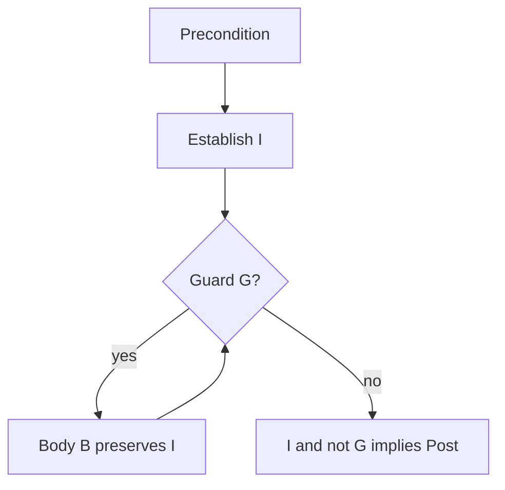
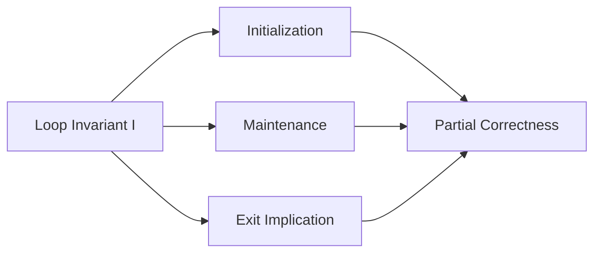

# Loop Invariants and Correctness Proofs

## Overview

A **loop invariant** is a predicate that holds before every iteration, remains true after each iteration (when the loop guard permits another step), and—combined with guard falsity at exit—implies the **postcondition**. Loop invariants are the workhorse of **inductive correctness proofs** for iterative algorithms: binary search, insertion sort, Dijkstra relaxation, and union-find path compression all hinge on stating the right invariant.

Finding invariants is harder than verifying them. The skill separates engineers who "fix until green" from those who prevent entire bug classes by construction.

## Learning Objectives

- State initialization, maintenance, and termination implications for loop invariants
- Prove correctness of linear search, insertion sort, and binary search variants
- Encode invariants as debug assertions and property tests
- Diagnose proof failure from wrong invariant strength (too weak / too strong)
- Connect invariants to production observability checkpoints

## Prerequisites

- [[05-Algorithms/00-Foundations-and-Correctness/Problem Specifications Preconditions and Postconditions|Problem Specifications Preconditions and Postconditions]]
- [[01-Computer-Science/09-Correctness-and-Reliability/Invariants Assertions and Contracts|Invariants Assertions and Contracts]]

## Difficulty

`intermediate`

## Estimated Time

- Reading: 2.5 hours
- Exercises: 4 hours
- Mini project: 5 hours

## History

Inductive reasoning about programs flourished with structured programming (Dijkstra, 1968) and Hoare logic. Floyd's inductive assertions generalized to loops. Today, SMT solvers (Dafny, Why3) automate parts of invariant verification; production teams still rely on human-stated invariants in code review and assertions.

## Problem It Solves

Without invariants:

- Off-by-one errors in binary search persist for decades
- Partial array processing bugs ("sorted so far" misunderstood)
- Concurrent algorithms ship with broken happens-before claims
- Refactors break implicit assumptions nobody documented

Invariants make the **hidden state** of a loop explicit: what portion of the problem is solved, what remains, and what bounds shrink.

## Internal Implementation

### Standard proof obligation triple

For `while (G) { B }` with invariant `I`:

1. **Initialization**: Pre ⇒ `I` before first test of `G`
2. **Maintenance**: `{I ∧ G} B {I}`
3. **Termination implication**: `I ∧ ¬G` ⇒ Post (see [[05-Algorithms/00-Foundations-and-Correctness/Termination Partial and Total Correctness|Termination Partial and Total Correctness]] for progress)



### Classic example: insertion sort

**Invariant**: at start of outer index `i`, subarray `a[0..i)` is sorted.

- Init: `i = 1`, single element sorted
- Maintenance: insert `a[i]` into sorted prefix by inner shifts
- Exit: `i = n`, entire array sorted

### Binary search (lower bound) invariant

**Invariant**: answer lies in `[lo, hi)`; `lo` is always a valid candidate index for "first ≥ target" when answer exists in original array.

Maintenance shrinks interval while preserving at least one witness index.

## Mermaid Diagrams

### Structure: invariant components



### Sequence: debugging with invariant checks

```mermaid
sequenceDiagram
    participant Loop
    participant Inv as Invariant Assert
    participant Log

    Loop->>Inv: before iteration
    alt invariant fails
        Inv->>Log: dump lo, hi, mid, slice
        Inv-->>Loop: abort in dev
    else ok
        Loop->>Loop: body
    end
```

## Correctness

**Partial correctness** via invariants: if the loop terminates, post holds.

Proof template for **linear search**:

- Pre: finite array, target `x`
- Inv: all indices `< i` examined and not equal to `x`
- Exit: `i = n` ⇒ not found; early return on match ⇒ found at smallest index

**Common failure modes**:

| Symptom | Likely cause |
| --- | --- |
| Post true but proof fails | Invariant too weak—strengthen |
| Maintenance step stuck | Invariant too strong—impossible after body |
| Infinite loop | Missing variant function (progress measure) |

Recursive algorithms use **inductive hypotheses** on subcalls—algebraically the same idea as loop invariants on call stack depth.

## Complexity

Invariants often **embed progress measures** used in complexity proofs:

- Insertion sort: outer `i` increases 1 per iteration → O(n) outer; inner ≤ i → O(n²) total
- Binary search: interval width `hi - lo` strictly decreases → O(log n) iterations

Separate **functional invariant** from **variant** `V` where `V` strictly decreases while `G` true. Termination proofs require variant ≥ 0 and decrease—link to termination note.

Assertion overhead: checking full invariant every iteration is O(n)—use **sampled** or **debug-only** checks in production hot paths.

## Examples

### Minimal Example

**TypeScript** — insertion sort with documented invariant:

```typescript
function insertionSort(a: number[]): void {
  // Inv: a[0..i) sorted when entering outer loop body
  for (let i = 1; i < a.length; i++) {
    const key = a[i]!;
    let j = i - 1;
    while (j >= 0 && a[j]! > key) {
      a[j + 1] = a[j]!;
      j--;
    }
    a[j + 1] = key;
    // Inv restored: prefix length i+1 sorted
  }
}
```

**Python**:

```python
def insertion_sort(a: list[int]) -> None:
    """Inv: a[0:i] sorted at start of each outer iteration."""
    for i in range(1, len(a)):
        key = a[i]
        j = i - 1
        while j >= 0 and a[j] > key:
            a[j + 1] = a[j]
            j -= 1
        a[j + 1] = key
```

### Production-Shaped Example

Paginated cursor export must preserve **"no skipped rows"** invariant:

- Inv: last emitted primary key `cursor` is maximum among all rows `< next page`
- Maintenance: query `WHERE id > cursor ORDER BY id LIMIT k`
- Adversarial: concurrent inserts with same timestamp—spec must tie-break on primary key
- Observability: assert monotonic `cursor` in dev; metric on page size variance

```typescript
async function* exportPages(fetch: (cursor: number) => Promise<{ id: number }[]>) {
  let cursor = 0;
  for (;;) {
    const page = await fetch(cursor);
    if (page.length === 0) break;
    for (const row of page) {
      if (row.id <= cursor) throw new Error("invariant: cursor monotonicity");
      cursor = row.id;
      yield row;
    }
  }
}
```

## Trade-offs

| Dimension | Upside | Downside | When it matters |
| --- | --- | --- | --- |
| Documented invariant | Reviewable proofs | Upfront thinking | Core libraries |
| Runtime asserts | Catches refactor bugs | CPU in hot loops | Staging, sampled prod |
| Formal verification | Machine-checked | Expertise, cost | Safety-critical |
| No invariant | Fast to hack | Long debug tails | Throwaway scripts |

### When to Use

- Any loop mutating state or narrowing search space
- Pagination, streaming aggregation, concurrent state machines
- Before merging subtle binary search variants

### When Not to Use

- Trivial `for (i=0; i<n; i++) sum += a[i]`—invariant is obvious; don't ceremony

## Exercises

1. State init/maintenance/exit for binary search lower bound on sorted distinct array.
2. Insertion sort: prove inner loop preserves `a[0..i)` sorted before assigning `key`.
3. Find a bug: invariant "max of `a[0..i)` at `a[i-1]`" for unsorted input—what breaks?
4. Write invariant for Dutch national flag partition (3-way).
5. Convert invariant to Hypothesis property for random small arrays.

## Mini Project

Implement `lowerBound` with `--invariant-check` flag (dev only) verifying `[lo,hi)` bracket property each iteration. Fuzz against naive scan.

## Portfolio Project

Add invariant documentation blocks to [[05-Algorithms/projects/Algorithm Workbench/README|Algorithm Workbench]] implementations; CI fails if invariant assert fails on shared vectors.

## Interview Questions

1. What three properties must a loop invariant satisfy?
2. Prove linear search returns smallest index.
3. Why is "array sorted" too weak as binary search invariant?
4. Invariant vs assertion vs contract—relationship?
5. Give an invariant for merging two sorted lists.

### Stretch / Staff-Level

1. Sketch invariant for Dijkstra's algorithm (distances finalized set).
2. Why do concurrent algorithms need invariants relating threads—not just local vars?

## Common Mistakes

- Stating invariant **after** coding—forces retrofitting
- Forgetting **exit implication** (`I ∧ ¬G ⇒ Q`)
- Using `<=` vs `<` inconsistently in index intervals
- Proving maintenance only for "typical" paths, not all branches

## Best Practices

- Write invariant comment **before** loop body
- Pair with **variant** for termination
- Use half-open intervals `[lo, hi)` to reduce off-by-one
- Property-test maintenance on random small states
- Cross-link [[05-Algorithms/02-Searching-and-Selection/Binary Search and Boundary Variants|Binary Search and Boundary Variants]]

## Summary

Loop invariants are the inductive spine of iterative algorithm correctness. Initialization, maintenance, and exit implication convert a loop into a proof obligation you can review, test, and assert. Master invariants before advanced paradigms—greedy exchange and DP optimal substructure are invariant-like statements on structure, not magic patterns.

## Further Reading

- [[00-References/Algorithms/README|Algorithms References]]
- Dijkstra — *A Discipline of Programming*
- [[05-Algorithms/00-Foundations-and-Correctness/Termination Partial and Total Correctness|Termination Partial and Total Correctness]]

## Related Notes

- [[05-Algorithms/00-Foundations-and-Correctness/Problem Specifications Preconditions and Postconditions|Problem Specifications Preconditions and Postconditions]]
- [[05-Algorithms/00-Foundations-and-Correctness/Termination Partial and Total Correctness|Termination Partial and Total Correctness]]
- [[05-Algorithms/02-Searching-and-Selection/Binary Search and Boundary Variants|Binary Search and Boundary Variants]]
- [[05-Algorithms/03-Sorting/Insertion and Selection Sort|Insertion and Selection Sort]]
- [[01-Computer-Science/09-Correctness-and-Reliability/Invariants Assertions and Contracts|Invariants Assertions and Contracts]]
- [[04-Data-Structures/00-Orientation-and-Contracts/Invariants Representation and Debug Assertions|Invariants Representation and Debug Assertions]]

## Progress Checklist

- [ ] Explained from first principles
- [ ] Drew at least one Mermaid diagram
- [ ] Implemented a minimal version
- [ ] Documented trade-offs and non-goals
- [ ] Completed exercises
- [ ] Practiced interview questions aloud
- [ ] Linked prerequisites and dependents
