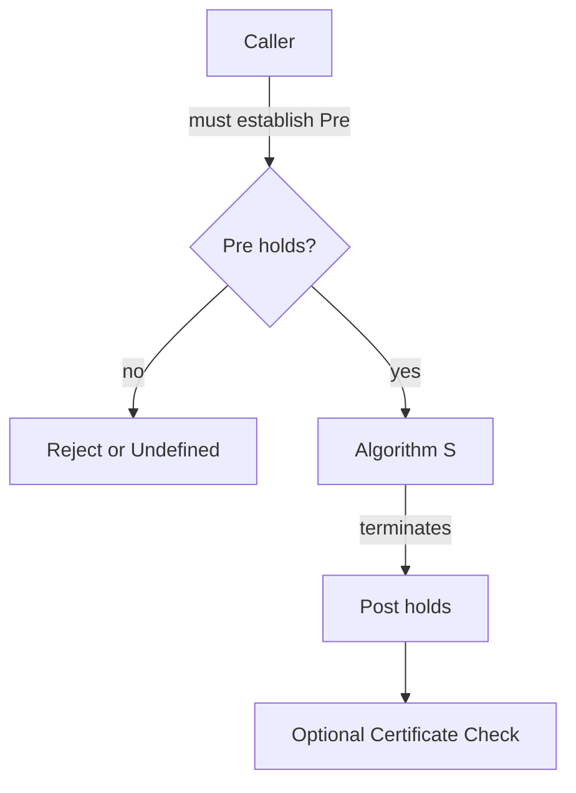
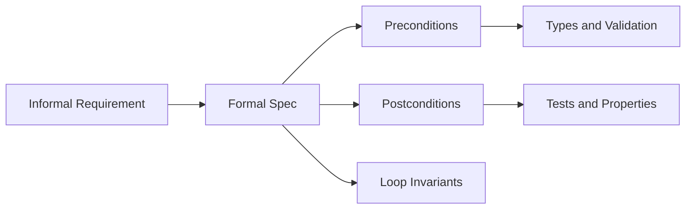
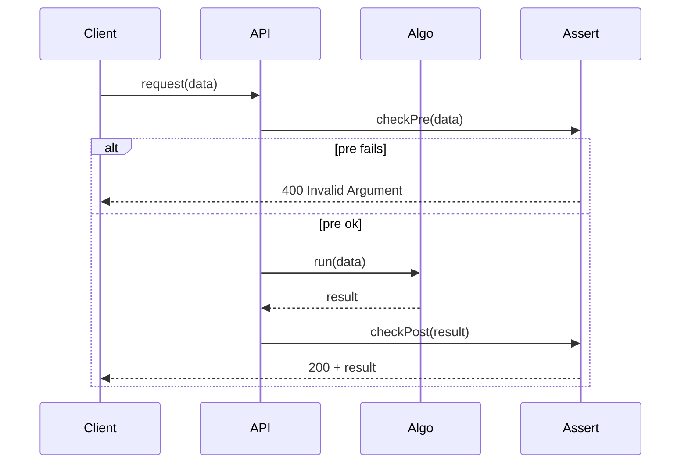

# Problem Specifications Preconditions and Postconditions

## Overview

A **problem specification** is a precise statement of the input domain, output relation, and any auxiliary resources an algorithm may use. **Preconditions** describe what must hold before invocation; **postconditions** describe what must hold after successful termination. Together they form an **algorithm contract**—the production analogue of API schemas, but for procedural correctness.

Hoare triple notation `{P} S {Q}` reads: if precondition `P` holds and statement `S` terminates, then postcondition `Q` holds. Specifications fail in the wild when preconditions are implicit (sorted input assumed but not checked), postconditions are incomplete (return `-1` on error but also on valid "not found"), or side effects are omitted (mutates input when callers expect purity).

## Learning Objectives

- Write pre/post pairs for search, sort, and aggregate problems
- Distinguish partial specifications from total correctness requirements
- Map contracts to TypeScript types, Python docstrings, and runtime assertions
- Identify under-specified comparators, equality, and edge cases (empty, duplicates)
- Design certificates checkable by callers (e.g., sorted permutation)

## Prerequisites

- [[05-Algorithms/00-Foundations-and-Correctness/Why Algorithms Exist|Why Algorithms Exist]]
- [[01-Computer-Science/09-Correctness-and-Reliability/Invariants Assertions and Contracts|Invariants Assertions and Contracts]]

## Difficulty

`beginner`

## Estimated Time

- Reading: 2 hours
- Exercises: 3 hours
- Mini project: 4 hours

## History

Floyd and Hoare (1960s–70s) formalized axiomatic semantics for imperative programs. Design-by-contract (Meyer, Eiffel) brought pre/post to mainstream OOP. Modern languages embed contracts via assertions (`assert`, `invariant` in C#), optional refinement types, and property-based testing (QuickCheck, Hypothesis)—all operational descendants of the same idea.

## Problem It Solves

Ambiguous specs cause:

- **Silent wrong answers**: binary search on unsorted data
- **Double meaning return codes**: `-1` as error vs valid index
- **Unstable production behavior**: locale-dependent string sort in audit logs
- **Integration failures**: upstream supplies duplicates; downstream assumes unique keys

Explicit contracts make wrong assumptions visible at boundaries instead of in revenue dashboards.

## Internal Implementation

### Specification template

| Field | Content |
| --- | --- |
| Name | e.g., `BINARY_SEARCH` |
| Input | Sorted array `a[0..n)`, target `x`, comparator `cmp` |
| Pre | `cmp` is a strict weak ordering; `a` sorted non-decreasing under `cmp` |
| Post | Returns `i ∈ [0,n)` with `cmp(a[i], x) = 0`, or sentinel `n` if absent |
| Errors | Invalid pre → throw vs undefined behavior (document which) |
| Effects | Read-only on `a` |
| Complexity | O(log n) comparisons (see dedicated section) |

### Certificates

Some postconditions are **verifiable** by callers cheaply:

- Sort: output is permutation of input + adjacent pairs ordered
- Shortest path: path cost equals sum of edges; no cheaper path exists (harder—often trust algorithm)

Certificates enable **property tests** and regression gates in CI.



## Mermaid Diagrams

### Structure: contract layers



### Sequence: contract at API boundary



## Correctness

**Specification correctness** means the pre/post pair is **consistent** and **strong enough** for callers:

- **Consistency**: there exists an implementation satisfying `{P} S {Q}` (not vacuously false)
- **Adequacy**: post captures caller needs (e.g., "first index" vs "any index" for duplicates)
- **Referential transparency**: if pre includes immutability, post must not secretly require hidden global state

**Partial correctness theorem**: assuming pre holds and loop invariants maintained, post follows. Link to [[05-Algorithms/00-Foundations-and-Correctness/Loop Invariants and Correctness Proofs|Loop Invariants and Correctness Proofs]].

Example Hoare sketch for `max` of non-empty array:

- Pre: `n ≥ 1`
- Post: `∀j. a[j] ≤ result` and `∃k. a[k] = result`
- Loop invariant: `maxSoFar` is maximum of prefix examined

## Complexity

Specifications may include **complexity obligations** as part of the contract:

- "Must run in O(log n) comparisons" — algorithmic requirement, not just functional
- "Must use O(1) extra space" — rules out copy-then-sort shortcuts

Separate **functional postconditions** from **resource postconditions**. A procedure can meet output spec while violating complexity spec—both are production failures at scale. Analysis tools live in [[05-Algorithms/01-Complexity-and-Analysis/README|Complexity and Analysis]] module; the primer vocabulary is in [[01-Computer-Science/08-Languages-and-Computation/Computational Complexity Primer|Computational Complexity Primer]]—this track applies it to algorithm families.

## Examples

### Minimal Example

**TypeScript** — contract-first binary search boundary (first `≥ target`):

```typescript
export type Cmp<T> = (a: T, b: T) => number;

/** Pre: `a` sorted ascending by `cmp` (cmp(a[i],a[j]) <= 0 for i <= j).
 *  Post: returns min i in [0,n] with cmp(a[i], target) >= 0, or n if none. */
export function lowerBound<T>(a: readonly T[], target: T, cmp: Cmp<T>): number {
  let lo = 0;
  let hi = a.length;
  while (lo < hi) {
    const mid = lo + Math.floor((hi - lo) / 2);
    if (cmp(a[mid]!, target) < 0) lo = mid + 1;
    else hi = mid;
  }
  return lo;
}
```

**Python**:

```python
from typing import Callable, Sequence, TypeVar

T = TypeVar("T")
Cmp = Callable[[T, T], int]

def lower_bound(a: Sequence[T], target: T, cmp: Cmp[T]) -> int:
    """Pre: sorted ascending by cmp. Post: min i with cmp(a[i], target) >= 0, else len(a)."""
    lo, hi = 0, len(a)
    while lo < hi:
        mid = lo + (hi - lo) // 2
        if cmp(a[mid], target) < 0:
            lo = mid + 1
        else:
            hi = mid
    return lo
```

### Production-Shaped Example

Rate limiter spec:

- **Pre**: monotonic clock; bucket parameters `rate`, `burst ≥ 0`
- **Post**: `allow()` returns boolean; token count ∈ [0, burst]; never exceeds burst
- **Not in spec**: thread-safety—must be documented as separate pre for concurrent callers
- **Adversarial**: clock skew backward jumps—spec must define behavior (clamp, reject, or use logical time)

```typescript
interface TokenBucket {
  /** Pre: tokens initialized in [0, burst]. */
  tryConsume(n: number): boolean;
  /** Post: if true, tokens decreased by n; always tokens in [0, burst]. */
}
```

## Trade-offs

| Dimension | Upside | Downside | When it matters |
| --- | --- | --- | --- |
| Strict pre (throw) | Fail fast, debuggable | Caller burden | Public APIs, security |
| Permissive pre (UB) | Hot path speed | Silent corruption | Inner loops with proven callers |
| Rich post + certificate | Testable | More code | Financial, compliance |
| Informal comments only | Low friction | Drift | Prototypes only |

### When to Use

- Any reusable algorithm module or shared library wrapper
- Boundary between teams (data pipeline → serving layer)
- Before optimizing—wrong spec optimized is wrong faster

### When Not to Use

- Throwing on every inner-loop invariant in trusted kernel code—use debug assertions instead per [[04-Data-Structures/00-Orientation-and-Contracts/Invariants Representation and Debug Assertions|Invariants Representation and Debug Assertions]]

## Exercises

1. Write full pre/post for "stable sort by key function `f`."
2. Why is `cmp(a,a) === 0` necessary but not sufficient for a valid comparator?
3. Specify `unique()` on a stream with duplicates—return order defined or arbitrary?
4. Convert a bug report ("wrong median") into missing or wrong postcondition language.
5. Design a certificate function `isSorted(a, cmp)` and property: `sort(a)` passes it.

## Mini Project

**Contract Linter**

Scan a small repo module; for each exported function, document missing pre/post. Add runtime `checkPre` in dev builds for one critical path.

## Portfolio Project

Define JSON schema for algorithm contracts in [[05-Algorithms/projects/Algorithm Workbench/README|Algorithm Workbench]] shared vectors—tests assert pre before run, post after.

## Interview Questions

1. Precondition vs input validation—same or different?
2. Write pre/post for stack `pop()` including empty case.
3. Binary search: why must array be sorted—what breaks in post if not?
4. How do property-based tests relate to specifications?
5. When is undefined behavior acceptable in specifications?

### Stretch / Staff-Level

1. Compare Hoare logic contracts to dependent types—what expressiveness gap remains?
2. Specify idempotent retry-safe `deductBalance(amount)` under concurrent calls.

## Common Mistakes

- Postcondition says "returns index" without **unique** vs **any** duplicate policy
- Precondition requires total order but comparator only defines partial order on objects
- Ignoring **empty input** and **single element** in spec
- Documenting post for success path only—not failure/ sentinel semantics

## Best Practices

- Co-locate pre/post with function; test boundary cases derived from spec
- Name sentinel values (`NOT_FOUND = n`) instead of overloading `-1`
- Version breaking contract changes explicitly
- Use property tests to fuzz pre-adjacent violations
- Link DS requirements: "pre: random access to `a[i]` in O(1)" → array not list

## Summary

Problem specifications translate intent into obligations. Preconditions guard entry; postconditions guarantee exit. Correctness arguments and complexity bounds attach to this contract—not to informal comments. Production quality starts when callers and implementers share the same `{P} S {Q}` story, including edge cases, side effects, and certificates.

## Further Reading

- [[00-References/Algorithms/README|Algorithms References]]
- Hoare — "An Axiomatic Basis for Computer Programming" (1969)
- [[05-Algorithms/00-Foundations-and-Correctness/Loop Invariants and Correctness Proofs|Loop Invariants and Correctness Proofs]]

## Related Notes

- [[05-Algorithms/00-Foundations-and-Correctness/Why Algorithms Exist|Why Algorithms Exist]]
- [[05-Algorithms/00-Foundations-and-Correctness/Loop Invariants and Correctness Proofs|Loop Invariants and Correctness Proofs]]
- [[05-Algorithms/00-Foundations-and-Correctness/Termination Partial and Total Correctness|Termination Partial and Total Correctness]]
- [[05-Algorithms/02-Searching-and-Selection/Binary Search and Boundary Variants|Binary Search and Boundary Variants]]
- [[01-Computer-Science/09-Correctness-and-Reliability/Invariants Assertions and Contracts|Invariants Assertions and Contracts]]
- [[04-Data-Structures/00-Orientation-and-Contracts/Interface Design Capacity Errors and Iteration|Interface Design Capacity Errors and Iteration]]

## Progress Checklist

- [ ] Explained from first principles
- [ ] Drew at least one Mermaid diagram
- [ ] Implemented a minimal version
- [ ] Documented trade-offs and non-goals
- [ ] Completed exercises
- [ ] Practiced interview questions aloud
- [ ] Linked prerequisites and dependents
