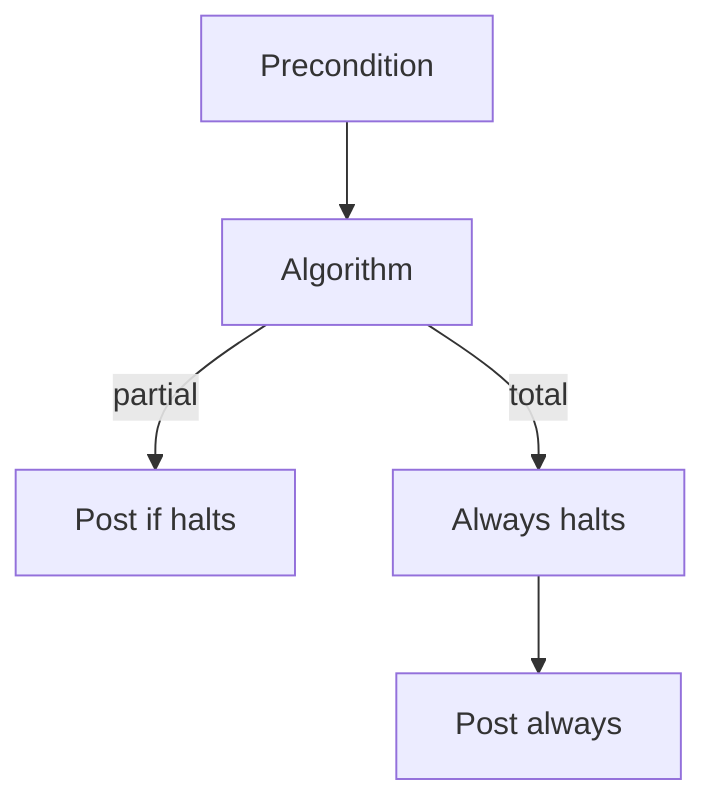
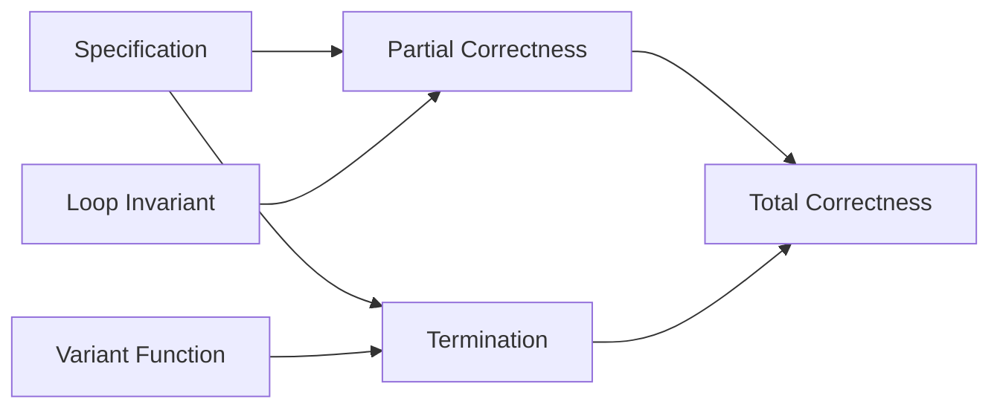
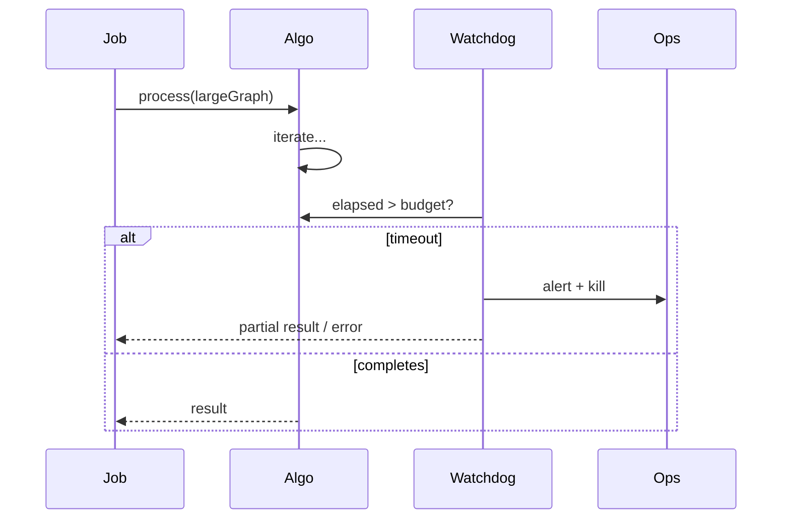

# Termination Partial and Total Correctness

## Overview

**Partial correctness** guarantees that *if* a program terminates, its result satisfies the postcondition. **Total correctness** adds **termination**: the program always halts under stated preconditions. **Termination** is not guaranteed by Turing-complete languages—a loop with no progress measure can run forever while preserving a perfect loop invariant.

Production outages from non-termination include unbounded retry loops, graph traversal without visited sets, and recursive parsers on cyclic inputs. Termination arguments use **ranking functions** (variants): natural numbers or well-founded ordinals that strictly decrease while work remains.

## Learning Objectives

- Distinguish partial vs total correctness and when each suffices
- Construct ranking functions for loops and recursive algorithms
- Recognize non-termination from cycles, unbounded recursion, and floating-point quirks
- Apply timeout and fuel patterns as engineering termination guards
- Relate halting to SLA budgets and watchdog kills

## Prerequisites

- [[05-Algorithms/00-Foundations-and-Correctness/Loop Invariants and Correctness Proofs|Loop Invariants and Correctness Proofs]]

## Difficulty

`intermediate`

## Estimated Time

- Reading: 2 hours
- Exercises: 3 hours
- Mini project: 4 hours

## History

Turing (1936) proved the halting problem undecidable in general—no algorithm decides termination for all programs. Floyd and Hoare separated partial correctness proofs from termination. Practical static analyzers (Totality checking in dependently typed languages, Rust loop `while` patterns) recover termination for restricted idioms. Production systems layer **external** termination: deadlines, cgroup limits, circuit breakers.

## Problem It Solves

| Failure | Missing termination ingredient |
| --- | --- |
| Infinite while on floating comparison | No strict progress; numeric tolerance |
| DFS on implicit graph | No visited set; cycle |
| Mutual recursion on malformed AST | No structural decrease on input |
| Retry storm | No backoff cap or budget |

Customers experience "hang" not "wrong answer"—harder to debug, equally severe for SLOs.

## Internal Implementation

### Ranking function (variant)

For loop guard `G`, variant `V` maps states to ℕ such that:

1. `V` bounded below (often ≥ 0)
2. Each iteration with `G` true strictly decreases `V`

Example: binary search `V = hi - lo`, initially ≤ n, decreases each step.

### Partial vs total



### Recursion termination

Structural recursion: each call operates on **smaller** input per well-founded order (list tail, subtree depth). Ackermann-style recursion needs explicit ordinal measures.

## Mermaid Diagrams

### Structure: correctness decomposition



### Sequence: watchdog termination in production



## Correctness

**Theorem schema (total)**:

If pre holds, invariant `I` maintained, variant `V` decreases while guard true, and `I ∧ ¬G ⇒ post`, then algorithm is **totally correct**.

**When partial suffices**:

- Interactive systems with user cancel
- Anytime algorithms returning best-so-far under budget
- Batched jobs killed by scheduler—post becomes "best effort within budget"

**When total required**:

- Financial settlement, consensus steps, lock release paths
- Embedded control loops with hard real-time caps

Link invariant proofs: [[05-Algorithms/00-Foundations-and-Correctness/Loop Invariants and Correctness Proofs|Loop Invariants and Correctness Proofs]].

## Complexity

Termination and complexity interact:

- A terminating algorithm may still be **useless** if variant decreases by 1 on an input of size n requiring n! steps
- **Amortized** analysis sometimes hides occasional long runs—termination holds per operation but sequence cost spikes

Engineering **fuel** pattern: pass remaining budget; each step decrements—O(1) check guarantees halt even if logic wrong.

Space: non-termination from infinite recursion consumes stack—termination in time does not imply bounded memory.

## Examples

### Minimal Example

**TypeScript** — gcd with variant `b`:

```typescript
/** Pre: a, b integers, b >= 0. Post: returns gcd(a,b). Terminates: b decreases. */
function gcd(a: number, b: number): number {
  let x = Math.abs(a);
  let y = b;
  while (y !== 0) {
    const r = x % y;
    x = y;
    y = r; // variant: y strictly decreases when y > 0
  }
  return x;
}
```

**Python**:

```python
def gcd(a: int, b: int) -> int:
    """Total correctness: b decreases toward 0 in Euclidean loop."""
    x, y = abs(a), b
    while y:
        x, y = y, x % y
    return x
```

### Production-Shaped Example

Graph walk with fuel and visited set:

```typescript
function reachable(
  start: string,
  adj: ReadonlyMap<string, readonly string[]>,
  fuel: number
): Set<string> {
  const seen = new Set<string>([start]);
  const stack = [start];
  while (stack.length > 0 && fuel-- > 0) {
    const u = stack.pop()!;
    for (const v of adj.get(u) ?? []) {
      if (!seen.has(v)) {
        seen.add(v);
        stack.push(v);
      }
    }
  }
  if (fuel <= 0 && stack.length) throw new Error("termination budget exceeded");
  return seen;
}
```

Adversarial: clique graph with n nodes needs O(n²) edges stored—fuel caps **time**, not memory blow-up.

## Trade-offs

| Dimension | Upside | Downside | When it matters |
| --- | --- | --- | --- |
| Proof of termination | Strong guarantee | Hard for complex loops | Core infra |
| Fuel / timeout | Ships safely | Wrong partial results | Untrusted inputs |
| Unbounded retry | Eventually succeeds | Outage amplification | External APIs |
| Static totality | Compile-time | Limited patterns | Rust, ML subsets |

### When to Use

- Any loop on user-controlled graph or tree depth
- Recursion on parsed structures (JSON, XML)—depth limits
- Worker pools processing unknown backlog

### When Not to Use

- Event loops and servers meant to run forever—termination is **process** level, not request handler loop

## Exercises

1. Give variant for insertion sort outer+inner loops combined.
2. Show a loop with invariant but **no** variant (`i` increases, guard `i >= 0` always true).
3. Prove quickselect terminates on finite array (variant: subarray size).
4. Design fuel API for recursive JSON pretty-print max depth 1000.
5. When does partial correctness + timeout = acceptable product behavior?

## Mini Project

Implement BFS with optional `maxNodes` cap; document total vs partial correctness under cap exceeded.

## Portfolio Project

Add termination metadata (`variant_desc`, `max_steps`) to Algorithm Workbench catalog entries.

## Interview Questions

1. Partial vs total correctness—define and compare.
2. What is a ranking function? Example for binary search.
3. Can a program be partially correct for all inputs but not terminate on some?
4. Why is halting problem undecidable—one-sentence intuition?
5. How do production systems enforce termination without proofs?

### Stretch / Staff-Level

1. Termination of union-find with path compression—why naive variant fails.
2. Compare fuel pattern to Rust's `loop` + break with counter for untrusted WASM plugins.

## Common Mistakes

- Assuming **finite loop counter** type prevents infinite loop on wraparound
- `while (x != target)` on floats without tolerance progress
- Ignoring **stack overflow** as non-termination manifestation
- Proving termination on **average** input only

## Best Practices

- State variant alongside invariant in comments
- Cap recursion depth in parsers; use iterative stack
- Expose **budget exceeded** as distinct error for ops
- Test cyclic inputs explicitly
- Link [[05-Algorithms/07-Graph-Traversal-and-DAGs/BFS|BFS]] visited-set requirement

## Summary

Total correctness = partial correctness + termination. Variants turn "this loop feels like it stops" into reviewable obligations. Undecidability in general does not excuse missing progress measures on the algorithms you ship—especially on adversarial graphs, retries, and recursive data.

## Further Reading

- [[00-References/Algorithms/README|Algorithms References]]
- Turing — "On Computable Numbers" (1936)
- [[05-Algorithms/00-Foundations-and-Correctness/Loop Invariants and Correctness Proofs|Loop Invariants and Correctness Proofs]]

## Related Notes

- [[05-Algorithms/00-Foundations-and-Correctness/Loop Invariants and Correctness Proofs|Loop Invariants and Correctness Proofs]]
- [[05-Algorithms/00-Foundations-and-Correctness/Problem Specifications Preconditions and Postconditions|Problem Specifications Preconditions and Postconditions]]
- [[05-Algorithms/02-Searching-and-Selection/Quickselect and Partition-Based Selection|Quickselect and Partition-Based Selection]]
- [[01-Computer-Science/09-Correctness-and-Reliability/Invariants Assertions and Contracts|Invariants Assertions and Contracts]]
- [[05-Algorithms/README|Algorithms Track]]

## Progress Checklist

- [ ] Explained from first principles
- [ ] Drew at least one Mermaid diagram
- [ ] Implemented a minimal version
- [ ] Documented trade-offs and non-goals
- [ ] Completed exercises
- [ ] Practiced interview questions aloud
- [ ] Linked prerequisites and dependents
