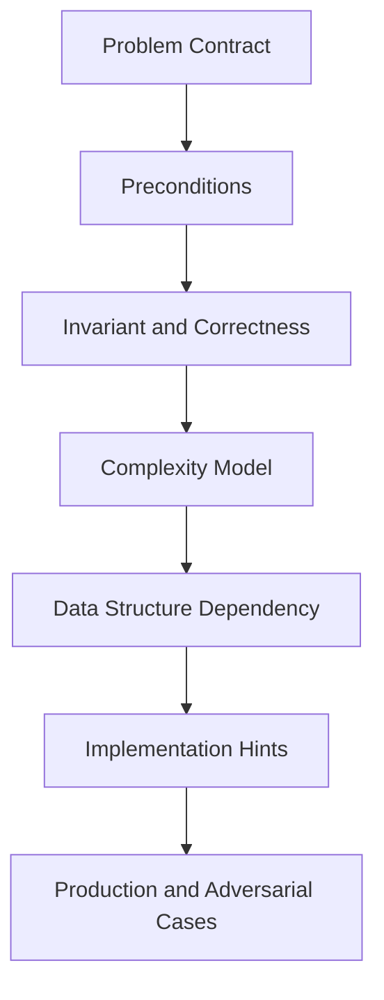
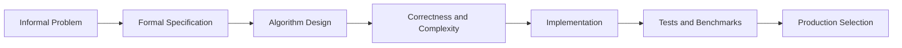
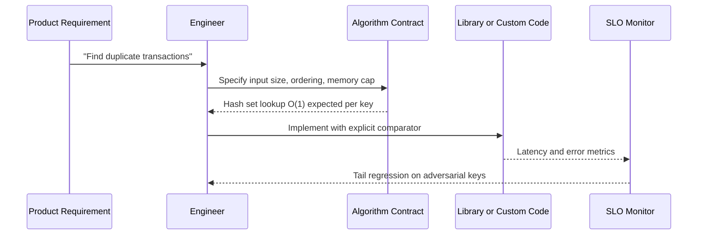

# Why Algorithms Exist

## Overview

An **algorithm** is a finite, unambiguous sequence of steps that transforms inputs satisfying stated **preconditions** into outputs satisfying **postconditions**, using a fixed repertoire of primitive operations. Computers do not "understand" problems—they execute instructions. An algorithm is the bridge between an informal goal ("find the cheapest route") and a machine-executable procedure with analyzable **correctness** and **resource cost**.

Algorithms exist because raw hardware speed is insufficient without structured procedures: brute-force enumeration explodes combinatorially, ambiguous steps produce divergent behavior across teams, and unbounded loops freeze production services. The [[05-Algorithms/README|Algorithms track]] treats algorithms as **engineering artifacts**—contracts first, proofs second, measurement third—not as trivia for interviews.

## Learning Objectives

- Define algorithm, instance, problem, and solution in precise terms
- Explain why finite, deterministic (or explicitly randomized) steps matter for reliability
- Connect algorithm choice to latency, memory, and correctness incidents
- Distinguish algorithm design from data-structure layout and from system architecture
- Articulate when a problem requires a new procedure versus reusing a known family

## Prerequisites

- [[01-Computer-Science/00-Orientation/How Computers Run Programs|How Computers Run Programs]]
- [[01-Computer-Science/08-Languages-and-Computation/Computational Complexity Primer|Computational Complexity Primer]]

## Difficulty

`beginner`

## Estimated Time

- Reading: 1.5 hours
- Exercises: 2 hours
- Mini project: 3 hours

## History

Euclid's *Elements* (~300 BCE) codified gcd via repeated subtraction—an early algorithm with a termination argument. Al-Khwarizmi's name became "algorithm" through Latin transliteration. The 20th century formalized computability (Turing, Church) and complexity (Hartmanis–Stearis, 1965). Knuth's *The Art of Computer Programming* (1968–) established analysis as engineering discipline. Modern production adds **adversarial inputs**, **distributed partial failure**, and **observability**—constraints Euclid never faced but the contract mindset still addresses.

## Problem It Solves

Without explicit algorithms, teams suffer:

- **Correctness drift**: two "sort the list" implementations diverge on stability, NaN, or locale
- **Scale cliffs**: O(n²) nested loops pass staging, fail at Black Friday traffic
- **Unmaintainable magic**: a 400-line `process()` nobody can prove terminates
- **Wrong abstraction**: graph traversal coded ad hoc when BFS contract already exists

Algorithms name **families** (search, sort, shortest path) with known trade-offs so you choose procedures deliberately rather than reinventing—and silently breaking—each time.

## Internal Implementation

### Problem contract (pedagogy spine)

Every algorithm note in this track follows:



### What an algorithm specifies

| Element | Question answered |
| --- | --- |
| Input domain | What instances are legal? |
| Output | What must be returned or established? |
| Primitive ops | Comparisons, assignments, arithmetic—cost model hooks |
| Control flow | Sequencing, branching, iteration, recursion |
| Resource bounds | Time, space, random bits, I/O passes |

**Representation** (array vs linked list vs B-tree page) lives in [[04-Data-Structures/README|Data Structures]]; the algorithm states *what* must hold after each step, not how bytes are laid out.

### Relationship to libraries

`Array.prototype.sort`, `sorted()`, `std::sort`, and database ORDER BY hide algorithm choices—often introsort, timsort, or external merge. The library does not remove the contract: stability, comparator consistency, and numeric ordering rules still determine correctness. See [[05-Algorithms/00-Foundations-and-Correctness/Algorithm Engineering and Reuse vs Reinvention|Algorithm Engineering and Reuse vs Reinvention]].

## Mermaid Diagrams

### Structure: from problem to executable procedure



### Sequence: algorithm lifecycle in a service



## Correctness

**Partial correctness**: *if* the algorithm terminates, the output satisfies the postcondition. **Total correctness** adds termination. At this introductory level, insist on three artifacts before shipping:

1. **Preconditions** — e.g., input array is finite, comparator defines a total order on elements compared
2. **Postconditions** — e.g., returned index is `-1` or valid; if valid, `a[i] === target`
3. **Progress** — each loop iteration advances a measure (index increases, interval shrinks)

An algorithm without a stated contract is not reusable—it is a one-off script. Link forward to [[05-Algorithms/00-Foundations-and-Correctness/Problem Specifications Preconditions and Postconditions|Problem Specifications Preconditions and Postconditions]] and [[05-Algorithms/00-Foundations-and-Correctness/Loop Invariants and Correctness Proofs|Loop Invariants and Correctness Proofs]].

## Complexity

Algorithms exist partly to make **cost predictable**. A procedure that is correct but runs 2ⁿ steps solves nothing at n = 40. Complexity analysis (developed in [[05-Algorithms/01-Complexity-and-Analysis/Cost Models and Input Size|Cost Models and Input Size]]) answers: "How does work grow with input size *n* under a stated model?"

At foundation level, internalize:

- **Input size** must be defined (n keys, m edges, bit length of integers)
- **Worst case** guards SLA tails; **average/expected** models random inputs; **amortized** models sequences of operations
- Big-O is a **suppression of constants**—two O(n log n) sorts differ by 5× in production

Correctness without complexity is mathematics; complexity without correctness is gambling.

## Examples

### Minimal Example

**TypeScript** — explicit contract for linear search (algorithm family preview):

```typescript
/** Pre: `a` finite; `eq` reflexive on values compared.
 *  Post: returns smallest i with eq(a[i], target), else -1. */
function findIndex<T>(a: readonly T[], target: T, eq: (x: T, y: T) => boolean): number {
  for (let i = 0; i < a.length; i++) {
    if (eq(a[i], target)) return i;
  }
  return -1;
}
```

**Python**:

```python
from typing import Callable, Sequence, TypeVar

T = TypeVar("T")

def find_index(a: Sequence[T], target: T, eq: Callable[[T, T], bool]) -> int:
    """Pre: finite sequence. Post: smallest i with eq(a[i], target), else -1."""
    for i, x in enumerate(a):
        if eq(x, target):
            return i
    return -1
```

### Production-Shaped Example

Duplicate payment detection in a ledger stream:

- **Contract**: given a sliding window of transaction IDs, report first duplicate within window
- **Naive**: pairwise compare — O(w²) per window
- **Algorithm**: hash set membership — O(1) expected per insert/lookup, O(w) space
- **Adversarial**: attacker crafts hash collisions if you use a weak hash without universal hashing
- **Observability**: track set size vs window bound; alert on comparator string normalization bugs

```typescript
function firstDuplicateInWindow(ids: string[], window: number): string | null {
  const seen = new Set<string>();
  for (let i = 0; i < ids.length; i++) {
    const id = ids[i]!;
    if (seen.has(id)) return id;
    seen.add(id);
    if (seen.size > window) {
      const expire = ids[i - window]!;
      seen.delete(expire);
    }
  }
  return null;
}
```

## Trade-offs

| Dimension | Upside | Downside | When it matters |
| --- | --- | --- | --- |
| Explicit algorithm | Provable behavior, teachable | Design time upfront | Regulated, financial, infra |
| Library default | Fast to ship | Hidden assumptions | CRUD with small n |
| Custom implementation | Tailored constants | Maintenance burden | Hot path at scale |
| Formal proof | Strong guarantees | Costly for large systems | Crypto, consensus cores |

### When to Use

- Hot paths with defined input distributions and SLO pressure
- Operations repeated across services (sort, search, dedupe, path find)
- Incidents traced to ambiguous or unbounded procedures

### When Not to Use

- One-off glue scripts with n < 100 and no growth path
- Problems already solved by DB/query planner with correct indexes—see [[08-Databases/04-Query-Processing-and-Planning/EXPLAIN and EXPLAIN ANALYZE Literacy|EXPLAIN and EXPLAIN ANALYZE Literacy]]
- When the bottleneck is network I/O, not CPU algorithmics—see [[09-System-Design/01-Capacity-Latency-and-Bottlenecks/Bottleneck Finding CPU Memory Disk Network|Bottleneck Finding CPU Memory Disk Network]]

## Exercises

1. Write a one-paragraph contract for "return the second-largest distinct integer in an array." List ambiguous cases.
2. Give an example from your work where a library function's hidden algorithm choice caused a bug or perf surprise.
3. Classify these as **problem**, **instance**, or **algorithm**: (a) sorting, (b) `[3,1,2]`, (c) mergesort, (d) "sorted order of `[3,1,2]`".
4. Prove informally that the `findIndex` above returns the **smallest** index on success.
5. Estimate n where O(n²) becomes unacceptable at 10 ms CPU budget and 1 μs per inner iteration.

## Mini Project

**Algorithm Card Catalog**

Create a markdown or JSON catalog of 10 operations your codebase performs (dedupe, top-k, merge intervals, etc.). For each: informal problem, suspected complexity, library used, preconditions assumed, and one failure story or "unknown."

## Portfolio Project

Contribute algorithm contract sections to [[05-Algorithms/projects/Algorithm Workbench/README|Algorithm Workbench]]: shared schema for `{ name, pre, post, time, space, ds_deps }`.

## Interview Questions

1. What is an algorithm? How does it differ from a program?
2. Why is "it works on my machine" insufficient for algorithm acceptance?
3. Give an example where correct output is not enough—complexity matters.
4. Problem vs instance vs algorithm—define each.
5. When would you reimplement versus use a standard library sort?

### Stretch / Staff-Level

1. Argue whether machine learning inference is an "algorithm" under the finite-step definition; what breaks?
2. How do immutability and persistence change algorithm engineering in functional production code?

## Common Mistakes

- Treating **big-O notation** as the entire analysis—ignoring n = 50 vs n = 10⁷
- Conflating **data structure** with **algorithm** ("we use a hash map" is not a procedure)
- Skipping **comparator consistency** (`cmp(a,b) === -cmp(b,a)` failures)
- Assuming library **sort** is stable without checking language spec

## Best Practices

- Write pre/post as comments or types before loops
- Name the **algorithm family** in design docs (Dijkstra, not "BFS with weights")
- Pair implementation with **counterexamples** from adversarial inputs
- Benchmark on **production-shaped** distributions, not only random arrays
- Cross-link to [[04-Data-Structures/README|Data Structures]] for representation choices

## Summary

Algorithms exist to turn well-defined problems into finite, analyzable procedures whose outputs and costs can be trusted at scale. Hardware executes instructions; algorithms supply the structure that makes those instructions correct and affordable. Master the contract mindset—preconditions, postconditions, invariants, complexity—before optimizing syntax or chasing pattern catalogs.

## Further Reading

- [[00-References/Algorithms/README|Algorithms References]]
- Knuth — *The Art of Computer Programming*, Vol. 1 (fundamentals)
- [[05-Algorithms/_exercises/README|Algorithms Exercises]]

## Related Notes

- [[05-Algorithms/00-Foundations-and-Correctness/Problem Specifications Preconditions and Postconditions|Problem Specifications Preconditions and Postconditions]]
- [[05-Algorithms/00-Foundations-and-Correctness/Loop Invariants and Correctness Proofs|Loop Invariants and Correctness Proofs]]
- [[05-Algorithms/00-Foundations-and-Correctness/Termination Partial and Total Correctness|Termination Partial and Total Correctness]]
- [[05-Algorithms/01-Complexity-and-Analysis/Cost Models and Input Size|Cost Models and Input Size]]
- [[01-Computer-Science/09-Correctness-and-Reliability/Invariants Assertions and Contracts|Invariants Assertions and Contracts]]
- [[04-Data-Structures/00-Orientation-and-Contracts/Why Data Structures Exist|Why Data Structures Exist]]
- [[05-Algorithms/README|Algorithms Track]]

## Progress Checklist

- [ ] Explained from first principles
- [ ] Drew at least one Mermaid diagram
- [ ] Implemented a minimal version
- [ ] Documented trade-offs and non-goals
- [ ] Completed exercises
- [ ] Practiced interview questions aloud
- [ ] Linked prerequisites and dependents
