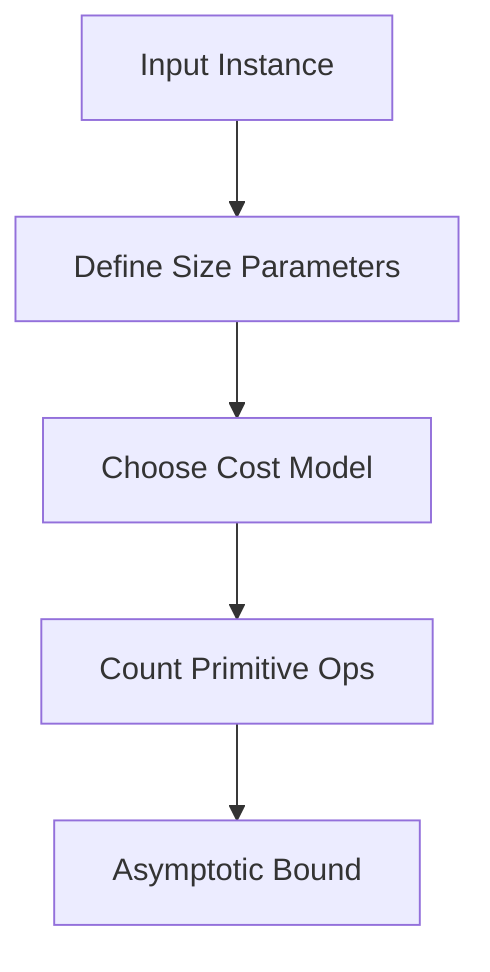
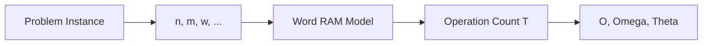
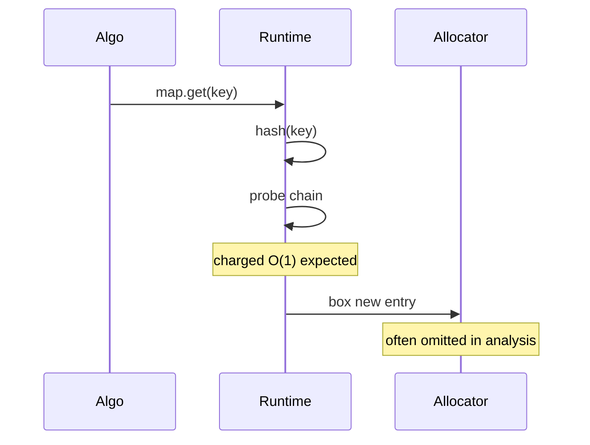

# Cost Models and Input Size

## Overview

A **cost model** assigns a price to each primitive operation so algorithm cost can be expressed as a function of **input size**. The usual default is the **word RAM model**: random access to memory words, arithmetic and comparisons on word-sized integers in O(1) time. **Input size** must be defined explicitly—array length `n`, graph `n` vertices and `m` edges, integer **bit length** `w`, string characters, or stream length not known upfront.

Analysis without a stated model and size measure is meaningless: "O(n)" is ambiguous if `n` mixes keys and edges, or if comparisons on 256-bit decimals are charged O(1) incorrectly.

## Learning Objectives

- State word RAM assumptions and where they break (big integers, I/O, cache)
- Define input size for arrays, graphs, strings, and numeric inputs
- Count operations in simple loops vs hidden costs (allocation, hashing)
- Relate cost model to language/runtime behavior
- Choose size parameters for multi-parameter bounds (O(n + m))

## Prerequisites

- [[01-Computer-Science/08-Languages-and-Computation/Computational Complexity Primer|Computational Complexity Primer]]
- [[05-Algorithms/00-Foundations-and-Correctness/Why Algorithms Exist|Why Algorithms Exist]]

## Difficulty

`beginner`

## Estimated Time

- Reading: 2 hours
- Exercises: 3 hours
- Mini project: 4 hours

## History

Knuth popularized detailed operation counts. The RAM model formalized what "unit cost" means. External memory and cache-oblivious models (Aggarwal–Vitter, 1988) address disk hierarchy. Modern systems add **network RTT** and **serialization** as dominant costs—still require explicit size parameters.

## Problem It Solves

Mis-specified size leads to:

- Claiming O(n) string sort when keys have length L → actually O(n L log n) comparisons of length L
- Graph algorithm "O(n²)" when input sparse m ≪ n²
- Integer algorithms ignoring **bit complexity** on crypto-sized numbers
- Streaming problems sized by **window** w not full history

Production SLAs fail when analysis uses wrong `n`.

## Internal Implementation

### Word RAM (default)

| Charged O(1) | Often *not* O(1) in reality |
| --- | --- |
| Read/write `a[i]` | Cache miss → hidden constant |
| Compare two words | BigInt arbitrary precision |
| Add/multiply word-sized ints | Memory allocation |
| Branch, index arithmetic | Virtual memory page fault |

### Input size conventions

| Problem | Typical size |
| --- | --- |
| Array algorithms | n = length |
| Graphs | n vertices, m edges |
| Strings | n strings, total chars N, or max length L |
| Numbers | value magnitude or bit length w |
| Streams | per-batch n; unbounded with window w |

### Multi-parameter bounds

Shortest paths on sparse graphs: O((n + m) log n)—both parameters matter; stating only n hides m dependency.



## Mermaid Diagrams

### Structure: analysis stack



### Sequence: hidden costs in one API call



## Correctness

Cost models do not affect **functional** correctness but affect **resource postconditions**:

- Spec: "returns shortest path in O((n+m) log n) time" — wrong algorithm violates spec even if path correct
- **Real-time correctness**: must finish within deadline—needs model matching hardware

Analysis correctness: operation counting must match loop structure—each iteration charged consistently.

## Complexity

This note *is* foundational complexity—deepens [[01-Computer-Science/08-Languages-and-Computation/Computational Complexity Primer|Computational Complexity Primer]] with algorithm-track application:

- **Uniform vs logarithmic cost** for integer ops
- **Output-sensitive** analysis: O(output size + n)
- **Parameterized** complexity: O(k n) for bounded k

Example: linear scan

- Pre: array length n
- Post: find index or -1
- Cost: n comparisons worst case, 1 best case — state which case

Link forward: [[05-Algorithms/01-Complexity-and-Analysis/Worst Average Expected and Amortized Cases|Worst Average Expected and Amortized Cases]].

## Examples

### Minimal Example

**TypeScript** — explicit size parameter in doc:

```typescript
/** Cost model: word RAM. Input size n = a.length.
 *  Worst-case comparisons: n. */
function maxIndex(a: readonly number[]): number {
  if (a.length === 0) throw new RangeError("empty");
  let best = 0;
  for (let i = 1; i < a.length; i++) {
    if (a[i]! > a[best]!) best = i;
  }
  return best;
}
```

**Python**:

```python
def max_index(a: list[int]) -> int:
    """Word RAM; n = len(a); Theta(n) comparisons."""
    if not a:
        raise ValueError("empty")
    best = 0
    for i in range(1, len(a)):
        if a[i] > a[best]:
            best = i
    return best
```

### Production-Shaped Example

Joining n events with m reference rows:

- Naive: O(n × m) if nested loop
- Indexed: O(n + m) with hash map on reference keys — **size is n + m**, not n alone
- Hidden: string key normalization UTF-8 NFC adds O(L) per key

```typescript
function enrichEvents(
  events: { key: string }[],
  ref: Map<string, unknown>
): unknown[] {
  return events.map((e) => ref.get(e.key) ?? null); // n expected O(1) lookups
}
```

Adversarial: m huge map, n small — memory dominates; cost model must include space O(m).

## Trade-offs

| Dimension | Upside | Downside | When it matters |
| --- | --- | --- | --- |
| Word RAM | Simple proofs | Misleading for BigInt/crypto | General apps |
| Bit complexity | Accurate for ints | Heavier notation | Crypto, arithmetic |
| External memory | Disk-aware | More parameters | Sort 100GB |
| Ignoring constants | Clean Big-O | Wrong at n=10⁴ | Latency SLOs |

### When to Use

- Every complexity claim in design docs—define n, m, model
- Comparing algorithms with different parameter dependencies

### When Not to Use

- Do not apply word RAM to arbitrary-precision decimal billing without adjustment

## Exercises

1. Define size for: (a) merge two sorted arrays, (b) all-pairs shortest paths, (c) multiply two w-bit integers.
2. Count comparisons in nested loop `for i` `for j<i` — bound in n.
3. Why is "O(log n)" binary search charged per comparison O(1) on strings of length L?
4. Graph with n=10⁶, m=10⁷ — is O(n²) acceptable?
5. List three operations JavaScript charges O(1) in theory but not always in practice.

## Mini Project

Instrument a function to count comparisons vs array length; plot T(n)/n for maxIndex.

## Portfolio Project

Extend Algorithm Workbench vectors with `size_params: ["n"]` and documented cost model field.

## Interview Questions

1. What is input size for graph algorithms?
2. Word RAM assumptions—list two.
3. O(n + m) vs O(n²)—when does each apply?
4. Why bit-length matters for gcd of big integers?
5. Hidden costs in `hashmap.get`?

### Stretch / Staff-Level

1. Cache-oblivious model in one paragraph—how differs from RAM?
2. Size stream of unknown length—how analyze memory of reservoir sampling?

## Common Mistakes

- Using **value** of integer as n instead of bit length
- Ignoring **output size** in generate-all-subsets O(2ⁿ)
- Single parameter n on sparse graphs
- Charging O(1) for **string compare** of length L

## Best Practices

- Declare `(n, m)` in function header comment
- Separate **time** and **space** bounds
- Note comparator cost if non-O(1)
- Cross-link [[04-Data-Structures/00-Orientation-and-Contracts/Memory Layout Locality and Allocation Patterns|Memory Layout Locality and Allocation Patterns]]
- Benchmark with production n—see practical constants note

## Summary

Cost models make complexity statements meaningful. Input size is a design choice—must match the instance. Word RAM is the default for in-memory array algorithms; extend or replace it when integers, I/O, or network dominate. Always pair functional specs with explicit size parameters before comparing algorithms.

## Further Reading

- [[00-References/Algorithms/README|Algorithms References]]
- [[01-Computer-Science/08-Languages-and-Computation/Computational Complexity Primer|Computational Complexity Primer]]
- [[05-Algorithms/01-Complexity-and-Analysis/Worst Average Expected and Amortized Cases|Worst Average Expected and Amortized Cases]]

## Related Notes

- [[05-Algorithms/01-Complexity-and-Analysis/Worst Average Expected and Amortized Cases|Worst Average Expected and Amortized Cases]]
- [[05-Algorithms/01-Complexity-and-Analysis/Practical Constants Locality and Benchmark Design|Practical Constants Locality and Benchmark Design]]
- [[04-Data-Structures/00-Orientation-and-Contracts/Complexity Tables Amortization and Practical Constants|Complexity Tables Amortization and Practical Constants]]
- [[05-Algorithms/00-Foundations-and-Correctness/Why Algorithms Exist|Why Algorithms Exist]]
- [[05-Algorithms/README|Algorithms Track]]

## Progress Checklist

- [ ] Explained from first principles
- [ ] Drew at least one Mermaid diagram
- [ ] Implemented a minimal version
- [ ] Documented trade-offs and non-goals
- [ ] Completed exercises
- [ ] Practiced interview questions aloud
- [ ] Linked prerequisites and dependents
