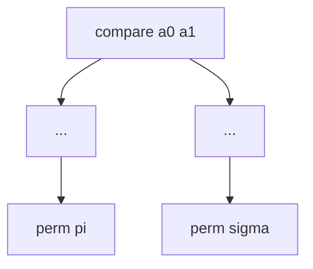
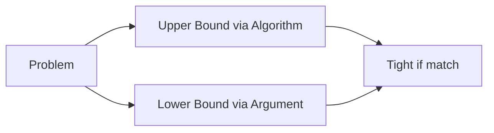
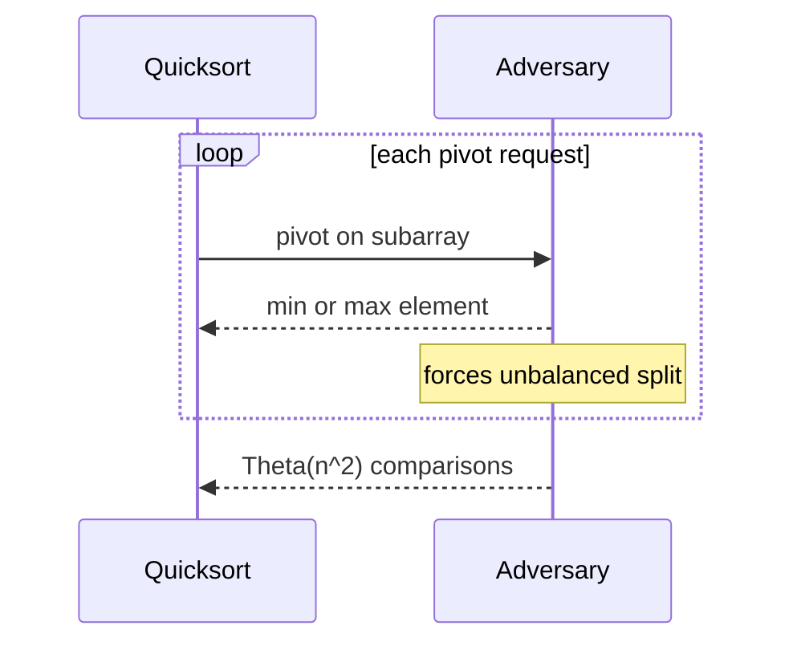

# Lower Bounds Decision Trees and Adversaries

## Overview

An **upper bound** shows an algorithm achieves cost X; a **lower bound** proves **no** algorithm in a model can do better. The **comparison decision tree** model counts binary outcomes of comparisons for sorting/searching: sorting n items requires Ω(n log n) comparisons in the worst case; searching unsorted data requires Ω(n); binary search on sorted data achieves O(log n) matching Ω(log n) lower bound.

**Adversarial arguments** construct an input that defeats a fixed algorithm (bad pivot order, comparison history). Lower bounds guide **impossibility** results: you cannot comparison-sort faster than n log n without changing the model (radix, integer bounds).

## Learning Objectives

- Build decision trees for small n sorting/searching
- Prove Ω(n log n) comparison sort lower bound via leaf counting
- Apply adversary for linear search and binary search limits
- Distinguish model-specific bounds from absolute impossibility
- Recognize when integer/radix sorts beat comparison lower bounds

## Prerequisites

- [[05-Algorithms/01-Complexity-and-Analysis/Recurrences Recursion Trees and Master Theorem|Recurrences Recursion Trees and Master Theorem]]

## Difficulty

`advanced`

## Estimated Time

- Reading: 2.5 hours
- Exercises: 4 hours
- Mini project: 4 hours

## History

Hartmanis–Stearis (1965) founded complexity theory. Comparison sort lower bound classic by Floyd or information-theoretic counting. Adversary methods extend to online paging, union-find lower bounds (Tarjan). Cell-probe model lower bounds for dynamic structures connect to [[04-Data-Structures/README|Data Structures]] theory.

## Problem It Solves

Teams waste effort seeking O(n) **comparison sort** or O(1) **worst-case** comparison min on general keys. Lower bounds redirect to:

- Change model (bounded integer keys → counting sort)
- Change goal (approximate median)
- Accept Ω(n log n) and optimize constants

Security: adversarial inputs break naive quicksort—lower bound mindset predicts failure.

## Internal Implementation

### Decision tree for sorting

Each internal node: compare `a[i]` vs `a[j]`; two children. Leaf: permutation order fixed. Sorting n distinct items needs ≥ n! leaves.

Tree height h satisfies 2^h ≥ n! → h = Ω(n log n) (Stirling).



### Adversary for comparison search

Algorithm asks comparisons; adversary answers consistently until forced to place target—forces Ω(n) for unsorted linear model.

For **sorted** search, adversary shrinks interval—Ω(log n) comparisons needed to distinguish n positions.

### Beyond comparisons

| Model | Sort bound |
| --- | --- |
| Comparison | Ω(n log n) |
| Bounded integers u | O(n + u) counting |
| Word RAM, w-bit keys | O(n log log n) etc. |

Handoff: [[05-Algorithms/03-Sorting/Counting Radix and Bucket Sort|Counting Radix and Bucket Sort]].

## Mermaid Diagrams

### Structure: upper vs lower bound



### Sequence: adversarial quicksort



## Correctness

Lower bounds are **theorems about models**, not bugs in code:

- Comparison sort lower bound assumes **only comparisons** reveal order
- Algorithm **correctness** independent—can be correct and slow

Adversary proofs must maintain **consistent** total order hidden from algorithm until late.

## Complexity

Central topic:

- Sorting: Θ(n log n) comparison sort optimal (mergesort/heapsort match lower bound)
- Selection: comparison **minimum** Ω(n); **median** Ω(n) (exact constant matters); quickselect O(n) expected optimal up to constants in comparison model
- Element uniqueness: Ω(n log n) via sort reduction or Ω(n) with hash (different model)

Link: [[05-Algorithms/02-Searching-and-Selection/Order Statistics Median and Top-K Trade-offs|Order Statistics Median and Top-K Trade-offs]].

## Examples

### Minimal Example

**TypeScript** — adversarial pivot input generator for testing:

```typescript
/** Builds array forcing always-min pivot on lomuto with last pivot. */
function adversarialQuicksortInput(n: number): number[] {
  const a = Array.from({ length: n }, (_, i) => i);
  // Prepend larger values so last element is always min in subarray
  return a.reverse();
}
```

**Python**:

```python
def adversarial_quicksort_input(n: int) -> list[int]:
    """Last-pivot Lomuto quicksort -> Theta(n^2) on sorted-reverse."""
    return list(reversed(range(n)))
```

### Production-Shaped Example

Attacker sends sorted keys to hash table with weak hash → collision chains → Ω(n) per op **degrades to linear search**. Lower bound mindset: without universal hashing assumption, claim "O(1)" fails.

Mitigation: SipHash, random seed per process, switch to tree bucket at chain length k.

Decision tree view: if API only exposes comparisons, you cannot beat bound—if API exposes key bytes, radix paths open.

## Trade-offs

| Dimension | Upside | Downside | When it matters |
| --- | --- | --- | --- |
| Comparison model | Clean proofs | Ignores integer structure | General objects |
| Integer/radix | Beats n log n | Needs key bounds | IDs, timestamps |
| Adversary testing | Finds worst paths | Crafted not natural | Security, QS |
| Approx algorithms | Lower effort | Wrong within ε | Streaming stats |

### When to Use

- Stopping futile optimization on comparison sort
- Designing test adversaries for pivot/heaps
- Choosing radix vs comparison for fixed-width keys

### When Not to Use

- Do not cite n log n lower bound to reject **counting sort** on 32-bit IDs

## Exercises

1. Draw decision tree for sorting n=3 distinct keys—min height?
2. Prove search unsorted array needs n comparisons worst case (adversary).
3. Why n! leaves ⇒ Ω(n log n) comparisons?
4. Construct input forcing bad partition for middle-pivot on sorted data.
5. Reduction: if O(n) comparison sort existed, what contradiction?

## Mini Project

Implement comparison counter wrapper; run sort adversary suite; verify Ω(n log n) scale at n=2^10..2^14.

## Portfolio Project

Add adversarial vector pack to Workbench (quicksort, binary search off-by-one traps).

## Interview Questions

1. Why comparison sort cannot be O(n) worst case?
2. Decision tree model—in one minute?
3. Adversarial input for naive quicksort?
4. When radix sort bypasses lower bound?
5. Ω(n) lower bound for finding minimum by comparisons?

### Stretch / Staff-Level

1. Cell-probe lower bound intuition for dynamic prefix sums.
2. Yao's minimax principle connecting adversaries to random inputs.

## Common Mistakes

- Applying comparison lower bound to **non-comparison** sorts
- Confusing **average** and **worst** lower bounds
- Thinking lower bound forbids **better on structured data** (timsort on runs)
- Ignoring **model change** (external memory has different bounds)

## Best Practices

- State **model** when citing lower bounds
- Test algorithms with adversarial + random + realistic skew
- When bounds tight, optimize **constants** not Big-O class
- Document key domain for non-comparison sorts

## Summary

Lower bounds prove what models cannot achieve. Decision trees count comparison outcomes; adversaries expose worst cases for fixed algorithms. Comparison sorting requires Ω(n log n)—match with mergesort/heapsort or leave the comparison model. Production failures often are adversaries realizing a lower-bound gap in disguise.

## Further Reading

- [[00-References/Algorithms/README|Algorithms References]]
- CLRS — sorting lower bounds chapter
- [[05-Algorithms/03-Sorting/Counting Radix and Bucket Sort|Counting Radix and Bucket Sort]]

## Related Notes

- [[05-Algorithms/01-Complexity-and-Analysis/Recurrences Recursion Trees and Master Theorem|Recurrences Recursion Trees and Master Theorem]]
- [[05-Algorithms/03-Sorting/Sorting Contracts Stability and Adaptivity|Sorting Contracts Stability and Adaptivity]]
- [[05-Algorithms/03-Sorting/Quicksort Partitioning and Introspective Fallbacks|Quicksort Partitioning and Introspective Fallbacks]]
- [[05-Algorithms/02-Searching-and-Selection/Binary Search and Boundary Variants|Binary Search and Boundary Variants]]
- [[01-Computer-Science/08-Languages-and-Computation/Computational Complexity Primer|Computational Complexity Primer]]

## Progress Checklist

- [ ] Explained from first principles
- [ ] Drew at least one Mermaid diagram
- [ ] Implemented a minimal version
- [ ] Documented trade-offs and non-goals
- [ ] Completed exercises
- [ ] Practiced interview questions aloud
- [ ] Linked prerequisites and dependents
