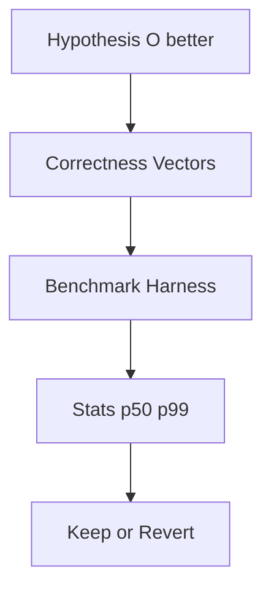
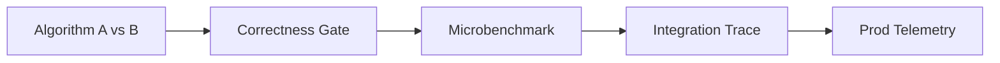
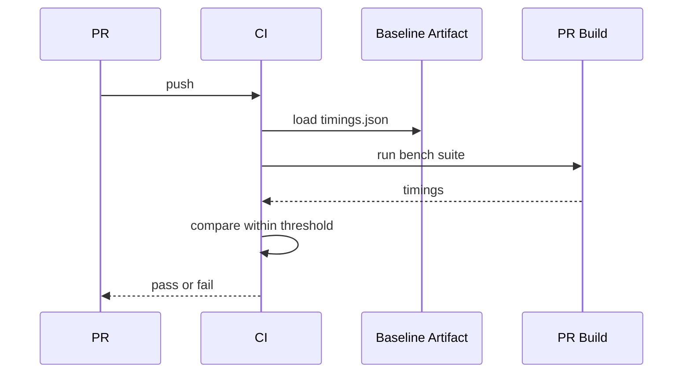

# Practical Constants Locality and Benchmark Design

## Overview

Big-O suppresses **constants** and **memory hierarchy** effects. Two O(n log n) sorts differ by 2–5×; linear scan beats binary search for small n; cache-friendly array algorithms beat pointer-chasing on modern CPUs. **Benchmark design** must use production-shaped distributions, warm-up, isolation, and statistical reporting—otherwise you optimize the wrong algorithm for real traffic.

This note bridges asymptotic analysis and [[05-Algorithms/13-Production-Selection-and-Interview-Patterns/Profiling Correctness and Regression Gates|Profiling Correctness and Regression Gates]] without duplicating DS layout details—those live in [[04-Data-Structures/00-Orientation-and-Contracts/Memory Layout Locality and Allocation Patterns|Memory Layout Locality and Allocation Patterns]].

## Learning Objectives

- Estimate crossover n where asymptotically faster algorithm wins
- Explain cache lines, spatial/temporal locality, and branch prediction impacts
- Design microbenchmarks avoiding dead-code elimination and JIT noise
- Report mean, p95, p99 with confidence intervals
- Pair perf benchmarks with correctness vectors on same inputs

## Prerequisites

- [[05-Algorithms/01-Complexity-and-Analysis/Cost Models and Input Size|Cost Models and Input Size]]
- [[04-Data-Structures/00-Orientation-and-Contracts/Memory Layout Locality and Allocation Patterns|Memory Layout Locality and Allocation Patterns]]

## Difficulty

`intermediate`

## Estimated Time

- Reading: 2 hours
- Exercises: 4 hours
- Mini project: 6 hours

## History

Knuth warned against premature optimization but advocated careful measurement. Ladner–Fischer (1980) formalized cache effects. Google Benchmark, criterion.rs, pytest-benchmark standardized harnesses. Data-oriented design (Acton) popularized struct-of-arrays for hot paths.

## Problem It Solves

| Pitfall | Consequence |
| --- | --- |
| Microbench on L1-resident tiny n | Binary search "wins" always |
| Cold JVM first run | Wrong regression alert |
| Uniform random keys only | Misses timsort run advantage |
| Single-thread peak ignoring alloc | GC pauses in prod |

## Internal Implementation

### Crossover intuition

Binary search: ~log₂(n) comparisons with branch mispredict cost.

Linear search: n comparisons but tight loop, prefetch friendly.

Crossover often n ∈ [10, 100] depending on type and cache—**measure**.

### Locality checklist

- **Sequential scan** of `Array` — excellent spatial locality
- **Linked list** — pointer chase, cache miss per node
- **Binary search** — random access pattern within array (still often OK)

### Benchmark hygiene

1. Warm-up iterations (JIT, caches)
2. Fixed seed + production skew distributions
3. Prevent DCE: consume results (checksum)
4. Multiple trials; report variance
5. Pin CPU frequency when comparing seriously
6. Same allocator/GC settings across runs



## Mermaid Diagrams

### Structure: measurement stack



### Sequence: regression CI



## Correctness

Performance optimizations must preserve **functional postconditions**:

- Faster unstable sort breaks audit contract
- SIMD parallel reduce needs associativity care for floats
- Benchmark-only code paths must not ship without same tests

**Perf correctness gate**: no merge if vectors fail; no merge if p99 regresses > budget without ADR.

## Complexity

Asymptotic class sets scaling; constants set **break-even**:

T_A(n) = c_a · n log n, T_B(n) = c_b · n

Crossover when n ≈ c_b/c_a (roughly, if dominated terms differ adjust).

Amortized spikes (rehash) appear in **p99** not mean—report both.

Space-time: cache-friendly O(n²) may beat cache-hostile O(n log n) at moderate n.

## Examples

### Minimal Example

**TypeScript** — timed linear vs binary (harness sketch):

```typescript
function bench(name: string, fn: () => void, reps: number): number {
  const t0 = performance.now();
  let sink = 0;
  for (let i = 0; i < reps; i++) sink += fn.length; // use fn
  fn();
  const t1 = performance.now();
  console.log(name, (t1 - t0) / reps, "ms", "sink", sink);
  return t1 - t0;
}

const a = Array.from({ length: 10_000 }, (_, i) => i);
bench("linear", () => {
  for (let i = 0; i < a.length; i++) if (a[i] === 9999) break;
}, 1000);
```

**Python**:

```python
import time

def bench(name: str, fn, reps: int) -> None:
    start = time.perf_counter()
    sink = 0
    for _ in range(reps):
        fn()
        sink ^= 1
    elapsed = time.perf_counter() - start
    print(name, elapsed / reps, "s", "sink", sink)
```

Use `pytest-benchmark` or `timeit` with `number` tuned in production projects.

### Production-Shaped Example

Feature flag picks sort algorithm:

- Staging bench: n=500 partial runs → insertion sort wins
- Prod traffic: n=50k near-sorted → timsort wins
- Decision: hybrid threshold by n **and** prescan run length

Adversarial: benchmark on developer laptop Apple M-series; deploy on cloud ARM—replicate target ISA.

Observability: export histogram of n per request; alert when p99 n crosses threshold.

## Trade-offs

| Dimension | Upside | Downside | When it matters |
| --- | --- | --- | --- |
| Microbenchmark | Isolates algo | Unrealistic context | Pick Big-O class |
| Macro trace | Realistic | Noisy | SLO validation |
| SIMD/custom | Huge constants win | Complexity | Hot loops |
| Portable pure code | Maintainable | Slower | Most business logic |

### When to Use

- Choosing sort/search variant at scale boundaries
- CI perf gates on known hot paths
- Validating cache-friendly layout changes

### When Not to Use

- Optimizing before correctness vectors green
- Bench on unrepresentative toy n only

## Exercises

1. Estimate crossover: linear 1ns/iter, binary 20ns/iter + log₂(n) iters.
2. Why binary search hurts branch predictor on uniform queries?
3. Design bench input distributions for timsort vs heapsort.
4. List three ways JIT makes JavaScript microbenchmarks lie.
5. Write CI policy: when perf regression blocks merge?

## Mini Project

Bench linear vs binary search for n ∈ {8..2^20}; plot crossover; document hardware.

## Portfolio Project

Integrate benchmark JSON artifacts into Algorithm Workbench CI compare step.

## Interview Questions

1. When is O(n) faster than O(log n)?
2. Cache locality in one sentence?
3. How warm-up JIT affects benchmarks?
4. p99 vs mean for hash table inserts?
5. Struct-of-arrays vs array-of-structs trade-off?

### Stretch / Staff-Level

1. Roofline model intuition for matrix vs sort bound.
2. Design prod A/B for two top-k algorithms with safety rollback.

## Common Mistakes

- Single-run timing
- Optimizing cold path seen in profiler once
- Ignoring **allocation** in functional-style code
- Comparing debug vs release builds

## Best Practices

- Check correctness before perf
- Store baseline artifacts in repo or CI cache
- Benchmark production skew from logs
- Document machine SKU for reproducibility
- Link [[05-Algorithms/00-Foundations-and-Correctness/Algorithm Engineering and Reuse vs Reinvention|Algorithm Engineering and Reuse vs Reinvention]]

## Summary

Asymptotics guide scaling; constants and locality decide winners at real n. Benchmark with production distributions, statistical rigor, and correctness gates. The fastest algorithm on paper loses when it misses cache, allocates, or mispredicts branches on your actual hardware and traffic.

## Further Reading

- [[00-References/Algorithms/README|Algorithms References]]
- [[04-Data-Structures/00-Orientation-and-Contracts/Memory Layout Locality and Allocation Patterns|Memory Layout Locality and Allocation Patterns]]
- [[05-Algorithms/13-Production-Selection-and-Interview-Patterns/Profiling Correctness and Regression Gates|Profiling Correctness and Regression Gates]]

## Related Notes

- [[05-Algorithms/01-Complexity-and-Analysis/Cost Models and Input Size|Cost Models and Input Size]]
- [[05-Algorithms/01-Complexity-and-Analysis/Worst Average Expected and Amortized Cases|Worst Average Expected and Amortized Cases]]
- [[04-Data-Structures/00-Orientation-and-Contracts/Complexity Tables Amortization and Practical Constants|Complexity Tables Amortization and Practical Constants]]
- [[05-Algorithms/02-Searching-and-Selection/Linear Search and Sentinels|Linear Search and Sentinels]]
- [[05-Algorithms/02-Searching-and-Selection/Binary Search and Boundary Variants|Binary Search and Boundary Variants]]

## Progress Checklist

- [ ] Explained from first principles
- [ ] Drew at least one Mermaid diagram
- [ ] Implemented a minimal version
- [ ] Documented trade-offs and non-goals
- [ ] Completed exercises
- [ ] Practiced interview questions aloud
- [ ] Linked prerequisites and dependents
