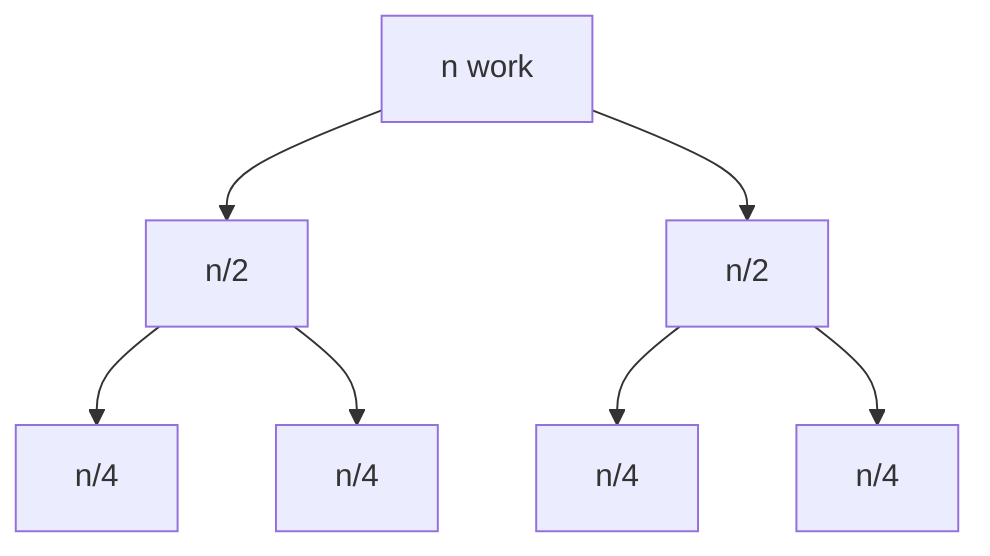
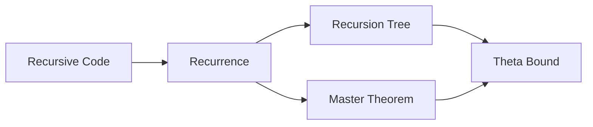
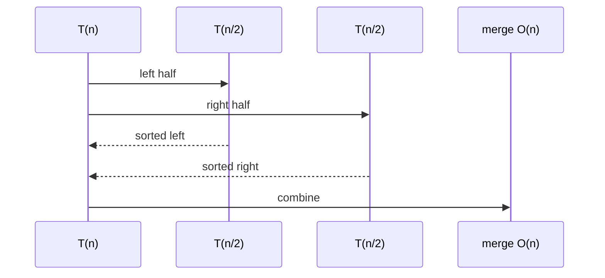

# Recurrences Recursion Trees and Master Theorem

## Overview

Divide-and-conquer and recursive algorithms express cost via **recurrence relations**: e.g., `T(n) = 2T(n/2) + O(n)` for mergesort. **Recursion trees** visualize work per level—sum across levels yields bounds. The **Master Theorem** (Akra–Bazzi generalization) solves recurrences of form `T(n) = aT(n/b) + f(n)` for common `f`.

These tools translate recursive structure into Big-O for design decisions: is combine step dominating or leaf work?

## Learning Objectives

- Set up recurrences from recursive code (mergesort, binary search, Karatsuba)
- Draw recursion trees and sum level costs
- Apply Master Theorem cases; recognize when it does not apply
- Use substitution and recursion tree for non-standard recurrences
- Connect recurrences to implementation base cases and off-by-one splits

## Prerequisites

- [[05-Algorithms/01-Complexity-and-Analysis/Cost Models and Input Size|Cost Models and Input Size]]
- [[05-Algorithms/01-Complexity-and-Analysis/Worst Average Expected and Amortized Cases|Worst Average Expected and Amortized Cases]]

## Difficulty

`intermediate`

## Estimated Time

- Reading: 3 hours
- Exercises: 4 hours
- Mini project: 5 hours

## History

Master theorem variants appear in CLRS and Knuth. Akra–Bazzi (1998) handles irregular splits and polylog `f(n)`. Real systems add **cache-aware** and **parallel** recurrences—not covered by basic Master alone.

## Problem It Solves

Without recurrence skills:

- Mis-analyze `T(n) = T(n-1) + O(1)` as log n
- Ignore **combine** cost in merge step
- Assume `n/2` when code uses `n-1` split (quickselect worst)
- Parallel fork-join recurrences mis-stated

## Internal Implementation

### Template divide-and-conquer

```
T(n) = a T(n/b) + f(n)
```

- `a` subproblems, size `n/b` each, `f(n)` divide + combine

### Master Theorem (simplified, a≥1, b>1)

Compare `f(n)` to `n^(log_b a)`:

1. **Case 1**: f(n) = O(n^(log_b a - ε)) → T(n) = Θ(n^(log_b a))
2. **Case 2**: f(n) = Θ(n^(log_b a) log^k n) → T(n) = Θ(n^(log_b a) log^(k+1) n)
3. **Case 3**: f(n) = Ω(n^(log_b a + ε)) and regularity → T(n) = Θ(f(n))

Examples:

| Algorithm | Recurrence | Result |
| --- | --- | --- |
| Binary search | T(n)=T(n/2)+O(1) | O(log n) |
| Mergesort | T(n)=2T(n/2)+O(n) | O(n log n) |
| Strassen | T(n)=7T(n/2)+O(n²) | O(n^log2 7) |

### Recursion tree for mergesort

Level i has 2^i nodes each size n/2^i → O(n) work per level → log n levels → O(n log n).



## Mermaid Diagrams

### Structure: analysis workflow



### Sequence: call tree depth



## Correctness

Recurrence setup must match **actual** recursive calls:

- Floor/ceiling: `T(⌊n/2⌋) + T(⌈n/2⌉)` — asymptotically same for mergesort
- Base case: `T(1) = O(1)` — tree height depends on it
- Wrong recurrence → wrong bound but algorithm may still be functionally correct

Substitution method proves guess: assume `T(n) ≤ cn log n`, prove by induction.

## Complexity

This note is the complexity toolkit for recursive algorithms.

Non-Master examples:

- `T(n) = T(n-1) + O(1)` → O(n) (linear chain)
- `T(n) = 2T(n-1) + O(1)` → O(2^n)
- Quickselect expected: `T(n) = T(n/2) + O(n)` → O(n) expected

Akra–Bazzi when splits uneven: `T(n) = T(n/3) + T(2n/3) + O(n)` → O(n log n) via tree.

Link: [[05-Algorithms/03-Sorting/Merge Sort|Merge Sort]], [[05-Algorithms/04-Divide-Conquer-and-Backtracking/Divide-and-Conquer Design|Divide-and-Conquer Design]].

## Examples

### Minimal Example

**TypeScript** — mergesort with recurrence comment:

```typescript
function mergeSort(a: number[]): number[] {
  if (a.length <= 1) return a.slice();
  const mid = Math.floor(a.length / 2);
  const left = mergeSort(a.slice(0, mid)); // T(n/2)
  const right = mergeSort(a.slice(mid)); // T(n/2)
  return merge(left, right); // O(n)
}
// T(n) = 2T(n/2) + O(n) => O(n log n)
```

**Python**:

```python
def merge_sort(a: list[int]) -> list[int]:
    if len(a) <= 1:
        return a[:]
    mid = len(a) // 2
    left = merge_sort(a[:mid])
    right = merge_sort(a[mid:])
    return merge(left, right)
```

### Production-Shaped Example

External merge sort passes: `T(N,r) = 2T(N/2,r) + O(N/B)` I/O passes—cost model shifts to disk blocks B. In-memory analysis insufficient—handoff [[05-Algorithms/03-Sorting/External Sorting Concepts and Production Selection|External Sorting Concepts and Production Selection]].

Recurrence mistake incident: recursive JSON merge assumed O(n log n) but unbalanced tree depth n → O(n²) comparisons—fix by tree height balance or iterative merge.

## Trade-offs

| Dimension | Upside | Downside | When it matters |
| --- | --- | --- | --- |
| Master Theorem | Fast | Gaps on exotic f | Standard D&C |
| Recursion tree | Visual | Tedious large a | Teaching, verification |
| Substitution | Rigorous | Needs guess | Interviews |
| Akra–Bazzi | General | Heavy integral | Research, uneven split |

### When to Use

- Analyzing merge sort, quicksort average, binary search, FFT-shaped algorithms
- Validating parallel divide depth

### When Not to Use

- DP with overlapping subproblems—different framework
- Amortized sequences—see amortized note

## Exercises

1. Solve T(n) = T(n/2) + O(1).
2. Draw tree for T(n) = 3T(n/2) + O(n).
3. Why Master fails on T(n) = 2T(n/2) + O(n log n)? (Case 2 borderline.)
4. Set up recurrence for naive recursive Fibonacci; solve.
5. Karatsuba T(n) = 3T(n/2) + O(n) — exponent?

## Mini Project

Implement recursive and iterative binary search; measure calls vs n; fit log curve.

## Portfolio Project

Auto-generate recursion tree ASCII for Workbench recurrences module.

## Interview Questions

1. Mergesort recurrence and solution?
2. Three Master Theorem cases—informally?
3. T(n)=T(n-1)+O(n) — bound?
4. Recursion tree vs substitution?
5. When does f(n) dominate leaves?

### Stretch / Staff-Level

1. Akra–Bazzi for T(n) = T(n/3) + T(2n/3) + n.
2. Parallel T(n) = T(n/2) + O(n) with P processors—speedup limit?

## Common Mistakes

- Forgetting **O(n)** merge in mergesort → claiming O(n)
- Applying Master when `a` or `b` not constant
- Linear `T(n-1)` analyzed as D&C
- Off-by-one in subproblem size at odd n

## Best Practices

- Write recurrence before coding split points
- Check base case cost explicitly
- Verify with small n hand simulation
- For production, validate with profiler at scale

## Summary

Recurrences encode recursive cost. Recursion trees sum work by level; Master Theorem closes common forms quickly. Match recurrence to real calls—split policy and combine cost determine whether you get O(n log n), O(n), or worse.

## Further Reading

- [[00-References/Algorithms/README|Algorithms References]]
- CLRS — Chapter on divide-and-conquer recurrences
- [[05-Algorithms/03-Sorting/Merge Sort|Merge Sort]]

## Related Notes

- [[05-Algorithms/01-Complexity-and-Analysis/Cost Models and Input Size|Cost Models and Input Size]]
- [[05-Algorithms/04-Divide-Conquer-and-Backtracking/Divide-and-Conquer Design|Divide-and-Conquer Design]]
- [[05-Algorithms/03-Sorting/Merge Sort|Merge Sort]]
- [[05-Algorithms/02-Searching-and-Selection/Binary Search and Boundary Variants|Binary Search and Boundary Variants]]
- [[01-Computer-Science/08-Languages-and-Computation/Computational Complexity Primer|Computational Complexity Primer]]

## Progress Checklist

- [ ] Explained from first principles
- [ ] Drew at least one Mermaid diagram
- [ ] Implemented a minimal version
- [ ] Documented trade-offs and non-goals
- [ ] Completed exercises
- [ ] Practiced interview questions aloud
- [ ] Linked prerequisites and dependents
