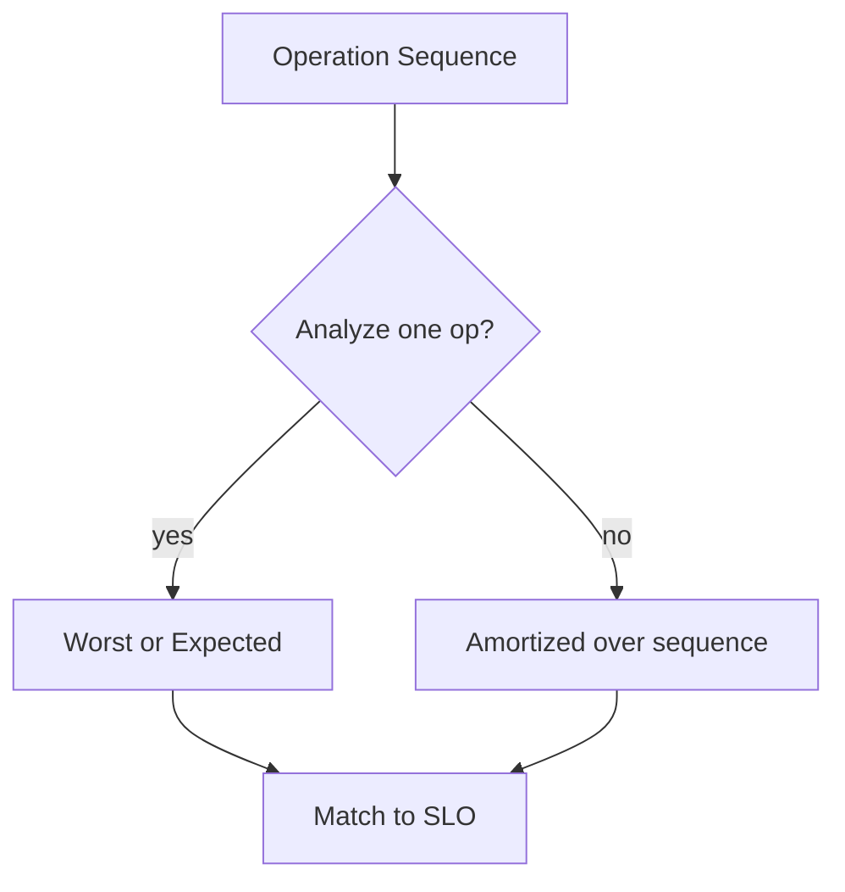
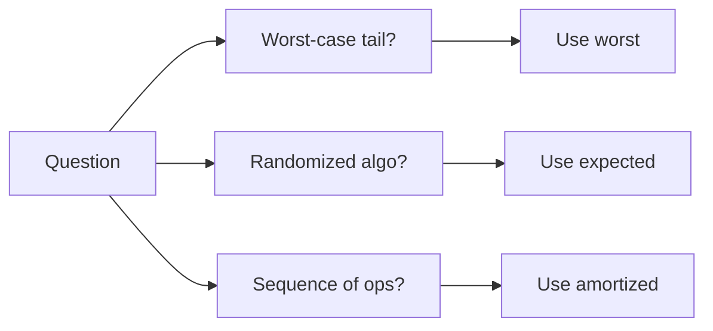
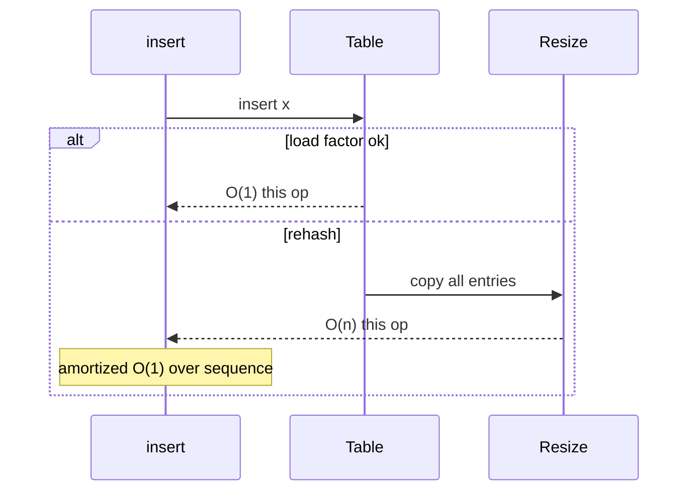

# Worst Average Expected and Amortized Cases

## Overview

Algorithm cost varies by input instance. **Worst-case** bounds the maximum cost over all legal inputs of size n—guards SLA tails. **Average-case** assumes a **input distribution** (often uniform) and bounds expected cost. **Expected-case** (randomized algorithms) bounds cost over **internal random choices** for any input (or fixed input family). **Amortized** analysis bounds the **average cost per operation** over a sequence of operations, allowing occasional expensive steps if cheap ones compensate.

Production needs all four lenses: worst-case for p99 latency, expected for hash tables, amortized for dynamic arrays, average rarely unless traffic distribution is measured.

## Learning Objectives

- Define worst, average, expected, and amortized complexity precisely
- Apply aggregate, accounting, and potential methods for amortization
- Analyze randomized quickselect expected O(n) vs worst O(n²)
- Choose which measure matches an SLO or contract
- Avoid confusing **input randomness** with **algorithm randomness**

## Prerequisites

- [[05-Algorithms/01-Complexity-and-Analysis/Cost Models and Input Size|Cost Models and Input Size]]

## Difficulty

`intermediate`

## Estimated Time

- Reading: 2.5 hours
- Exercises: 4 hours
- Mini project: 5 hours

## History

Knuth detailed average-case sorting analysis. Tarjan formalized amortized analysis (1985) for union-find and dynamic tables. Randomized algorithms (Quicksort, Karger min-cut) popularized expected bounds. Modern systems mix: timsort adaptive **runs** exploit partial order—neither pure worst nor uniform average.

## Problem It Solves

| Misstatement | Risk |
| --- | --- |
| "Hash map is O(1)" | p99 spikes on rehash/collisions |
| "Quicksort is O(n log n)" | Adversarial pivot → O(n²) |
| "Append is O(1)" | One resize O(n) without amortized view |
| "Average O(n)" on skewed prod traffic | Wrong capacity plan |

## Internal Implementation

### Comparison table

| Measure | Quantifier | Typical use |
| --- | --- | --- |
| Worst | max over inputs | Real-time, security |
| Average | E[cost] over input distribution | Legacy theory |
| Expected | E[cost] over random bits | Randomized algo |
| Amortized | (Σ cost)/q over q ops | Dynamic structures |

### Amortized methods (sketch)

- **Aggregate**: total cost T(q) ⇒ T(q)/q per op
- **Accounting**: assign credits; expensive op spends stored credit
- **Potential**: Φ(data structure state) increases pay for expensive op

Dynamic array doubling: n appends → O(n) total resize work ⇒ **amortized O(1)** append.



## Mermaid Diagrams

### Structure: which bound applies



### Sequence: hash table insert with rehash



## Correctness

Complexity class does not change functional postconditions. **Probabilistic correctness**: Monte Carlo may err with small probability; Las Vegas always correct, runtime random.

Contract example: "Returns kth smallest **always**; expected O(n) comparisons; worst O(n²) without fallback" — honesty required for production selection.

## Complexity

**Worst-case** quickselect: bad pivots every step → O(n²).

**Expected** with random pivot: O(n) comparisons (linearity of expectation on partition sizes).

**Amortized** dynamic array: worst single insert O(n), sequence of n inserts O(n) total.

**Average-case** insertion sort: O(n²) worst, O(n) on nearly sorted—**adaptive** behavior matters for real data; see sorting module.

Link: [[05-Algorithms/02-Searching-and-Selection/Quickselect and Partition-Based Selection|Quickselect and Partition-Based Selection]], [[04-Data-Structures/00-Orientation-and-Contracts/Complexity Tables Amortization and Practical Constants|Complexity Tables Amortization and Practical Constants]].

## Examples

### Minimal Example

**TypeScript** — dynamic array with potential-style comment:

```typescript
class DynArray<T> {
  private a: T[] = [];
  private len = 0;

  /** Amortized O(1) push; worst O(n) on resize. */
  push(x: T): void {
    if (this.len === this.a.length) {
      const next = new Array<T>(this.a.length === 0 ? 4 : this.a.length * 2);
      for (let i = 0; i < this.len; i++) next[i] = this.a[i]!;
      this.a = next;
    }
    this.a[this.len++] = x;
  }
}
```

**Python**:

```python
class DynArray:
    def __init__(self) -> None:
        self._a: list = []
        self._len = 0

    def push(self, x) -> None:
        """Amortized O(1); occasional Theta(n) resize."""
        if self._len == len(self._a):
            self._a = self._a + [None] * max(1, len(self._a))
        self._a[self._len] = x
        self._len += 1
```

### Production-Shaped Example

Randomized pivot quickselect with worst-case guard (introselect pattern preview):

```typescript
function quickselect(a: number[], k: number, rng = Math.random): number {
  let l = 0;
  let r = a.length - 1;
  while (l < r) {
    const p = l + Math.floor(rng() * (r - l + 1));
    [a[p], a[r]] = [a[r]!, a[p]!];
    const q = partition(a, l, r);
    if (k <= q) r = q - 1;
    else l = q + 1;
  }
  return a[k]!;
}
```

Adversarial: `Math.random` predictable—use crypto RNG for security-sensitive selection; for perf attacks use median-of-medians fallback.

## Trade-offs

| Dimension | Upside | Downside | When it matters |
| --- | --- | --- | --- |
| Worst-case guarantee | Predictable tails | Higher typical cost | Payments, realtime |
| Expected / randomized | Fast typical | Rare bad luck | In-memory analytics |
| Amortized | Simple API | One huge spike | UI jank on resize |
| Average-case input model | Tight on uniform | Wrong on skew | Theoretical papers |

### When to Use

- Worst: latency SLO, attacker-controlled input
- Expected: randomized select, skip lists, treap
- Amortized: vectors, hash tables, union-find sequences
- Average: only when telemetry proves distribution

### When Not to Use

- Do not cite average-case uniform for user-generated text lengths

## Exercises

1. Prove aggregate amortized O(1) for doubling array starting empty, n pushes.
2. Expected comparisons in randomized quickselect—outline recurrence.
3. Worst-case input for naive quicksort on sorted array with first pivot.
4. Hash table: separate worst (all collide) vs expected (simple uniform hashing).
5. Which measure for "process 1M events/sec inserts" SLA?

## Mini Project

Simulate 10⁵ random quickselect runs; plot max/average comparisons vs n.

## Portfolio Project

Document complexity_kind per algorithm in Workbench: worst | expected | amortized.

## Interview Questions

1. Worst vs expected vs amortized—define each.
2. Is hash map insert O(1)? Nuanced answer.
3. Why amortized analysis for dynamic arrays?
4. Randomized quicksort expected vs worst.
5. When average-case analysis misleads in production?

### Stretch / Staff-Level

1. Potential method proof for binary counter increment (multiset of ones).
2. Adversarial inputs breaking Java hashCode balance—mitigations?

## Common Mistakes

- Saying "hash map O(1)" without **expected** qualifier
- Using amortized bound for **single** operation SLA without explaining spike
- Confusing **uniform random input** with **random pivot**
- Ignoring **worst-case** when input sorted adversarially

## Best Practices

- State measure in every complexity claim
- Pair randomized algorithms with **worst-case fallback** at scale
- Monitor p99 separately from mean
- Link DS amortization docs in [[04-Data-Structures/README|Data Structures]]

## Summary

Different complexity measures answer different engineering questions. Worst-case protects tails; expected and average describe typical randomness; amortized smooths expensive bursts across sequences. Production contracts should name which measure is guaranteed—and measure reality against it.

## Further Reading

- [[00-References/Algorithms/README|Algorithms References]]
- Tarjan — amortized analysis survey
- [[05-Algorithms/01-Complexity-and-Analysis/Recurrences Recursion Trees and Master Theorem|Recurrences Recursion Trees and Master Theorem]]

## Related Notes

- [[05-Algorithms/01-Complexity-and-Analysis/Cost Models and Input Size|Cost Models and Input Size]]
- [[05-Algorithms/01-Complexity-and-Analysis/Recurrences Recursion Trees and Master Theorem|Recurrences Recursion Trees and Master Theorem]]
- [[05-Algorithms/02-Searching-and-Selection/Quickselect and Partition-Based Selection|Quickselect and Partition-Based Selection]]
- [[04-Data-Structures/00-Orientation-and-Contracts/Complexity Tables Amortization and Practical Constants|Complexity Tables Amortization and Practical Constants]]
- [[01-Computer-Science/08-Languages-and-Computation/Computational Complexity Primer|Computational Complexity Primer]]

## Progress Checklist

- [ ] Explained from first principles
- [ ] Drew at least one Mermaid diagram
- [ ] Implemented a minimal version
- [ ] Documented trade-offs and non-goals
- [ ] Completed exercises
- [ ] Practiced interview questions aloud
- [ ] Linked prerequisites and dependents
