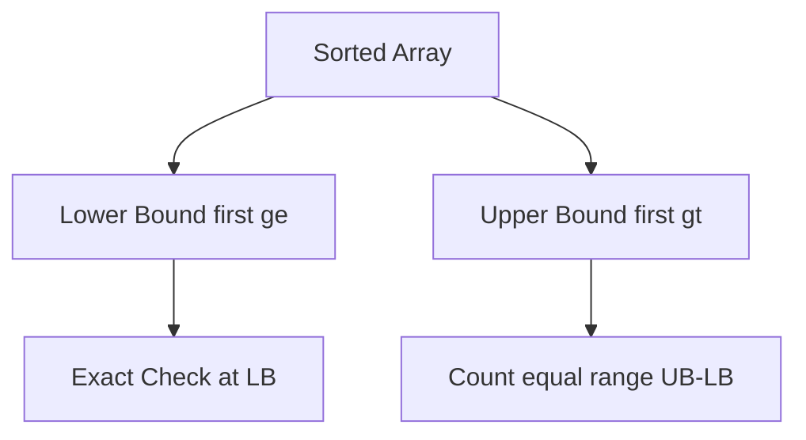
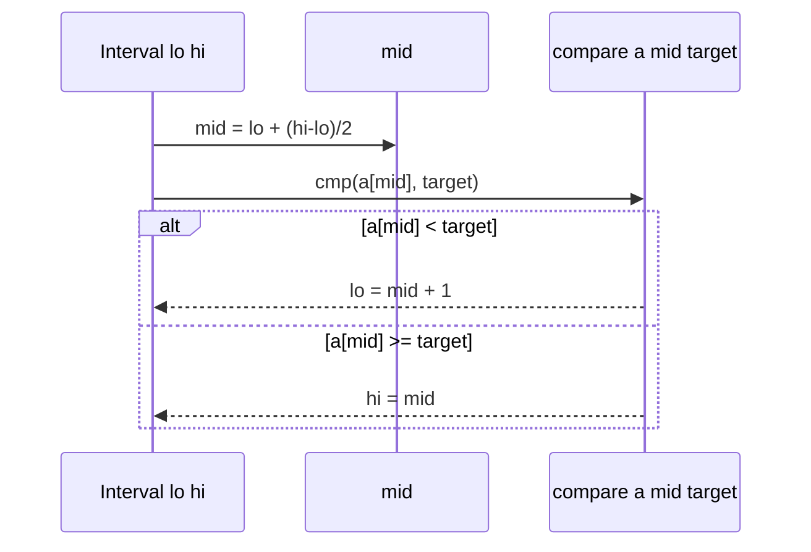

# Binary Search and Boundary Variants

## Overview

**Binary search** on a sorted array maintains a candidate interval `[lo, hi)` and halves it by comparing against the middle element. Exact-match search is one variant; production code more often needs **boundary searches**: **lower bound** (first position `≥ target`), **upper bound** (first position `> target`), and **insertion point**. Half-open intervals `[lo, hi)` reduce off-by-one errors versus inclusive `[lo, hi]`.

Worst-case Θ(log n) comparisons—optimal for comparison-based search on sorted data (Ω(log n) lower bound).

## Learning Objectives

- Implement lower bound, upper bound, and exact search on half-open intervals
- State and prove loop invariants for each variant
- Handle duplicates, empty arrays, and comparator consistency
- Choose variant for "first/last occurrence" and insertion index
- Avoid overflow in `mid = lo + (hi - lo) / 2`

## Prerequisites

- [[05-Algorithms/02-Searching-and-Selection/Linear Search and Sentinels|Linear Search and Sentinels]]
- [[05-Algorithms/00-Foundations-and-Correctness/Loop Invariants and Correctness Proofs|Loop Invariants and Correctness Proofs]]

## Difficulty

`intermediate`

## Estimated Time

- Reading: 2.5 hours
- Exercises: 4 hours
- Mini project: 4 hours

## History

Binary search appears in Bainbridge (1946) and Knuth's history note—off-by-one bugs persisted for decades ("binary search bug" in textbooks). C++ STL `lower_bound`/`upper_bound` (1994) standardized half-open semantics. Interview culture still produces incorrect variants; invariant-first writing fixes this.

## Problem It Solves

- Lookup in sorted IDs, timestamps, version lists
- Insertion index in sorted buffer (editor piece table, merge join)
- First/last slot for equal keys in ranked data
- Foundation for **binary search on answer** — [[05-Algorithms/02-Searching-and-Selection/Binary Search on Monotone Answers|Binary Search on Monotone Answers]]

Broken binary search causes subtle data loss (wrong merge join row), infinite loops (`lo`/`hi` stall), or wrong duplicate handling.

## Internal Implementation

### Preconditions

- Array `a[0..n)` sorted non-decreasing under strict weak ordering `cmp`
- Random access O(1) — array or [[04-Data-Structures/01-Contiguous-Sequences/Dynamic Array ADT|Dynamic Array ADT]]; not singly linked list

### Lower bound invariant

**Inv**: answer ∈ `[lo, hi)`; `lo` always feasible candidate index for "first ≥ target" property.

```text
while lo < hi:
  mid = lo + (hi - lo) / 2
  if a[mid] < target: lo = mid + 1
  else: hi = mid
return lo  // in [0, n]
```

### Variant map

| Need | Use |
| --- | --- |
| First ≥ x | lowerBound |
| First > x | lowerBound(x+ε) or upperBound |
| Last ≤ x | upperBound(x) - 1 with care |
| Exact hit? | lb then check cmp(a[lb], x)==0 |

### Data structure dependency

Sorted **contiguous** storage. Balanced BST offers O(log n) search with updates—structure in [[04-Data-Structures/05-Trees-and-Ordered-Maps/Balanced BST Contracts|Balanced BST Contracts]]; algorithm logic identical on random access via iterator indexing.

## Mermaid Diagrams

### Structure: boundary variants



### Sequence: one iteration



## Correctness

**Lower bound proof sketch**:

- Init: `[0, n)` contains all indices; `lo=0` feasible if any ≥ exists
- Maint: shrink but keep at least one witness if exists in original
- Exit: `lo==hi` single candidate; if target exists, returns first ≥ position

**Exact search**: after `lb`, verify `lb < n && cmp(a[lb], target)==0`.

Common bugs = broken invariant: using `mid = (lo+hi)/2` overflow; `hi = mid - 1` with wrong termination; inclusive bounds without `+1` adjustment.

## Complexity

| Measure | Comparisons |
| --- | --- |
| Worst | ⌊log₂ n⌋ + 1 |
| Best | 1 |
| Space | O(1) |

Each step halves interval width—recurrence `T(n)=T(n/2)+O(1)` → O(log n).

Branch mispredictions hurt vs linear for tiny n—see practical constants note.

## Examples

### Minimal Example

**TypeScript**:

```typescript
export type Cmp<T> = (a: T, b: T) => number;

export function lowerBound<T>(a: readonly T[], target: T, cmp: Cmp<T>): number {
  let lo = 0;
  let hi = a.length;
  while (lo < hi) {
    const mid = lo + ((hi - lo) >> 1);
    if (cmp(a[mid]!, target) < 0) lo = mid + 1;
    else hi = mid;
  }
  return lo;
}

export function upperBound<T>(a: readonly T[], target: T, cmp: Cmp<T>): number {
  let lo = 0;
  let hi = a.length;
  while (lo < hi) {
    const mid = lo + ((hi - lo) >> 1);
    if (cmp(a[mid]!, target) <= 0) lo = mid + 1;
    else hi = mid;
  }
  return lo;
}

export function binarySearchExact<T>(a: readonly T[], target: T, cmp: Cmp<T>): number {
  const i = lowerBound(a, target, cmp);
  if (i < a.length && cmp(a[i]!, target) === 0) return i;
  return -1;
}
```

**Python**:

```python
from typing import Callable, Sequence, TypeVar

T = TypeVar("T")
Cmp = Callable[[T, T], int]

def lower_bound(a: Sequence[T], target: T, cmp: Cmp[T]) -> int:
    lo, hi = 0, len(a)
    while lo < hi:
        mid = lo + (hi - lo) // 2
        if cmp(a[mid], target) < 0:
            lo = mid + 1
        else:
            hi = mid
    return lo

def upper_bound(a: Sequence[T], target: T, cmp: Cmp[T]) -> int:
    lo, hi = 0, len(a)
    while lo < hi:
        mid = lo + (hi - lo) // 2
        if cmp(a[mid], target) <= 0:
            lo = mid + 1
        else:
            hi = mid
    return lo
```

### Production-Shaped Example

Merge join two sorted exports on `user_id`:

```typescript
function mergeJoin(
  left: { id: string; payload: unknown }[],
  right: { id: string; payload: unknown }[],
): { id: string; l: unknown; r: unknown }[] {
  const out: { id: string; l: unknown; r: unknown }[] = [];
  let j = 0;
  for (const L of left) {
    while (j < right.length && right[j]!.id < L.id) j++;
    if (j < right.length && right[j]!.id === L.id) {
      out.push({ id: L.id, l: L.payload, r: right[j]!.payload });
    }
  }
  return out;
}
```

Adversarial: duplicate keys—define first-first vs all-pairs semantics explicitly.

## Trade-offs

| Dimension | Upside | Downside | When it matters |
| --- | --- | --- | --- |
| Binary search | O(log n) | Needs sorted + random access | Large static tables |
| Linear | No sort | O(n) | Tiny n |
| Hash map | O(1) expected | No order | Unordered lookups |
| BST | Dynamic order | Pointer/locality cost | Frequent inserts |

### When to Use

- Sorted arrays with many queries
- Insertion point in sorted buffers
- Building block for monotone answer search

### When Not to Use

- Unsorted data (undefined behavior if pre violated)
- Linked list without index — use linear or tree

## Exercises

1. Prove lower bound invariant maintenance.
2. Array `[1,2,2,2,3]`: lb/ub for target 2?
3. Implement `lastOccurrence` using lb/ub.
4. Find bug: `hi = mid - 1` with `while lo <= hi` for first ≥.
5. Empty array—what should lb return?

## Mini Project

Fuzz lb/ub/exact against naive scan on random arrays length ≤ 200.

## Portfolio Project

Workbench vectors: duplicates, all equal, target outside range, overflow-safe mid.

## Interview Questions

1. Write lower bound with half-open interval.
2. First vs last occurrence with duplicates?
3. Why `lo + (hi-lo)/2`?
4. Preconditions for binary search?
5. Binary vs linear crossover intuition?

### Stretch / Staff-Level

1. Uniformly random rank queries—compare binary vs interpolation search.
2. Prove Ω(log n) comparison search lower bound on sorted array.

## Common Mistakes

- Inclusive/exclusive bound mix
- Infinite loop when `lo`/`hi` don't shrink
- Not verifying exact match after lb
- Sort comparator inconsistent with search cmp

## Best Practices

- One canonical lb implementation; derive ub/exact
- Unit test duplicates and out-of-range
- Document strict weak ordering requirements
- Prefer bisect_left/bisect_right in Python with understood semantics

## Summary

Binary search is invariant management on a halving interval. Lower and upper bounds generalize exact match for duplicates and insertion. Half-open `[lo, hi)` and overflow-safe mid are production defaults. Sorted precondition is non-negotiable—violating it silently returns wrong indices.

## Further Reading

- [[00-References/Algorithms/README|Algorithms References]]
- [[05-Algorithms/02-Searching-and-Selection/Binary Search on Monotone Answers|Binary Search on Monotone Answers]]

## Related Notes

- [[05-Algorithms/02-Searching-and-Selection/Linear Search and Sentinels|Linear Search and Sentinels]]
- [[05-Algorithms/02-Searching-and-Selection/Binary Search on Monotone Answers|Binary Search on Monotone Answers]]
- [[05-Algorithms/00-Foundations-and-Correctness/Loop Invariants and Correctness Proofs|Loop Invariants and Correctness Proofs]]
- [[05-Algorithms/01-Complexity-and-Analysis/Lower Bounds Decision Trees and Adversaries|Lower Bounds Decision Trees and Adversaries]]
- [[04-Data-Structures/05-Trees-and-Ordered-Maps/Balanced BST Contracts|Balanced BST Contracts]]

## Progress Checklist

- [ ] Explained from first principles
- [ ] Drew at least one Mermaid diagram
- [ ] Implemented a minimal version
- [ ] Documented trade-offs and non-goals
- [ ] Completed exercises
- [ ] Practiced interview questions aloud
- [ ] Linked prerequisites and dependents
