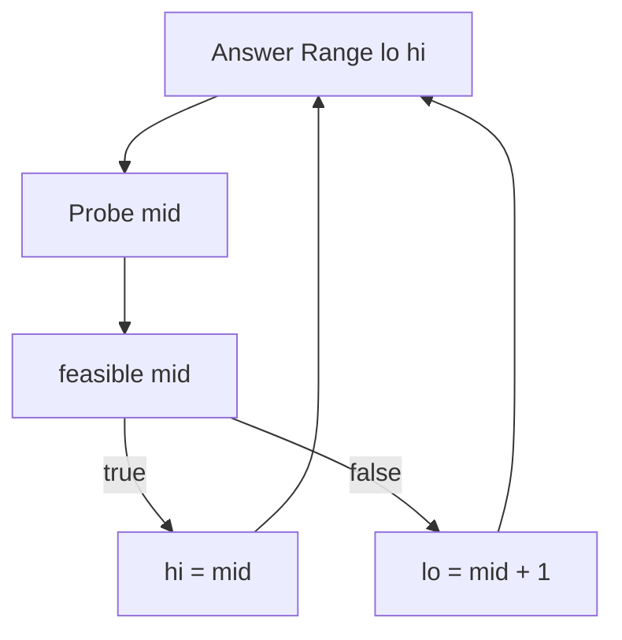
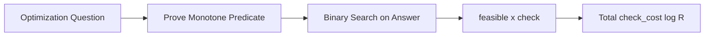
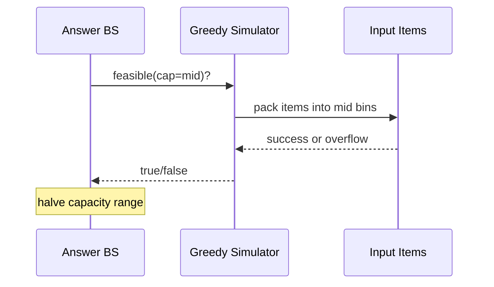

# Binary Search on Monotone Answers

## Overview

When the **answer space** is numeric or ordered and a predicate `feasible(x)` flips from false to true (or true to false) monotonically, **binary search on the answer** finds the threshold in O(log R) evaluations where R is the search range width—not the input size n directly. Each step probes mid `m`; monotone structure lets discard half the range.

Classic pattern: minimize maximum lateness, minimum capacity to ship in D days, maximum minimum distance (aggressive cows), smallest `λ` satisfying constraint. Distinct from array binary search: **oracle** `feasible` may cost O(n) per check → total O(n log R).

## Learning Objectives

- Recognize monotone predicates and choose minimize vs maximize framing
- Implement integer and real/binary answer search with correct boundary
- Analyze total cost: O(check_cost · log R)
- Avoid off-by-one on discrete vs continuous domains
- Apply to production capacity planning and rate limiting

## Prerequisites

- [[05-Algorithms/02-Searching-and-Selection/Binary Search and Boundary Variants|Binary Search and Boundary Variants]]

## Difficulty

`intermediate`

## Estimated Time

- Reading: 2 hours
- Exercises: 4 hours
- Mini project: 5 hours

## History

Parametric search appears in operations research and competitive programming. Real-valued bisection predates computers (root finding). Discrete answer binary search unifies many "min max" problems. Lagrangian relaxation connects to dual search on penalty λ.

## Problem It Solves

- **Minimize the maximum** (minimax): load balance, partition arrays into k parts minimizing largest sum
- **Maximize the minimum**: largest minimum gap, bandwidth allocation
- **First feasible** capacity: minimum servers, minimum buffer size
- Avoid enumerating exponential candidate sets

Failure: predicate not monotone → binary search returns arbitrary wrong threshold; `feasible` too expensive without caching.

## Internal Implementation

### Monotone types

| Goal | Predicate shape | Search for |
| --- | --- | --- |
| Minimize max cost ≤ C | feasible(C) false→true as C increases | first true |
| Maximize min gap ≥ g | feasible(g) true→false as g increases | last true |

Template (find minimum feasible C):

```text
lo = min_possible, hi = max_possible + 1  // half-open on false..true edge
while lo < hi:
  mid = lo + (hi - lo) / 2
  if feasible(mid): hi = mid
  else: lo = mid + 1
return lo
```

**Invariant**: all `< lo` infeasible; all `≥ hi` feasible (when minimizing first feasible).

### Check function design

`feasible(x)` must be **pure** given inputs, deterministic, and documented side effects. Often greedy simulation inside check—greedy correctness required separately.



## Mermaid Diagrams

### Structure: answer search stack



### Sequence: capacity search



## Correctness

Requires **monotonicity lemma**: if `feasible(x)` true and searching for min feasible, then `feasible(y)` true for all `y ≥ x` (for increasing capacity style).

Proof obligation split:

1. Prove monotonicity of predicate
2. Prove `feasible` check correct for fixed x
3. Apply standard lower-bound invariant on answer index

If monotonicity only holds on integers after rounding, document discrete domain.

## Complexity

Total: O(T(n) · log(R/ε)) where T(n) is check cost, R range, ε precision for reals.

Example: ship packages in D days, n weights, check greedy O(n) → O(n log sum(weights)).

Integer R up to 10¹⁸ needs `BigInt` mid—watch overflow in `lo+hi`.

Real-valued: fixed iterations or tolerance; not exact without analysis.

## Examples

### Minimal Example

**TypeScript** — minimum maximum load splitting into `k` contiguous groups:

```typescript
function canSplit(a: number[], k: number, maxSum: number): boolean {
  let parts = 1;
  let cur = 0;
  for (const x of a) {
    if (x > maxSum) return false;
    if (cur + x > maxSum) {
      parts++;
      cur = 0;
    }
    cur += x;
  }
  return parts <= k;
}

/** Minimize largest segment sum splitting into k parts. Monotone: larger maxSum easier. */
export function minMaxSegmentSum(a: number[], k: number): number {
  let lo = Math.max(...a);
  let hi = a.reduce((s, x) => s + x, 0) + 1;
  while (lo < hi) {
    const mid = lo + Math.floor((hi - lo) / 2);
    if (canSplit(a, k, mid)) hi = mid;
    else lo = mid + 1;
  }
  return lo;
}
```

**Python**:

```python
def can_split(a: list[int], k: int, max_sum: int) -> bool:
    parts, cur = 1, 0
    for x in a:
        if x > max_sum:
            return False
        if cur + x > max_sum:
            parts += 1
            cur = 0
        cur += x
    return parts <= k

def min_max_segment_sum(a: list[int], k: int) -> int:
    lo, hi = max(a), sum(a) + 1
    while lo < hi:
        mid = lo + (hi - lo) // 2
        if can_split(a, k, mid):
            hi = mid
        else:
            lo = mid + 1
    return lo
```

### Production-Shaped Example

Find minimum cache TTL such that hit rate ≥ 95% on replayed trace:

- Predicate monotone: higher TTL → more hits (usually)
- Check scans trace O(events) — binary search over TTL ∈ [1s, 7d]
- Adversarial: non-monotone if TTL evicts hot items—predicate breaks; need measured curve or smaller buckets

Observability: log each probe's hit rate; cap probes for CI budget.

## Trade-offs

| Dimension | Upside | Downside | When it matters |
| --- | --- | --- | --- |
| Answer BS | Log probes | Needs monotonicity | Minimax partition |
| Direct formula | O(1) | Rarely exists | Closed form stats |
| Linear scan R | Simple | R huge | Small domains |
| Convex opt | Faster | Needs convexity | Continuous tuning |

### When to Use

- Min-max / max-min with monotone feasibility
- Integer answer in large range
- Oracle cheaper than enumerate all answers

### When Not to Use

- Non-monotone predicate without reformulation
- R exponential and check also exponential

## Exercises

1. Prove `canSplit(a,k,maxSum)` monotone in `maxSum`.
2. Maximize minimum distance between k points on line—predicate direction?
3. Implement "minimum speed to finish route in H hours" with check O(n).
4. Off-by-one: hi = sum vs sum+1 in template—why?
5. When greedy inside check fails—give counterexample array.

## Mini Project

Solve "minimum days to ship weights with daily capacity C" with trace logging of probes.

## Portfolio Project

Add monotone answer module to Workbench with shared vectors for split-array and ship-packages.

## Interview Questions

1. Difference array BS vs answer BS?
2. What must you prove before answer binary search?
3. Minimize maximum lateness—sketch predicate.
4. Total complexity if check is O(n log n)?
5. Maximize minimum—search first true or last true?

### Stretch / Staff-Level

1. Lagrangian binary search on penalty for knapsack cardinality.
2. Non-monotone hit rate TTL—alternative search strategy?

## Common Mistakes

- Wrong monotonicity direction (min vs max)
- Greedy check incorrect while BS correct-looking
- Integer overflow in hi bound
- Using floating BS without termination criteria

## Best Practices

- Write monotonicity proof sketch in comment
- Test check independently before BS wrapper
- Log probe sequence in staging
- Bound R tightly from problem physics

## Summary

Binary search on monotone answers finds optimal thresholds with logarithmic probes over the answer range. Correctness splits into monotone predicate and accurate feasibility check. Total cost is check time times log range—dominant check design matters as much as bisection.

## Further Reading

- [[00-References/Algorithms/README|Algorithms References]]
- [[05-Algorithms/05-Greedy-Algorithms/Greedy Choice and Exchange Arguments|Greedy Choice and Exchange Arguments]]

## Related Notes

- [[05-Algorithms/02-Searching-and-Selection/Binary Search and Boundary Variants|Binary Search and Boundary Variants]]
- [[05-Algorithms/04-Divide-Conquer-and-Backtracking/Divide-and-Conquer Design|Divide-and-Conquer Design]]
- [[05-Algorithms/05-Greedy-Algorithms/Fractional Knapsack and Scheduling|Fractional Knapsack and Scheduling]]
- [[05-Algorithms/01-Complexity-and-Analysis/Recurrences Recursion Trees and Master Theorem|Recurrences Recursion Trees and Master Theorem]]

## Progress Checklist

- [ ] Explained from first principles
- [ ] Drew at least one Mermaid diagram
- [ ] Implemented a minimal version
- [ ] Documented trade-offs and non-goals
- [ ] Completed exercises
- [ ] Practiced interview questions aloud
- [ ] Linked prerequisites and dependents
