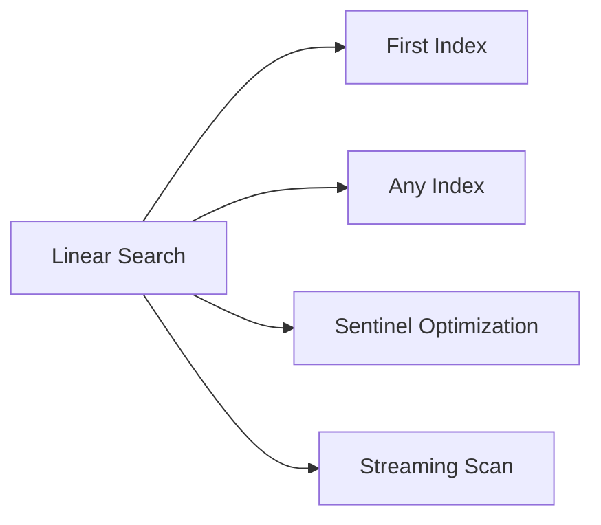
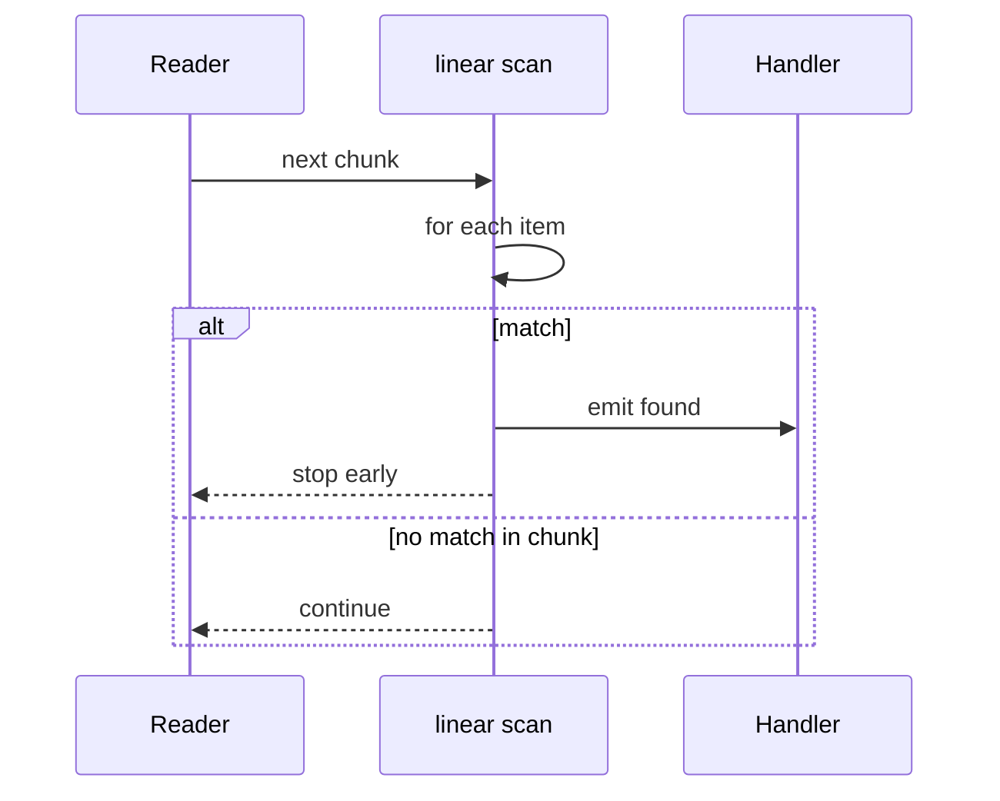

# Linear Search and Sentinels

## Overview

**Linear search** (sequential search) examines elements in order until a match or end of sequence. Worst-case cost is Θ(n) comparisons; best case Θ(1). It is optimal in the **comparison model** for **unsorted** data (Ω(n) lower bound). **Sentinels** eliminate per-iteration bounds checks by placing a guaranteed stop element—classic micro-optimization when search repeats on the same buffer.

Linear search wins for tiny n, unsorted streams, linked structures without index access, and when setup cost of indexing (sort, hash) exceeds one pass.

## Learning Objectives

- Specify search contracts: first index, any index, existence only
- Implement linear search with explicit comparator and equality
- Apply sentinel technique safely without mutating shared data
- Analyze when linear beats binary or hash search
- Handle production cases: early exit, partial scans, streaming

## Prerequisites

- [[05-Algorithms/00-Foundations-and-Correctness/Problem Specifications Preconditions and Postconditions|Problem Specifications Preconditions and Postconditions]]
- [[04-Data-Structures/01-Contiguous-Sequences/Dynamic Array ADT|Dynamic Array ADT]]

## Difficulty

`beginner`

## Estimated Time

- Reading: 1.5 hours
- Exercises: 2 hours
- Mini project: 3 hours

## History

The simplest search strategy—predates formal CS. Sentinels appear in Knuth's MIX programs and embedded loops. Modern languages bounds-check or JIT-optimize loops; sentinels remain relevant in hand-tuned C, ring buffers, and duplicate-key elimination patterns.

## Problem It Solves

- Find key in **unsorted** catalog, permission list, small config array
- Scan stream until predicate (first error line in log tail)
- Verify membership when hash setup dominates (n < 10)
- Linked list traversal—no random access for binary search

Failure modes: O(n) on every request at scale; comparing objects with expensive `equals`; not short-circuiting on match when only existence needed.

## Internal Implementation

### Problem contract

| Variant | Postcondition |
| --- | --- |
| `findFirst` | Smallest i with `eq(a[i], x)` or NOT_FOUND |
| `findAny` | Any i or NOT_FOUND |
| `contains` | Boolean |

Pre: finite iterable; `eq` consistent with intent.

**Invariant** (index i): all indices `< i` examined and not equal.

### Sentinel pattern

Append copy of target at end; loop `while a[i] !== target: i++` always terminates without `i < n` check each time.

Requires **writable** scratch slot or duplicate buffer—unsafe on shared immutable arrays without copy.

### Data structure dependency

- **Dynamic array**: O(1) index access — ideal
- **Linked list**: O(1) per step, no sentinels without dummy node trick
- **Stream**: one pass, O(1) extra space if no storage

Layout details: [[04-Data-Structures/01-Contiguous-Sequences/Dynamic Array ADT|Dynamic Array ADT]].

```mermaid
flowchart TD
    Start[i = 0] --> Check{a[i] eq target?}
    Check -->|no| Inc[i++]
    Inc --> Check
    Check -->|yes| Return[return i]
```

## Mermaid Diagrams

### Structure: search variants



### Sequence: streaming early exit



## Correctness

**Proof sketch** (`findFirst`):

- Init: i=0, no indices examined
- Maint: after checking i, all `< i` rejected
- Term: return on match at smallest i, or i=n ⇒ not found

**Sentinel correctness**: requires sentinel slot equals target only at artificial position ≥ original n, or duplicate of target exists—document whether duplicate returns first or sentinel index.

Comparator must match **equality** semantics used elsewhere (case fold, Unicode NFC).

## Complexity

| Case | Comparisons |
| --- | --- |
| Worst | n |
| Best | 1 |
| Average (uniform position) | (n+1)/2 |

Space: O(1) extra without copy; O(n) if sentinel needs duplicate array.

Matches Ω(n) lower bound for unsorted search—cannot asymptotically improve without preprocessing (sort/hash).

Crossover with binary search: see [[05-Algorithms/01-Complexity-and-Analysis/Practical Constants Locality and Benchmark Design|Practical Constants Locality and Benchmark Design]] — often n < 32–128.

## Examples

### Minimal Example

**TypeScript**:

```typescript
export function linearSearchFirst<T>(
  a: readonly T[],
  target: T,
  eq: (x: T, y: T) => boolean
): number {
  for (let i = 0; i < a.length; i++) {
    if (eq(a[i]!, target)) return i;
  }
  return -1;
}

/** Sentinel on mutable copy; returns index in original or -1. */
export function linearSearchSentinel(a: number[], target: number): number {
  const copy = a.slice();
  copy.push(target);
  let i = 0;
  while (copy[i] !== target) i++;
  return i < a.length ? i : -1;
}
```

**Python**:

```python
from typing import Callable, Sequence, TypeVar

T = TypeVar("T")

def linear_search_first(a: Sequence[T], target: T, eq: Callable[[T, T], bool]) -> int:
    for i, x in enumerate(a):
        if eq(x, target):
            return i
    return -1
```

### Production-Shaped Example

Scan audit log lines for first `ERROR` without loading whole file:

```typescript
async function firstErrorLine(path: string): Promise<number | null> {
  const fs = await import("node:fs");
  const stream = fs.createReadStream(path, { encoding: "utf8" });
  let lineNo = 0;
  let buf = "";
  for await (const chunk of stream) {
    buf += chunk;
    let nl: number;
    while ((nl = buf.indexOf("\n")) >= 0) {
      lineNo++;
      const line = buf.slice(0, nl);
      buf = buf.slice(nl + 1);
      if (line.includes("ERROR")) return lineNo;
    }
  }
  return null;
}
```

Adversarial: single-line multi-GB file without `\n` — memory blow-up; use bounded buffer and rolling scan.

## Trade-offs

| Dimension | Upside | Downside | When it matters |
| --- | --- | --- | --- |
| Linear | Simple, no prep | Θ(n) | Small n, unsorted |
| Sentinel | Fewer branches | Mut/copy | Hot inner loop C |
| Hash precompute | O(1) lookup | Setup O(n) | Many queries |
| Sort + binary | O(log n) query | O(n log n) prep | Static catalog |

### When to Use

- n small or single query
- Unsorted data, stream, linked list
- Predicate search (not just equality)

### When Not to Use

- Repeated queries on static set → build hash or sort
- Multi-GB indexed lookup → DB/index

## Exercises

1. Prove linear search returns **first** index.
2. When sentinel unsafe on shared read-only array?
3. Implement `contains` returning early without index.
4. Expected comparisons if target uniform random in array.
5. Linear search on singly linked list—sentinel with dummy head?

## Mini Project

Dual impl: standard vs sentinel on 10⁷ iterations synthetic array; measure crossover benefit on your hardware.

## Portfolio Project

Add linear search vectors to Workbench including empty, duplicates, first/last position.

## Interview Questions

1. Linear search complexity all cases?
2. Why Ω(n) for unsorted search?
3. Sentinel optimization—when worth it?
4. findFirst vs findAny contract difference?
5. Linear vs hash for 5 lookups on 10⁶ array?

### Stretch / Staff-Level

1. SIMD grep-style scan vs scalar linear—when model breaks?
2. Early termination in parallel scan without missing first match?

## Common Mistakes

- Using `==` on objects without defined equality
- Off-by-one when sentinel index equals n
- Linear search on sorted data repeatedly—should preprocess
- Not handling **empty** array in max/min variants

## Best Practices

- Inject `eq` for testability
- Document NOT_FOUND sentinel (-1 vs null)
- For hot paths, benchmark vs binary crossover
- Stream with bounded buffer, not unbounded concat

## Summary

Linear search is the baseline: correct on any order, optimal without preprocessing, simple to prove. Sentinels trim branch overhead at cost of mutability or copy. Choose it when n is small, data is unsorted or streaming, or setup for faster structures exceeds benefit.

## Further Reading

- [[00-References/Algorithms/README|Algorithms References]]
- [[05-Algorithms/02-Searching-and-Selection/Binary Search and Boundary Variants|Binary Search and Boundary Variants]]

## Related Notes

- [[05-Algorithms/02-Searching-and-Selection/Binary Search and Boundary Variants|Binary Search and Boundary Variants]]
- [[05-Algorithms/01-Complexity-and-Analysis/Lower Bounds Decision Trees and Adversaries|Lower Bounds Decision Trees and Adversaries]]
- [[05-Algorithms/01-Complexity-and-Analysis/Practical Constants Locality and Benchmark Design|Practical Constants Locality and Benchmark Design]]
- [[04-Data-Structures/01-Contiguous-Sequences/Dynamic Array ADT|Dynamic Array ADT]]
- [[04-Data-Structures/03-Linked-Structures/Linked List ADT|Linked List ADT]]

## Progress Checklist

- [ ] Explained from first principles
- [ ] Drew at least one Mermaid diagram
- [ ] Implemented a minimal version
- [ ] Documented trade-offs and non-goals
- [ ] Completed exercises
- [ ] Practiced interview questions aloud
- [ ] Linked prerequisites and dependents
