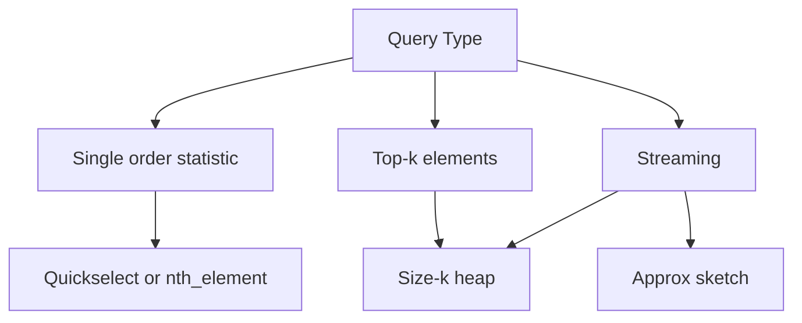
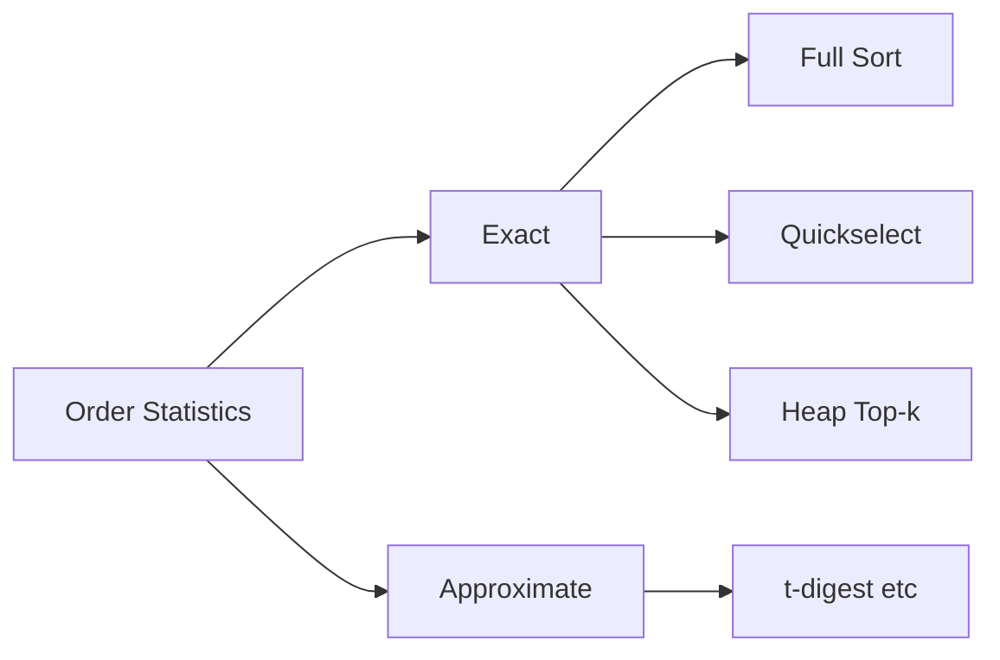
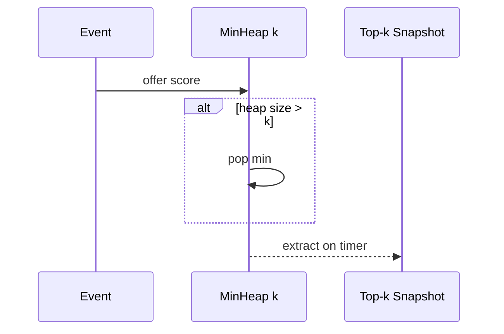

# Order Statistics Median and Top-K Trade-offs

## Overview

The **kth order statistic** is the element with rank k in sorted order (0-based: minimum at k=0, median at ⌊(n−1)/2⌋ or average of two middles for even n). **Top-k** queries ask for the k largest or smallest elements—often with **partial order** only, not full sort. Algorithm choice spans full sort O(n log n), quickselect O(n) expected, min-heap of size k O(n log k), max-heap + k pops O(n log k), counting/radix for bounded keys, and **streaming** structures (heap, reservoir, Count-Min sketch for approximate).

Production picks by: one-shot vs many queries, mutability, memory, exact vs approximate, and adversarial input.

## Learning Objectives

- Define median, rank, and top-k with even-n and duplicate policies
- Compare sort, quickselect, heap, and bucket strategies with total cost formulas
- Implement top-k streaming with size-k heap
- Choose exact vs approximate for telemetry at scale
- Document stability and tie-breaking for audit use cases

## Prerequisites

- [[05-Algorithms/02-Searching-and-Selection/Quickselect and Partition-Based Selection|Quickselect and Partition-Based Selection]]
- [[04-Data-Structures/06-Heaps-and-Priority-Queues/Priority Queue ADT|Priority Queue ADT]]

## Difficulty

`intermediate`

## Estimated Time

- Reading: 2.5 hours
- Exercises: 4 hours
- Mini project: 6 hours

## History

Selection problem Ω(n) comparisons lower bound (comparison model). Blum median-of-medians (1973). Streaming quantiles via Greenwald–Khanna, t-digest, DDSketch in observability stacks. Database TOP N via indexes + heap merge.

## Problem It Solves

- Dashboard p50/p95/p99 latencies
- Leaderboards (top 100 scores)
- Robust stats (median vs mean under outliers)
- Resource scheduling by priority top-k

Wrong tool costs: full sort every minute on 10⁶ samples; O(n²) partial bubble for top-k; unstable tie order in payouts.

## Internal Implementation

### Decision matrix

| Scenario | Approach | Time | Space |
| --- | --- | --- | --- |
| One rank k, mutable array | Quickselect | O(n) exp | O(1) |
| One rank, need stability | Sort | O(n log n) | O(n) |
| Top-k, k ≪ n, stream | Min-heap size k | O(n log k) | O(k) |
| Top-k, small k repeated | Partial heap | O(n log k) | O(k) |
| Bounded integer keys | Counting/bucket | O(n + u) | O(u) |
| Approximate quantile stream | Sketch | O(1) update | O(1) |

### Median conventions

- **Odd n**: single middle at index (n−1)/2
- **Even n**: lower mid, upper mid, or average of two—**specify in contract**
- Financial median: often average of two middles for even

### Top-k heap invariant

Maintain min-heap of k best items seen; `size > k` pop smallest of heap for "k largest" problem.



## Mermaid Diagrams

### Structure: algorithm selection



### Sequence: streaming top-k



## Correctness

**Order statistic post**: returned value equals element at rank k in sorted multiset (define duplicate rank: usually any or first in stable sort).

**Top-k post**: returned set contains k greatest elements; order among them optional unless stable spec.

**Approximate**: error bound ε on rank or quantile—document for SLO ("p99 ± 1%").

Certificate: sort copy and compare—CI property test.

## Complexity

Comparison model:

- Select minimum: Ω(n) comparisons
- Sorting reduces selection: O(n log n) overhead if only one k
- Top-k: O(n log k) with heap beats O(n log n) when k ≪ n

Multiple quantiles on same array: sort once O(n log n) beats multiple quickselect unless few ranks with introselect.

Streaming: exact top-k needs Ω(k) memory; approximate sublinear memory with error.

Link counting sort when keys bounded: [[05-Algorithms/03-Sorting/Counting Radix and Bucket Sort|Counting Radix and Bucket Sort]].

## Examples

### Minimal Example

**TypeScript**:

```typescript
class MinHeap<T> {
  private a: T[] = [];
  constructor(private readonly better: (x: T, y: T) => boolean) {}
  push(x: T): void {
    this.a.push(x);
    this.bubbleUp(this.a.length - 1);
  }
  pop(): T | undefined {
    if (this.a.length === 0) return undefined;
    const top = this.a[0]!;
    const last = this.a.pop()!;
    if (this.a.length) {
      this.a[0] = last;
      this.bubbleDown(0);
    }
    return top;
  }
  peek(): T | undefined {
    return this.a[0];
  }
  size(): number {
    return this.a.length;
  }
  private bubbleUp(i: number): void {
    while (i > 0) {
      const p = (i - 1) >> 1;
      if (!this.better(this.a[i]!, this.a[p]!)) break;
      [this.a[i], this.a[p]] = [this.a[p]!, this.a[i]!];
      i = p;
    }
  }
  private bubbleDown(i: number): void {
    for (;;) {
      let s = i;
      const l = 2 * i + 1;
      const r = l + 1;
      if (l < this.a.length && this.better(this.a[l]!, this.a[s]!)) s = l;
      if (r < this.a.length && this.better(this.a[r]!, this.a[s]!)) s = r;
      if (s === i) break;
      [this.a[i], this.a[s]] = [this.a[s]!, this.a[i]!];
      i = s;
    }
  }
}

/** Top-k largest by numeric score. better = larger wins. */
export function topK(scores: number[], k: number): number[] {
  const better = (x: number, y: number) => x > y;
  const heap = new MinHeap<number>(better);
  for (const s of scores) {
    heap.push(s);
    if (heap.size() > k) heap.pop();
  }
  return heap["a"].slice().sort((x, y) => y - x);
}
```

**Python**:

```python
import heapq

def median(a: list[float]) -> float:
    b = sorted(a)
    n = len(b)
    if n == 0:
        raise ValueError("empty")
    mid = n // 2
    if n % 2:
        return b[mid]
    return (b[mid - 1] + b[mid]) / 2

def top_k_largest(a: list[int], k: int) -> list[int]:
    return heapq.nlargest(k, a)
```

### Production-Shaped Example

Dual-path metrics aggregator:

- **Exact path** (n ≤ 10⁴): quickselect for p99 on scratch buffer
- **Stream path** (n unbounded): t-digest or fixed-bucket histogram with documented ε
- **Top-k users**: min-heap keyed by `(score, user_id)` for stable tie-break
- Adversarial: all equal scores—heap still ok; define tie policy for payouts

Observability: compare exact vs sketch in shadow mode before cutover.

## Trade-offs

| Dimension | Upside | Downside | When it matters |
| --- | --- | --- | --- |
| Full sort | Simple, multiple quantiles | O(n log n) | Small n, reports |
| Quickselect | O(n) one rank | Mutates, worst O(n²) | Single median |
| Heap top-k | O(n log k), stream | Not sorted output | Leaderboards |
| Sketch | Bounded memory | Approx error | High-cardinality |
| Index + SQL | Pushdown | DB dependency | Large persistent data |

### When to Use

- Sort: many order stats or stable output needed
- Quickselect: single rank, in-memory array
- Heap: streaming top-k, k ≪ n
- Sketch: telemetry quantiles at millions QPS

### When Not to Use

- Sort every event on infinite stream
- Quickselect on immutable shared arrays without copy
- Exact median on distributed shards without merge plan—see [[09-System-Design/README|System Design]]

## Exercises

1. Even-length median: list three conventions; pick for SLA latency.
2. Prove min-heap size k returns k largest if heap stores smallest of candidates correctly.
3. n=10⁶, k=10 — compare sort vs heap constant factors.
4. Distributed median of 100 shards—outline merge strategy.
5. When counting sort beats heap for top-k?

## Mini Project

Implement exact + t-digest-style bucket median; measure error vs n on synthetic skew.

## Portfolio Project

Top-k module in Workbench: heap vs sort vs quickselect on shared vectors; document crossover k.

## Interview Questions

1. Find median — options and complexities?
2. Top-k largest — O(n log k) approach?
3. Streaming median impossible exactly in O(1) space—why?
4. Quickselect vs sort for one p99?
5. Stable top-k with ties?

### Stretch / Staff-Level

1. Approximate quantile mergeability for map-reduce.
2. Selection lower bound Ω(n)—sketch information argument.

## Common Mistakes

- Using mean when spec says median under outliers
- Heap wrong polarity (max vs min for top-k largest)
- Forgetting to copy before quickselect on shared data
- Approximate sketch without error SLO in contract

## Best Practices

- Specify even-n median and tie policy in API docs
- Use `nlargest`/`nth_element`/stdlib after verifying semantics
- Shadow-test sketches against exact on sample traffic
- For paywalls/leaderboards: stable `(score, id)` tuple compare

## Summary

Order statistics and top-k sit between full sort and single scan. Quickselect wins one-shot exact ranks; heaps win streaming top-k; sorts win when many ranks or stability matter; sketches win at scale with tolerated error. State the contract—median definition, tie breaks, exact vs approximate—before picking an algorithm.

## Further Reading

- [[00-References/Algorithms/README|Algorithms References]]
- [[05-Algorithms/12-Randomized-Approximation-and-Online/Reservoir Sampling|Reservoir Sampling]]
- [[08-Databases/README|Databases]] — ORDER BY LIMIT pushdown

## Related Notes

- [[05-Algorithms/02-Searching-and-Selection/Quickselect and Partition-Based Selection|Quickselect and Partition-Based Selection]]
- [[05-Algorithms/03-Sorting/Sorting Contracts Stability and Adaptivity|Sorting Contracts Stability and Adaptivity]]
- [[04-Data-Structures/06-Heaps-and-Priority-Queues/Priority Queue ADT|Priority Queue ADT]]
- [[05-Algorithms/01-Complexity-and-Analysis/Lower Bounds Decision Trees and Adversaries|Lower Bounds Decision Trees and Adversaries]]
- [[05-Algorithms/12-Randomized-Approximation-and-Online/Online Streaming and Competitive Trade-offs|Online Streaming and Competitive Trade-offs]]
- [[05-Algorithms/README|Algorithms Track]]

## Progress Checklist

- [ ] Explained from first principles
- [ ] Drew at least one Mermaid diagram
- [ ] Implemented a minimal version
- [ ] Documented trade-offs and non-goals
- [ ] Completed exercises
- [ ] Practiced interview questions aloud
- [ ] Linked prerequisites and dependents
