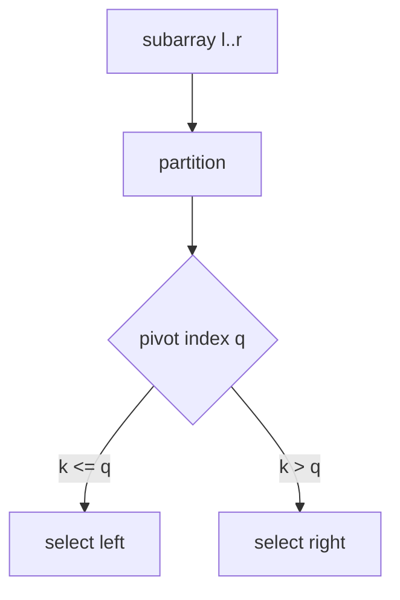
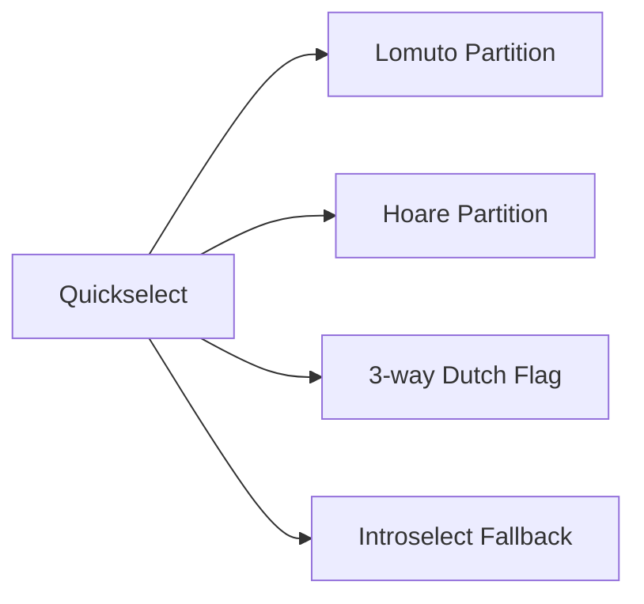
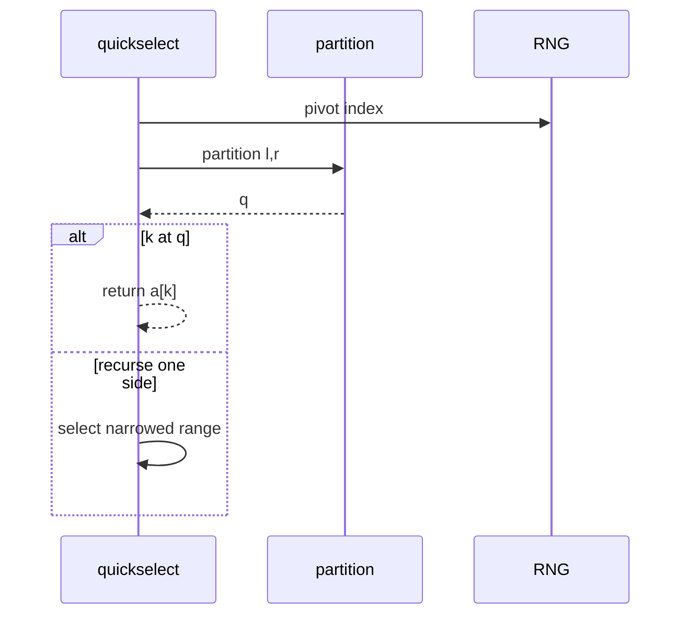

# Quickselect and Partition-Based Selection

## Overview

**Quickselect** finds the kth smallest element (0-based rank k) by **partitioning** like quicksort but recursing into only one side. Average Θ(n) comparisons; worst Θ(n²) with bad pivots. **Partition-based selection** family includes Lomuto, Hoare, Dutch-flag variants for duplicates.

Used for medians, percentile dashboards, and pivot steps in quicksort. Production systems add **random pivots**, **median-of-medians** fallback (introselect), or switch to heap for small k.

## Learning Objectives

- Implement Hoare/Lomuto partition with correct pivot placement semantics
- Derive quickselect expected O(n) via recurrence or accounting
- Handle duplicate keys with 3-way partition
- Specify rank conventions (0-based vs 1-based kth)
- Mitigate worst-case with randomization or introselect

## Prerequisites

- [[05-Algorithms/02-Searching-and-Selection/Binary Search and Boundary Variants|Binary Search and Boundary Variants]]
- [[05-Algorithms/01-Complexity-and-Analysis/Worst Average Expected and Amortized Cases|Worst Average Expected and Amortized Cases]]

## Difficulty

`intermediate`

## Estimated Time

- Reading: 2.5 hours
- Exercises: 4 hours
- Mini project: 5 hours

## History

Hoare's quicksort (1961) implies selection. Floyd–Rivest (1975) selection sampling. Median-of-medians (Blum et al., 1973) yields worst-case O(n) selection. `std::nth_element` and NumPy `partition` expose industrial variants.

## Problem It Solves

- Median latency without full sort O(n log n)
- **Partial sort** unnecessary when only one order statistic needed
- Quick pivot for outlier detection (compare to median absolute deviation pipeline)

Failures: wrong partition invariants on duplicates; O(n²) on adversarial input; mutating shared array without documenting side effect.

## Internal Implementation

### Contract

- Pre: array `a[0..n)`, integer k ∈ [0, n)
- Post: element at rank k in sorted order placed at index k (or returned); elements `< pivot` left, `> pivot` right (exact duplicate policy variant-dependent)
- Effect: typically **mutates** array in-place

### Hoare partition sketch

Pick pivot `p`; two pointers move inward swapping misplaced elements; return split index `q`.

Quickselect:

```text
select(a, l, r, k):
  if l >= r: return a[l]
  q = partition(a, l, r)
  if k <= q: return select(a, l, q, k)
  else: return select(a, q+1, r, k)
```

**Variant**: `k` relative to global array—keep global k or pass offset carefully.

### Data structure dependency

In-place **mutable array** random access. Linked lists lack partition efficiency—use heap or copy to array.

See [[04-Data-Structures/06-Heaps-and-Priority-Queues/Priority Queue ADT|Priority Queue ADT]] for alternative selection.



## Mermaid Diagrams

### Structure: partition family



### Sequence: one selection call



## Correctness

**Loop invariant** (partition): elements outside `[i,j]` window satisfy `< pivot` left, `> pivot` right (Hoare style varies).

**Selection correctness**: by induction, kth smallest always in chosen recursive subarray—rank adjusted when recursing right.

**Duplicates**: Lomuto with last pivot places equal elements ambiguously—3-way partition fixes Dutch national flag style.

Total correctness requires termination variant: subarray size strictly decreases—see [[05-Algorithms/00-Foundations-and-Correctness/Termination Partial and Total Correctness|Termination Partial and Total Correctness]].

## Complexity

| Case | Time |
| --- | --- |
| Expected | O(n) |
| Worst | O(n²) |
| Space | O(1) iterative; O(n) recursion stack worst |

Expected recurrence: `T(n) = T(n/2) + O(n)` → O(n).

Worst: unbalanced partitions → `T(n) = T(n-1) + O(n)`.

Mitigation: random pivot, median-of-medians introselect O(n) worst.

Compare [[05-Algorithms/02-Searching-and-Selection/Order Statistics Median and Top-K Trade-offs|Order Statistics Median and Top-K Trade-offs]].

## Examples

### Minimal Example

**TypeScript**:

```typescript
function partition(a: number[], l: number, r: number): number {
  const pivot = a[r]!;
  let i = l;
  for (let j = l; j < r; j++) {
    if (a[j]! <= pivot) {
      [a[i], a[j]] = [a[j]!, a[i]!];
      i++;
    }
  }
  [a[i], a[r]] = [a[r]!, a[i]!];
  return i;
}

export function quickselect(a: number[], k: number): number {
  let l = 0;
  let r = a.length - 1;
  for (;;) {
    const q = partition(a, l, r);
    if (k < q) r = q - 1;
    else if (k > q) l = q + 1;
    else return a[k]!;
  }
}
```

**Python**:

```python
def partition(a: list[int], l: int, r: int) -> int:
    pivot = a[r]
    i = l
    for j in range(l, r):
        if a[j] <= pivot:
            a[i], a[j] = a[j], a[i]
            i += 1
    a[i], a[r] = a[r], a[i]
    return i

def quickselect(a: list[int], k: int) -> int:
    l, r = 0, len(a) - 1
    while True:
        q = partition(a, l, r)
        if k < q:
            r = q - 1
        elif k > q:
            l = q + 1
        else:
            return a[k]
```

### Production-Shaped Example

Rolling p99 latency estimate with quickselect on ring buffer each minute:

- Mutates scratch copy not live buffer
- Random pivot + size cap; fallback `heapq.nsmallest` if recursion depth > 64
- Adversarial sorted input if pivot deterministic—seed RNG per process

```typescript
function p99Copy(samples: number[]): number {
  const a = samples.slice();
  const k = Math.floor(0.99 * (a.length - 1));
  return quickselect(a, k);
}
```

## Trade-offs

| Dimension | Upside | Downside | When it matters |
| --- | --- | --- | --- |
| Quickselect | O(n) expected in-place | Worst O(n²) | General k |
| Sort | Simple | O(n log n) | Many ranks |
| Min-heap size k | O(n log k) | Extra space | Small k |
| Median-of-medians | O(n) worst | Larger constants | Adversarial |

### When to Use

- Single order statistic on mutable array
- n large, k arbitrary, memory tight

### When Not to Use

- Need stable order or non-mutation — sort or copy
- Many k queries — preprocess sort or heap structure
- Adversarial without randomized pivot protection

## Exercises

1. Expected cost recurrence for random pivot quickselect.
2. Lomuto vs Hoare partition return index semantics.
3. 3-way partition when all elements equal—time?
4. Implement introselect depth limit + heap fallback.
5. Rank k=0 and k=n-1—special cases?

## Mini Project

Compare quickselect vs sort vs heap for k ∈ {1, n/2, n-1} on n=10⁶; plot times.

## Portfolio Project

Workbench vectors: duplicates, sorted adversarial, single element; verify rank.

## Interview Questions

1. Quickselect expected vs worst complexity?
2. Partition role in quicksort vs quickselect?
3. How handle duplicates in partition?
4. Why mutate array—can avoid?
5. nth_element vs full sort?

### Stretch / Staff-Level

1. Prove median-of-medians O(n) worst-case outline.
2. Parallel quickselect challenges on shared memory?

## Common Mistakes

- Off-by-one on k after recursing right
- Pivot always last on sorted input
- Assuming partition places pivot at final rank k
- Confusing 0-based rank with 1-based "kth smallest"

## Best Practices

- Document mutation and rank convention
- Random pivot or introselect for untrusted input
- 3-way partition for heavy duplicate keys
- Test adversarial sorted/reverse arrays

## Summary

Quickselect locates order statistics by partitioning like quicksort but recursing one side. Expected linear time makes it the workhorse for medians; worst-case quadratic demands randomization or introselect. Partition invariants and rank bookkeeping determine correctness—especially with duplicates.

## Further Reading

- [[00-References/Algorithms/README|Algorithms References]]
- [[05-Algorithms/03-Sorting/Quicksort Partitioning and Introspective Fallbacks|Quicksort Partitioning and Introspective Fallbacks]]

## Related Notes

- [[05-Algorithms/02-Searching-and-Selection/Order Statistics Median and Top-K Trade-offs|Order Statistics Median and Top-K Trade-offs]]
- [[05-Algorithms/03-Sorting/Quicksort Partitioning and Introspective Fallbacks|Quicksort Partitioning and Introspective Fallbacks]]
- [[05-Algorithms/01-Complexity-and-Analysis/Lower Bounds Decision Trees and Adversaries|Lower Bounds Decision Trees and Adversaries]]
- [[04-Data-Structures/06-Heaps-and-Priority-Queues/Priority Queue ADT|Priority Queue ADT]]

## Progress Checklist

- [ ] Explained from first principles
- [ ] Drew at least one Mermaid diagram
- [ ] Implemented a minimal version
- [ ] Documented trade-offs and non-goals
- [ ] Completed exercises
- [ ] Practiced interview questions aloud
- [ ] Linked prerequisites and dependents
